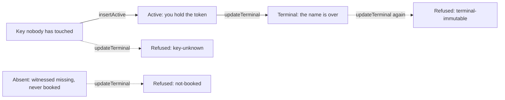

# Ending a name

## Who this is for

You hold a Singular name. You booked it, the registry handed you a token
that says so, and now you want it over — permanently, publicly, and in a
way nobody can undo, including you.

This page is about that one move: **retirement**. It is the edge the
registry calls `updateTerminal`, and it is the only one that destroys a
token instead of creating one.

## What you can do

Retire a name you hold. The registry takes the token back out of your
wallet and burns it, and the name's entry becomes `Terminal` — the last
state it will ever have.



What has to be true for it to go through:

- the registry's entry for your key reads **Active**;
- the transaction carries **your** token — the one the booking delivered
  — as an input for the burn to destroy;
- nothing else moves under the registry's three token policies.

What comes out:

- exactly one token destroyed, the one named by your key, and no output
  anywhere carries it afterwards;
- the entry reads `Terminal`;
- no refund, no new token, and no signature from any application.

The last point is worth stating plainly: **no application can veto a
retirement and none is asked to sign one.** The registry decides, from
the entry and the token, and nothing else.

## Why it cannot be undone

`Terminal` is the end of the line by construction. A second retirement
at the same key does not produce a smaller effect or a no-op — it
produces no transaction at all, refused `terminal-immutable`. There is
no edge out of `Terminal` in the registry's table, so no sequence of
folds returns the name to circulation.

That is also why the token is destroyed rather than parked somewhere:
while a token exists, someone holds it, and "who holds it" is a question
with consequences. After a retirement there is nothing to hold.

## When it is refused, and why the reason matters

Three different situations look the same from outside — "the retirement
did not happen" — and the registry keeps them apart, because the repair
is different in each case:

| what is true | the reason given | what to do |
|---|---|---|
| the registry has never heard of this key | `key-unknown` | book it first, or check the key |
| the key is only witnessed *absent* | `not-booked` | somebody recorded that the name was free; nobody took it |
| the key is already `Terminal` | `terminal-immutable` | nothing; the name is over |
| the key is Active but the token is not in the transaction | `token-missing` | send the transaction the token it is supposed to burn |

Each of these is decided against the registry's **own** entry, not
against what the request claims about it. A request that says "this key
is active" does not make it so, and a retirement built on that claim is
refused by name rather than dying inside a proof.

The last row is different from the other three: under the registry's
laws, an Active entry and exactly one outstanding token are the same
fact, so a caller cannot actually reach that situation. It stays a guard
because a guard that is never reached is cheap, and because being wrong
about it would destroy nothing while claiming to.

## Seeing it happen

The release archive ships a command that performs the whole story
against a throwaway network, from a fresh extraction with no source
checkout:

```bash
cd offchain
REGISTRY_BLUEPRINT=../onchain/plutus.json \
  nix run --quiet .#update-terminal -- --observed /tmp/update-terminal.json
```

It boots a registry, books a name to a wallet, retires it, and writes
what it saw to the file you name: the two transaction ids, the three
registry roots, the token count going from one to zero, the exact burn,
the input it came from, and the final entry. The two refusals are in
there too, each beside a retirement that *did* work — because "it was
refused" only means something when you can see the same machinery
succeed on the next line.

Every value in that file is read back from the network or from the
compiled contract. None of it is written by the command to make itself
look right.
