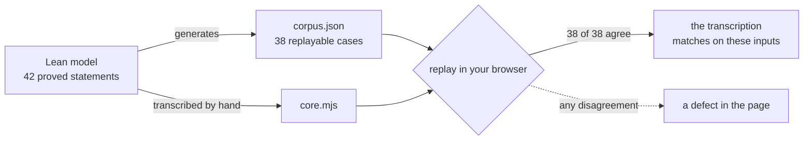

# Play the simulation

<a href="https://lambdasistemi.github.io/singular/simulator/">Open the playable
Singular simulator</a>. It is one self-contained page: no framework, no network,
no server. Everything it computes it computes in front of you.

The page is a **transcription** of the frozen Lean model into JavaScript, so
that a reader can play what the proofs are about. Where the two disagree the
Lean is right and the page is a defect — which is exactly what the corpus replay
on the page is for.

## What you can do

**Follow a journey.** Five stories, twenty steps between them. *Book a name* is
the shortest: one unknown key, one fold, the record holds the active token.
*Witness an absence, then book it* shows the other order — anyone may record
that a key is unknown, the absent token waits in the cage, and booking it
consumes that token and pays the deposit back to whoever funded it, not to
whoever spent it. *Retire a name and attest it* ends in the state that cannot
move again, and then attests it twice, because an attestation is a read: it
changes nothing, so every copy of it is equally true. *What the cage refuses*
walks four attempts that are turned away, each with its own reason. *Delete
recreates the key* deletes a booked name and books it again — the same key, not
a second incarnation, because the registry has no version counter to advance.

Step with ⏮ ◀ ▶ ⏭. Stepping back unwinds the tokens as well as the leaf, so you
can watch a witness appear and disappear. Where a story reaches a point that
admits more than one continuation, the branches are offered and taking one does
not destroy the other.

**Try it yourself.** Free play gives you the seven edges, a key, an owner, an
output and a deposit, and a choice of approval: matching, *right policy but
wrong tuple*, another policy, or none at all. The third and fourth are
obviously refused. The second is the interesting one — an approval minted under
the registry's own pinned policy, for a real request, that does not match
*this* request's edge, key, owner and destination. It is refused, and a model
that checked only the policy would admit it.

**Read what is refused, by name.** Seven primitives against four possible
leaves is twenty-eight combinations. Seven of them are the edges; the other
twenty-one are refusals, and the page lists all twenty-eight so you can see that
the refusals are the *complement* of the table rather than a separately
maintained list. Each carries its own reason — `key-exists`, `key-unknown`,
`already-booked`, `not-booked`, `not-active`, `not-absent`,
`terminal-immutable`, `read-unknown`, `read-absent`, `read-active` — because a
single generic failure would hide which rule stopped you.

**See the naming instance.** Switch the profile to *Naming — the Over witness*.
Naming is an instance of the registry, not a second model: a retired name is
attested by a folded read, the witness is plural, and burning every copy leaves
the leaf exactly where it was.

## What the page proves, and what it does not



Every case in the corpus carries its **input** — the state before and the
request — not just the answer, so the page recomputes each one from scratch and
compares. The header line on the page reports the count it actually reproduced
against the count it was given; a page that silently skipped cases would show a
smaller denominator, and one that skipped all of them would show zero rather
than passing.

That establishes agreement **on the exported inputs**. It is not a proof of
equivalence: a transcription can agree on every corpus row and still diverge on
the next one. The proofs are in the Lean; the page is evidence that what you are
playing is the thing that was proved about, over the cases the model itself
chose to export.

**One caveat a reader should have, stated plainly.** The Lean model, the corpus
generator and this transcription were written by the same author. Agreement
between them is therefore weaker evidence than agreement between independent
implementations would be: a misunderstanding held while writing the model is
very likely to be held again while transcribing it. The corpus replay catches
transcription slips, which is what it is for. It cannot catch a shared
misreading of the specification. The independent check on that is the audit of
the Lean statements against the interface, not this page.

## Reproduce the checks

From a source checkout, inside the development shell:

```sh
just model        # compile the Lean, regenerate the corpus, check the axioms
just simulator    # rebuild the page, replay every row, then prove the gate can fail
just browser      # drive the built page in a pinned Chromium
```

`just simulator` runs three commands. `node simulator/build.mjs --check`
rebuilds the standalone page from its sources and fails if the committed
`index.html` differs, so the page you play is the page in the repository.
`node simulator/gate.mjs` replays the corpus outside the browser and reports
what it covered:

```json
{ "corpusCases": 38, "codec": 7, "ada": 2, "complementPairs": 28,
  "refusedPairs": 21, "storySteps": 20, "controlledLaws": 7,
  "namingRows": 24, "boundary": 4 }
```

`node simulator/gate.mjs --selftest` then seeds a defect and requires the gate
to reject it. A checker that has never been seen to fail is not evidence, so the
failing run is part of the passing one.

`just browser` loads the built page in Chromium, serves nothing but
`index.html` — every other request returns 404, which is how the page's
self-containment is checked rather than asserted — plays the journeys, drives
free play including the wrong-tuple approval, reads the refusal table and
verifies the naming journey. Twenty-five assertions, and a page error or an
outbound network request fails the run.

## Where the model itself is

<a href="../lean/Singular/Model.lean">The executable model</a> ·
<a href="../lean/Singular/Statements.lean">the statements</a> ·
<a href="../lean/corpus.json">the generated corpus</a> ·
[what each statement says](theorems.md) ·
[how the model was read back](LEAN-CLARITY.md).

The page models states, leaves, tokens and approvals. It does not execute
validators, check signatures, build transactions or hold funds. A deposit in
the simulator is a number that must come back to the right address; on a ledger
it is lovelace, and nothing here establishes that the compiled validator agrees
with the model it was derived from.
