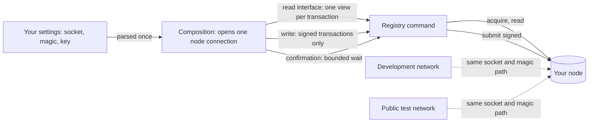
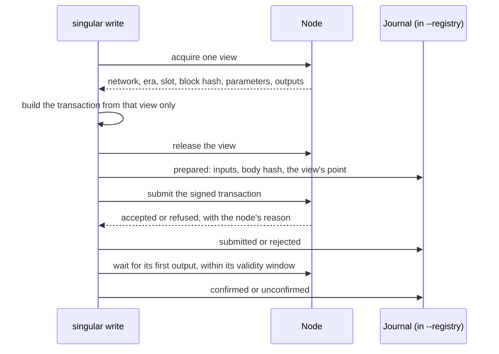

# Connecting singular to a node

You run the `singular` registry commands — `create`, `insert`, `update`,
`terminate` and `inspect` — against a cardano node you already run: a
public test network's node, or a development network you started yourself.
You tell each command where the node is and which network it carries; the
command reads the chain through that node, signs with your key, submits,
waits for the chain to carry what it submitted, and leaves a journal entry
that names exactly which chain state each transaction was built from. When a
setting is missing, contradictory or points at the wrong network, the
command refuses before it reads or submits anything.

## The settings you give

| Setting | Commands | What it is |
| --- | --- | --- |
| `--node-socket PATH` | all five | The node's node-to-client socket, the file `cardano-node` creates with `--socket-path`. |
| `--network-magic N` | all five | The magic of the network the node runs: 1 for preprod, 2 for preview, 42 for the factory development network. Mainnet's magic is refused for writes. |
| `--wallet-skey FILE` | `create`, `insert`, `update`, `terminate` | Your payment signing key: a `cardano-cli` text envelope, its `cborHex` value or the 32 key bytes as bare hex, or the 32 raw key bytes. The key funds and signs every write; it is read and never printed — only the address derived from it appears. `inspect` refuses it. |
| `--confirm-timeout SECONDS` | the four writes | How long each submission may take to appear on chain; ten minutes when not given. Past it the command stops with the submission journalled as unconfirmed and never resubmits it. |

The three node settings travel together on a write: naming one or two of
them is refused as partially configured, and so is a write that names none,
because `singular` never starts a node of its own — a registry booted on a
chain that dies with the process could not be attached to again. The
settings are read from the command line only.

```sh
singular registry insert --registry ./reg --blueprint plutus.json \
  --key 6b657941 --envelope alice.json \
  --node-socket /run/cardano/node.socket --network-magic 1 \
  --wallet-skey ~/keys/payment.skey
```

## One path to every node

A development network and a public test network's node are reached the same
way. Each command is handed what it needs — a way to read the chain, a way
to submit signed transactions, and a way to wait for a confirmation — by one
composition step that turns the settings into a connection. Nothing else in
the command knows which node it talks to, and a source check in CI refuses
any other module that names the node backend.



`inspect` takes only the socket and the magic: it gets the read interface
and nothing that can sign or send.

## What a write does with the node

Each transaction a write submits is built from one view of the chain — one
acquired ledger state, with its network, era, slot and block hash — and that
view is closed before the transaction is signed and sent. The journal line
written before the send names that view's point, so a later reader knows
exactly which chain state the transaction's inputs, fees and validity were
decided against.



## When the node cannot be used

| What happened | What you see |
| --- | --- |
| One or two of the three write settings given | refused before anything runs: the missing setting is named and all three are required together |
| No node settings on a write | refused: `singular` never starts a node of its own |
| Network magic 764824073 (mainnet) on a write | refused: the commands submit live transactions and are for test networks only |
| No node at the socket, or a node on another network | `node-unavailable`: the node did not accept a connection for that magic, with the magic it was asked for |
| The chain has not made its first block yet | the command waits up to two minutes for one, then refuses: no view of a chain at its origin can be acquired |
| A signing key passed to `inspect` | refused: `inspect` reads, and never funds or submits |
| The node is lost after it accepted a submission | the command ends within `--confirm-timeout` with the submission journalled as unresolved; nothing is resubmitted |
