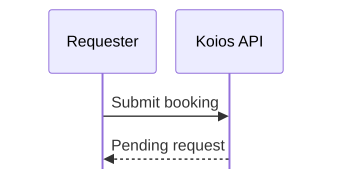
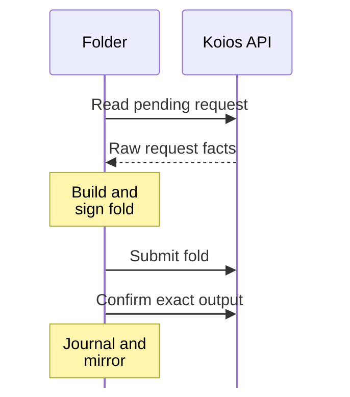
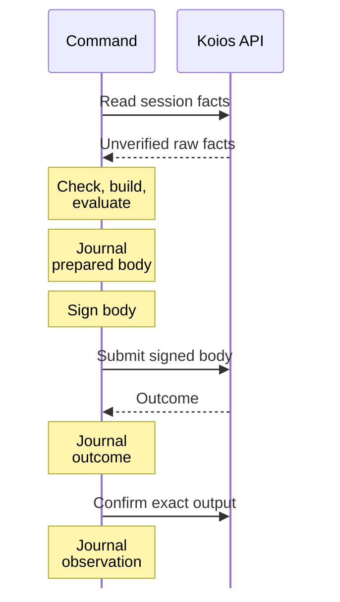
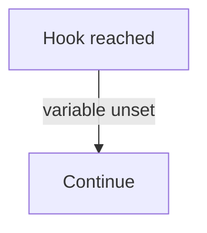
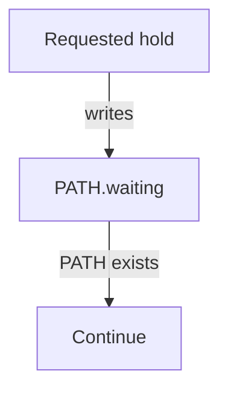
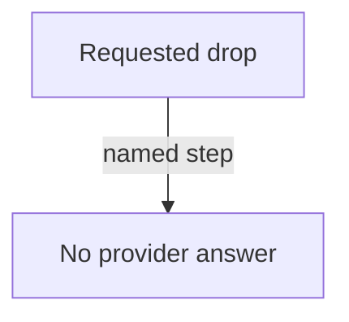

# Connecting singular to a ledger provider

As a registry operator, you want to use `create`, `insert`, `update`, `terminate`,
`fold`, `reclaim`, `reject` and `inspect` with a Koios API on your chosen network.
You supply the API settings and pinned time material; writes also use your local
payment signing key. Commands read raw facts through one logical session, build
and evaluate locally, submit signed transactions, and preserve recovery evidence
in the registry journal.

The ordinary provider is Koios. Old backend and socket settings are refused
before acquisition or registry effects. The current provider session promises
no coherent chain snapshot and carries no verification witness.

## The settings you give

| Setting | Commands | What it is |
| --- | --- | --- |
| `--koios-url URL` | all eight | The Koios API base URL used for raw reads and signed submission. There is one ordinary provider path. |
| `--koios-token-file FILE` | all eight | An optional authentication token read from this file. Keep its contents private; receipts and logs redact it. |
| `--network-time DIR` | all eight | Pinned time-manifest.json, shelley-genesis.json and era-history.cbor. Preprod can use the reviewed packaged recording; generated network 42 requires its exact published directory. |
| `--network-magic N` | all eight | The requested network: 1 for preprod or 42 for the generated development network. Time material and provider answers must agree with it; unsupported time networks refuse. Mainnet's magic is refused for writes. |
| `--wallet-skey FILE` | `create`, `insert`, `update`, `terminate`, `fold`, `reclaim`, `reject` | Your payment signing key: a `cardano-cli` text envelope, its `cborHex` value or the 32 key bytes as bare hex, or the 32 raw key bytes. The key funds and signs every write; it is read and never printed — only the address derived from it appears. `inspect` refuses it. |
| `--process-time MS` | `create` | How long a booked request may wait for its fold, in positive integer milliseconds: 600 000 (ten minutes) when omitted. Fixed for the life of the registry. |
| `--retract-time MS` | `create` | How long the owner may reclaim a request after its processing deadline, in positive integer milliseconds: 300 000 (five minutes) when omitted. Fixed for the life of the registry. |
| `--confirm-timeout SECONDS` | the seven writes | How long each submission may take to appear on chain; ten minutes when not given. Past it the command stops with the submission journalled as unconfirmed and never resubmits it. |
| `--registry DIR` | all eight | The directory that holds one registry: its identity, its mirror of the chain and its journal. `create` makes it; every later command reads it. |
| `--blueprint PLUTUS_JSON` | all eight | The registry partition's compiled blueprint, the `onchain/plutus.json` a release archive carries. |
| `--wallet-address ADDR` | `create`, `insert`, `update`, `terminate` | Your wallet's public address, in place of the signing key on a preview: the command reads that wallet and prints what it would submit, and signs, submits and journals nothing. |
| `--seed TXID#IX` or `--preview` | `create` | The output of your wallet the new registry is booted from, which fixes its identity; or, with `--preview`, the identity a seed from your wallet would give, without submitting anything. |
| `--preview` | `insert`, `update`, `terminate` | Build and measure what the command would submit — fee, measured units, stated collateral, outlay — from the wallet a public address names, and print it; nothing is signed, submitted or journalled. |
| `--fund-input TXID#IX` | `insert`, `update`, `terminate`, `fold`, `reclaim`, `reject` | The wallet output that funds and collateralises the write. `create` and `inspect` refuse it rather than ignore it. |
| `--max-outlay LOVELACE` | `insert`, `update`, `terminate`, `fold`, `reclaim`, `reject` | The most the write may put out of your wallet. A booking, an update, a fold, reclaim or reject past it is not signed; an insert or terminate given `--fold` whose fold, built after its booking confirms, costs more than the booking left of it stops partial, its request pending and the fold unsigned. `create` and `inspect` refuse it. |
| `--fold` | `insert`, `terminate` | Also fold the request this command just booked, in the same command and by the same routine `registry fold` runs. Without it the command books and stops. A preview and `update` refuse it. |
| `--request TXID#IX` | `fold`, `reclaim` | The pending request to act on. Required by reclaim, which takes back only that request. On fold it is optional: without it the fold takes the one pending request. A named request that is not pending is refused. |
| `--key KEY` | `insert`, `update`, `terminate`, `inspect` | The registry key the command acts on, as text: its UTF-8 bytes, between 1 and 32 of them. A string that looks like hex is still text. Give this or `--key-hex`, not both. |
| `--key-hex HEX` | `insert`, `update`, `terminate`, `inspect` | The same key spelled as base16 bytes, for a key that is not printable text. The receipts print every key as hex, and as text when its bytes are valid UTF-8. |
| `--outputs-at ADDR` | `inspect` | A public address, bech32, whose outputs the receipt also lists, each with its output reference and what it actually holds, read from the provider. It is a read apart from any write: nothing is signed, submitted or journalled. Every other command refuses it. |
| `--payload DATUM_JSON` | `insert`, `update` | The key's payload, a datum in detailed-schema JSON. `insert` makes it the key's first value: the command builds the protected control itself, from the registry's state asset and active policy, the key, the signing wallet's payment key hash as controller (the public address's on a preview) and the deposit. `update` replaces the payload; the protected control stays as it was. A file that is not Plutus data is refused: by `insert`, in either mode, before anything is read from the provider; by `update`, before anything is signed or submitted. |
| `--deposit LOVELACE` | `insert` | The deposit the key's envelope protects, a whole number of lovelace: 2 000 000 when not given, and refused below that. The minimum is the client's own policy; the chain enforces only that a request's deposit equals the control's at booking and that an update keeps at least the control's deposit, and sets no floor. |
| `--receipt FILE` | all eight | Also write the JSON receipt the command prints on standard output to this file. |
| `--trace LEVEL` | all eight | How much the command narrates as it runs: `off`, `what` (its protocol steps: the registry, key, request, edge and transaction it acts on, and each verdict) or `how` (also the mechanics under each step: reads, script evaluation, build, signing, submission, confirmation, with their times). When not given: `what` if standard error is a terminal, otherwise `off`. Any other value is refused before anything runs. |
| `--trace-to SINK` | all eight | Where the narration goes: `stderr`, or `file:PATH`, appended a line at a time as each event happens. Give it more than once to narrate to several places; standard error when not given. Any other value is refused before anything runs. |
| `--trace-format FORMAT` | all eight | `text`, indented lines for a person, or `json`, one JSON object per line for a program. When not given: text on standard error, JSON in a file. |

The URL, network magic and signing key travel together on a write: naming only some of
them is refused as partially configured, and so is a write that names none,
because `singular` never starts a node of its own — a registry booted on a
chain that dies with the process could not be attached to again. The
settings are read from the command line only; the one exception is the
[test-harness hooks](#test-harness-hooks), which operators never set.

```sh
singular registry insert --registry ./reg --blueprint plutus.json \
  --key keyA --payload alice.json \
  --koios-url "$koios_url" --network-magic 1 \
  --wallet-skey ~/keys/payment.skey
```

## Choosing a registry's windows

As a registry creator, you choose the processing and retract windows when you
run `registry create`, through `--process-time MS` and `--retract-time MS`.
Each must be a positive integer number of milliseconds; any other value is
refused before the command builds or signs anything. When omitted, they are
600 000 and 300 000 milliseconds: ten minutes to fold a booked request, then
five minutes for its owner to reclaim it.

Both windows are written into the state datum and fixed for the life of the
registry. A later command cannot change them. The successful `create` receipt
and `inspect` report `processTime` and `retractTime` read from that datum;
booking deadlines follow the registry's actual windows, including those of a
registry created before these defaults changed. The defaults give public
network reads and folds more time; development-network CI explicitly creates
its throwaway registries with shorter windows.

## Booking and folding

An `insert` or a `terminate` books a request and stops. The request waits at
the registry; the command's receipt names it, the booking's transaction, and
the fold deadline — the request's submission time plus the registry's
processing time — as a POSIX time, and as a slot when pinned time converts it. Nothing is folded, and the
registry's root, its mirror and its saved state do not move.

`registry fold` folds that request. It is an ordinary command: it signs and
funds with the wallet it is given, journals its own transactions, and may be
run by any wallet, not only the one that booked. An insertion's request carries
the envelope its fold delivers, so the folder reads it from the pending request
on the chain; nothing the booking wrote to its own registry directory is needed.



The requester books with its wallet. The folder reads that pending request,
then builds, signs and funds the fold with the folder's wallet; the saved
registry journal, mirror and state follow the observed fold:



The registry's fold takes every pending request, so a fold is built only while
exactly one is pending. Before anything is signed the command refuses, naming
the reason: nothing pending; the request named by `--request` is not the one
pending; more than one pending, each named; an insertion whose request carries
no envelope, or something that is not one; an edge other
than an insertion or a termination; the outlay past `--max-outlay`; a funding
output that is not the wallet's; and a request whose processing deadline has
passed or is within thirty seconds of passing, judged on the host's clock and named by its time, and by its slot when pinned time converts it.
Run after its own booking by `--fold`, a fold that cannot be built or signed
stops the command partial, naming the request that stays pending.

That check is the fast refusal, not the proof. After the fold is built and
before it is signed, its validity upper bound is judged again from the built
body and the host clock: the bound must be at or before the slot of the
deadline when pinned time converts it, or, when it does not, must begin at or
before the deadline time; a bound pinned time cannot convert, or a clock that has
meanwhile come within the margin, is refused unsigned, with the bound, the
clock and the deadline in the receipt.

The deadline the fold is judged against is the one the booking's receipt
states. A fold refused for it submitted nothing, and its request stays pending.

## Reclaiming your pending request

As a requester, you can take back your pending insertion or terminal-witness
request after its processing deadline, while its retract window remains open.
`registry reclaim` requires `--request TXID#IX` and signs with the wallet you
give it. It refuses before building when that request is not pending, belongs
to another wallet, or names an update or deletion edge that Lean cannot retract.

```bash
singular registry reclaim --registry reg --blueprint onchain/plutus.json \
  --request TXID#IX --koios-url "$koios_url" --network-time "$time_dir" --network-magic 42 \
  --wallet-skey alice.skey --receipt reclaim.json
```

The command judges the window from the actual tip observed through its session and converted
processing deadline: that deadline must convert, and the tip must reach it.
The retract deadline stays open while its converted slot is ahead of the tip,
or when a conversion refusal cannot establish its closing slot, exactly as reject judges it.
An unconverted processing deadline does not prove opening and is refused before
the window, naming the opening time. A known, reached retract deadline is closed;
the refusal names `registry reject` as the way to clear expired requests. No
host clock or estimated slot decides admission. Conversions extend the pinned final era. A moving ledger horizon separately caps the built upper bound, and a short usable interval refuses before signing; a build failure is no evidence of a successful reclaim.

Inside the window, the existing retract builder pays the owner all the
request's locked lovelace in one output whose inline datum is that request's
reference. The command checks that output and the built validity interval before
signing. When the retract deadline has no slot, the built upper bound must still
be placed in time by that same session's pinned time and be no later than the deadline. The
receipt names the request, retract transaction, actual locked value,
owner, return address and output, returned value and any minimum-output top-up.
It does not assume a protected holding deposit ever reached the request.
After confirmation, it reads back the consumed request, exact return output and
unchanged registry root before journalling `observed`. The mirror and `state.json`
do not move. The next request can be booked and folded normally.

## Rejecting expired requests

A request that nobody folds and whose owner does not take it back stays
pending, and the registry's fold, which takes every pending request, is
blocked behind it. `registry reject` clears it. It is an ordinary command: it
signs and funds with the wallet it is given and journals its own transactions.
It rejects every pending request in one transaction, using the registry's
published reference scripts, and the registry's root, its mirror and its saved
state do not move.

A request is rejected only once it is past both its windows: the processing
window, in which the registry's fold may take it, and the retract window after
it, in which its owner may take it back. That is judged from the ledger, not
from the host's clock. The command converts the retract deadline — the
request's submission time plus the registry's processing time and retract time
— to a slot using the pinned time consumed by its build session, and builds only when that session's observed
tip is at or past it. A deadline pinned time cannot place in a slot is taken as
still open. Before anything is signed the command refuses, naming the reason:
nothing pending; any pending request still inside a window, each named with
when its retract window closes, as a time, as a slot when pinned time converts it,
and the provider's observed tip slot; the outlay past `--max-outlay`; a funding output
that is not the wallet's; and a built reject that does not carry each owner's
whole refund in one designated output.

Each owner is refunded the request's value less the tip, in the one output
designated for that request; the wallet that runs the reject keeps the tip. The
receipt names every rejected request, the value it actually locked (its
lovelace and any other assets: a request holds only what was put into it, and
one whose deposit never landed holds no deposit), the tip, and where the refund
went: the output, its recipient and its amount, with the top-up when the
minimum output required one. After the reject confirms the command reads back
that every rejected request output is gone, that the root is where it was, and
that each refund is live at its owner as built, before it journals the reject
observed.

The check is exact on one shape. The chain pays a refund only when the
designated output covers the owed amount by itself; a refund split across
several outputs to the same owner is accepted by the model and refused by the
chain (issue #361), and `reject` never builds it. A reject that succeeds is
that shape on this chain, not general reject-refund conformance.

## What a write records

As a registry operator, you can identify the session and raw facts used for a
prepared transaction, and distinguish them from its submission and later
confirmation. Shared HTTP sessions are `Unbound`: several reads in one session
may observe different chain states. Every supplied fact is explicitly
`Unverified` with `NoVerifierConfigured`; no witness verifies it.



A prepared receipt carries the actual acquisition identity, fact/verdict extent
and raw-source records. Its chain-point field is empty for an Unbound session.
An inspect or confirmation tip is a separate observation, not proof that the
prepared reads belonged to that block. A provider's facts also cannot override
the ledger's refusal of a transaction.

Confirmation waits for the exact transaction output, rather than a status flag
alone. With an upper validity bound, its provider deadline is the POSIX start of
that slot plus 120 seconds; with no upper bound, it is now plus 300 seconds.
The CLI's `--confirm-timeout` also bounds its wait. The latest observed block can
establish expiry. An unresolved submission remains journalled and is not sent
again by recovery.

## Choosing a usable validity interval

As a caller building under load, you want a usable interval before construction
starts. The builder selects bounds only when at least ten seconds of usable
slots remain at its observed tip. Build duration and later provider observations
can consume that interval; this selection does not guarantee ledger acceptance. Floor, ceiling and slot-start
conversions use the pinned genesis/history, with only the final era's end opened.
A time before genesis refuses `TimeBeforeHistory`; a fresh protocol major that
differs from the pin refuses `EraBeyondPinned` before construction.

The moving ledger horizon is the first epoch boundary at or after the observed
tip plus the authenticated consensus buffer. The selected upper is the smaller
of the registry's original upper and the horizon minus one. The usable lower is
the larger of the actual finite lower and tip plus one; an omitted body lower
stays omitted.

An empty interval refuses `WindowPastLedgerHorizon`. A nonempty registry-limited
interval shorter than ten seconds refuses `WindowTooShort` without waiting. If
the horizon alone shortens an otherwise longer window, the builder waits once
for a later horizon before constructing the body. The wait is bounded by ten
seconds of slots and 20 seconds of wall time; a stalled horizon refuses
`HorizonWaitTimedOut` with the last observed tip and horizon. The wait is logged
and neither signs nor submits anything. These observations remain Unbound.

## Following what a command does

As a registry operator, you can watch a command take its protocol steps while
it runs, and keep the same account as data. Every command narrates one stream
of events: at `--trace what`, the registry it attached, each key and request it
read, the edge action it takes on them and its result; at `--trace how`, also
the mechanics under each step, each with its time. Standard output still
carries the receipt alone, so a script reading the receipt is unaffected by
any narration.

On a terminal a command narrates `what` to standard error unless told
otherwise. A fold, narrated at `how`:

```text
registry 7c58a200… (root 58397587…, 1 pending)
  how  read state, requests via Koios ................................... 0.8s
  request 5e0f19c2…#0 insertActive "alice-3" (deadline 2026-10-06 07:31:26Z, slot 135588686)
    fold insertActive
      how  evaluate 3 scripts ✓ (mem 1.24M, steps 439M) ................. 0.4s
      how  build fold ................................................... 0.6s
      how  sign 9a51d7e4…, fee 0.889465 tADA ............................ 0.1s
      how  submit tx 9a51d7e4… at tip slot 135588101 .................... 0.4s
      how  confirm tx 9a51d7e4… ........................................ 17.4s
      how  observe tx 9a51d7e4… ......................................... 2.0s
    result "alice-3" insertActive folded, output 9a51d7e4…#1
  root 58397587… → 4f2be0a1…
fold success ........................................................... 53.4s
```

Each line is indented by where it happened: the registry, then the key or
request, then the edge action, with each mechanic under the action it belongs
to. Identifiers are shortened in text; amounts are in tADA. A failure says
where it happened, and the four places are distinct: refused by the client
before anything was submitted, refused by local script evaluation before
anything was submitted, rejected by the ledger, or refused by the provider, so
that no ledger judged the transaction.

With `--trace-format json`, or a `file:PATH` sink, each event is one JSON
object on its own line, written as it happens: its `level` (`what` or `how`),
its `scope` (the registry, key, request, edge action and transaction it
happened in, outermost first) and its `event` with that event's fields, in
full. The last line of every stream is `command-ended`, naming the command,
the outcome class of its receipt and its elapsed time. Keys are written in
base16, and no event carries a signing key or the text of a failure: a failure
names only its type.

```sh
singular registry fold --registry ./reg --blueprint plutus.json \
  --koios-url "$koios_url" --network-magic 1 \
  --wallet-skey ~/keys/payment.skey \
  --trace how --trace-to stderr --trace-to file:fold.trace.jsonl
```

A sink that cannot be written, a closed standard error or a full disk loses
that sink's narration and nothing else: the other sinks, the receipt, the
journal and the exit status are as they would be with no narration at all.

## When the provider cannot be used

| What happened | What you see |
| --- | --- |
| A write omits its URL, network or signing key | configuration refusal before provider reads and key access, naming the missing setting |
| An old backend selector, socket flag or socket environment setting is supplied | its named removed-setting refusal before provider acquisition or registry effects |
| Mainnet magic is supplied for a write | configuration refusal; writes are restricted to test networks |
| The API cannot answer or the requested time network is unsupported | `node-unavailable` at startup, preserving the existing outcome and diagnostic |
| Time source identities, start, network or protocol major disagree | the specific time refusal; no unsigned body is supplied for signing |
| `inspect` is given a signing key | configuration refusal; inspect has no signing or submission capability |
| The API becomes unavailable after submission | an unresolved journalled result within the confirmation bound; recovery does not resubmit it |

## Reading through an index

The former `--backend node` / `--backend indexer` comparison is retired. Ordinary
commands use the Koios path only. They do not create an in-memory chain index or
accept an ordinary node socket: the production node read adapter and the
in-memory indexer are removed with the provider migration, and no registry
command names a node backend. Private generated nodes and independent LSQ
probes remain test harness components behind the private facade; none of
them ships with the terminal.

An index must not fabricate transaction history for genesis-only allocations.
The retained private genesis-only control uses genuine initial ledger outputs
and refuses `coverage-incomplete`, naming their output references, with exit 12
and no registry write. Funding those allocations through a real transaction
creates full-block history that the accepting control can read. This is a
private source control, not a promise that every remote service detects all
missing history. Missing or inconsistent registry reconstruction remains a
refusal and must not become an empty registry.

<a id="test-harness-hooks"></a>

## Harness appendix: test hooks

You never set these. The released `singular` reads eleven environment
variables whose only purpose is to let the project's own tests stop a
command at an exact point — to inspect it there, kill it there, or make it
meet no answer from the provider — and check what it leaves behind. When none
is set, which is how every operator runs it, they do nothing: no hold, no
dropped send. The retained harness controls check the ordinary path with no variable set
and the holds at the requested points. Their local, hosted and release results
are separate evidence; an unexecuted control establishes nothing.

A hold variable names a path. When the command reaches its point it writes
`PATH.waiting` and waits until `PATH` exists.



A requested hold writes its waiting file and continues only after the release
file exists. A requested drop models a missing provider answer at that step.





| Variable | Where the command stops or what it changes |
| --- | --- |
| `SINGULAR_HARNESS_HOLD_BEFORE_LOCK` | a write, after its checks and before it takes the registry directory's lock |
| `SINGULAR_HARNESS_HOLD_AFTER_SEND` | a submission sent, its answer not yet journalled |
| `SINGULAR_HARNESS_HOLD_AFTER_SUBMIT` | the provider's acceptance of a submission journalled |
| `SINGULAR_HARNESS_HOLD_STEP` | names the submission step (for example `boot`, `fold`, `update`) at which the two holds above stop; they stop at no other step, and at none when it is unset |
| `SINGULAR_HARNESS_HOLD_BEFORE_COMMIT` | a fold's local commit about to start |
| `SINGULAR_HARNESS_HOLD_AFTER_MIRROR` | a fold's mirror saved, the rest of its local commit not yet |
| `SINGULAR_HARNESS_HOLD_BEFORE_OBSERVED` | a fold committed locally, its observation not yet journalled |
| `SINGULAR_HARNESS_HOLD_BEFORE_REWIND` | a rollback journalled, the mirror not yet rebuilt |
| `SINGULAR_HARNESS_HOLD_BEFORE_REWIND_STATE` | the mirror rebuilt by a rollback, the saved state not yet following |
| `SINGULAR_HARNESS_DROP_SEND` | names a step whose send does not happen |
| `SINGULAR_HARNESS_DROP_ANSWER` | names a step whose provider answer is discarded after the send |
