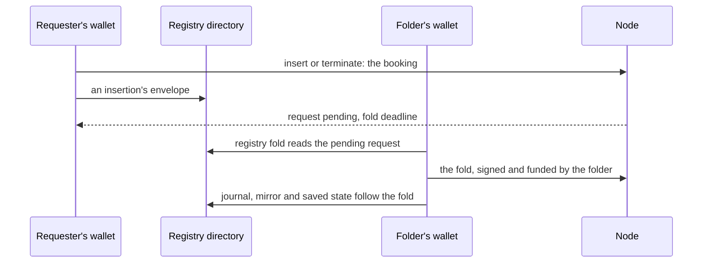
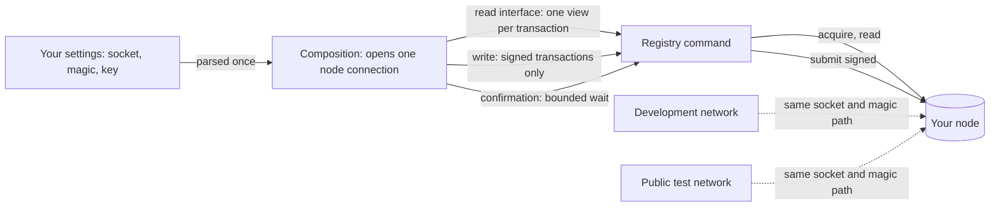
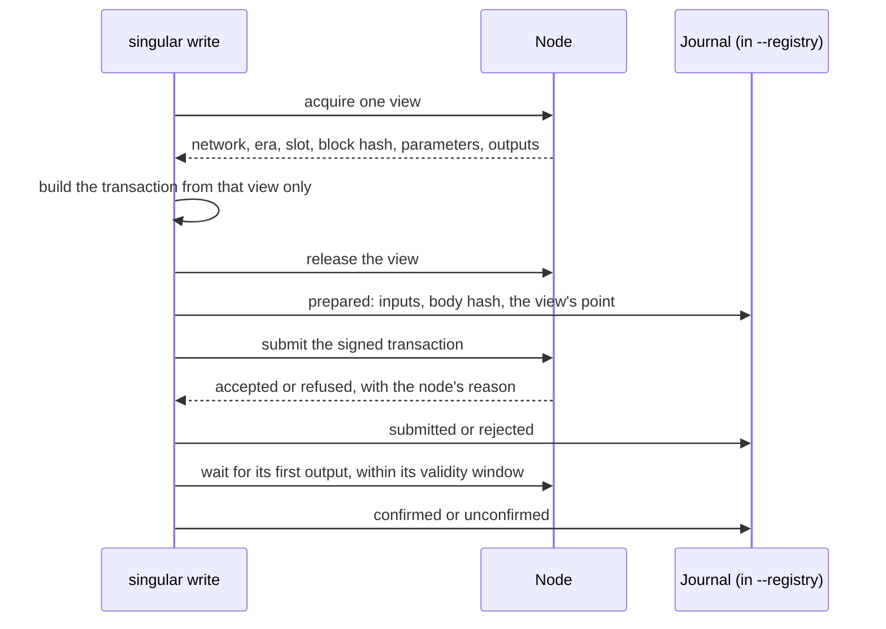
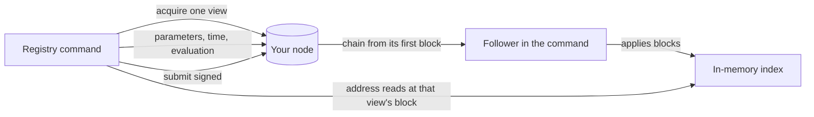
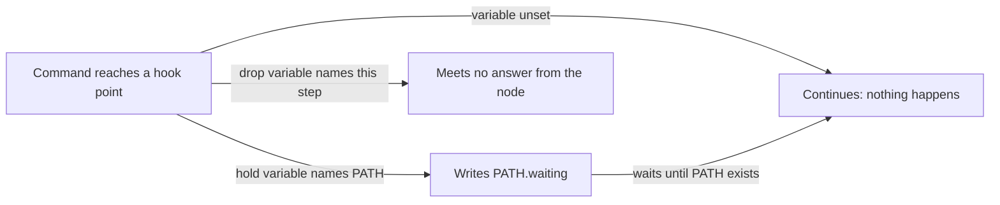

# Connecting singular to a node

You run the `singular` registry commands — `create`, `insert`, `update`,
`terminate`, `fold` and `inspect` — against a cardano node you already run: a
public test network's node, or a development network you started yourself.
You tell each command where the node is and which network it carries; the
command reads the chain through that node, signs with your key, submits,
waits for the chain to carry what it submitted, and leaves a journal entry
that names exactly which chain state each transaction was built from. When a
setting is missing, contradictory or points at the wrong network, the
command refuses before it reads or submits anything.

## The settings you give

| Setting | Commands | What it is |
| --- | --- | --- |
| `--node-socket PATH` | all six | The node's node-to-client socket, the file `cardano-node` creates with `--socket-path`. |
| `--network-magic N` | all six | The magic of the network the node runs: 1 for preprod, 2 for preview, 42 for the factory development network. Mainnet's magic is refused for writes. |
| `--wallet-skey FILE` | `create`, `insert`, `update`, `terminate`, `fold` | Your payment signing key: a `cardano-cli` text envelope, its `cborHex` value or the 32 key bytes as bare hex, or the 32 raw key bytes. The key funds and signs every write; it is read and never printed — only the address derived from it appears. `inspect` refuses it. |
| `--confirm-timeout SECONDS` | the five writes | How long each submission may take to appear on chain; ten minutes when not given. Past it the command stops with the submission journalled as unconfirmed and never resubmits it. |
| `--backend node` or `--backend indexer` | all six | Where the command reads addresses from: the node itself (`node`, the default) or an index the command builds by following the node's chain from its first block (`indexer`). Any other value is refused before anything runs. See [Reading through an index](#reading-through-an-index). |
| `--registry DIR` | all six | The directory that holds one registry: its identity, its mirror of the chain and its journal. `create` makes it; every later command reads it. |
| `--blueprint PLUTUS_JSON` | all six | The registry partition's compiled blueprint, the `onchain/plutus.json` a release archive carries. |
| `--wallet-address ADDR` | `create`, `insert`, `update`, `terminate` | Your wallet's public address, in place of the signing key on a preview: the command reads that wallet and prints what it would submit, and signs, submits and journals nothing. |
| `--seed TXID#IX` or `--preview` | `create` | The output of your wallet the new registry is booted from, which fixes its identity; or, with `--preview`, the identity a seed from your wallet would give, without submitting anything. |
| `--preview` | `insert`, `update`, `terminate` | Build and measure what the command would submit — fee, measured units, stated collateral, outlay — from the wallet a public address names, and print it; nothing is signed, submitted or journalled. |
| `--fund-input TXID#IX` | `insert`, `update`, `terminate`, `fold` | The wallet output that funds and collateralises the write. `create` and `inspect` refuse it rather than ignore it. |
| `--max-outlay LOVELACE` | `insert`, `update`, `terminate`, `fold` | The most the write may put out of your wallet. A booking, an update or a fold past it is not signed; an insert or terminate given `--fold` whose fold, built after its booking confirms, costs more than the booking left of it stops partial, its request pending and the fold unsigned. `create` and `inspect` refuse it. |
| `--fold` | `insert`, `terminate` | Also fold the request this command just booked, in the same command and by the same routine `registry fold` runs. Without it the command books and stops. A preview and `update` refuse it. |
| `--request TXID#IX` | `fold` | The pending request the caller expects to fold. The fold is refused when it is not the one pending; without it the fold takes the one pending request. |
| `--key KEY` | `insert`, `update`, `terminate`, `inspect` | The registry key the command acts on, as text: its UTF-8 bytes, between 1 and 32 of them. A string that looks like hex is still text. Give this or `--key-hex`, not both. |
| `--key-hex HEX` | `insert`, `update`, `terminate`, `inspect` | The same key spelled as base16 bytes, for a key that is not printable text. The receipts print every key as hex, and as text when its bytes are valid UTF-8. |
| `--payload DATUM_JSON` | `insert`, `update` | The key's payload, a datum in detailed-schema JSON. `insert` makes it the key's first value: the command builds the protected control itself, from the registry's state asset and active policy, the key, the signing wallet's payment key hash as controller (the public address's on a preview) and the deposit. `update` replaces the payload; the protected control stays as it was. A file that is not Plutus data is refused: by `insert`, in either mode, before anything is read from the node; by `update`, before anything is signed or submitted. |
| `--deposit LOVELACE` | `insert` | The deposit the key's envelope protects, a whole number of lovelace: 2 000 000 when not given, and refused below that. The minimum is the client's own policy; the chain enforces only that a request's deposit equals the control's at booking and that an update keeps at least the control's deposit, and sets no floor. |
| `--receipt FILE` | all six | Also write the JSON receipt the command prints on standard output to this file. |

The three node settings travel together on a write: naming one or two of
them is refused as partially configured, and so is a write that names none,
because `singular` never starts a node of its own — a registry booted on a
chain that dies with the process could not be attached to again. The
settings are read from the command line only; the one exception is the
[test-harness hooks](#test-harness-hooks), which operators never set.

```sh
singular registry insert --registry ./reg --blueprint plutus.json \
  --key keyA --payload alice.json \
  --node-socket /run/cardano/node.socket --network-magic 1 \
  --wallet-skey ~/keys/payment.skey
```

## Booking and folding

An `insert` or a `terminate` books a request and stops. The request waits at
the registry; the command's receipt names it, the booking's transaction, and
the fold deadline — the request's submission time plus the registry's
processing time — as a POSIX time, and as a slot when the node converts it. Nothing is folded, and the
registry's root, its mirror and its saved state do not move.

`registry fold` folds that request. It is an ordinary command: it signs and
funds with the wallet it is given, journals its own transactions, and may be
run by any wallet, not only the one that booked. The registry directory is the
shared state: the booking leaves there the envelope an insertion delivers, and
the fold reads it back and checks it against the hash the request names before
it builds anything.



The registry's fold takes every pending request, so a fold is built only while
exactly one is pending. Before anything is signed the command refuses, naming
the reason: nothing pending; the request named by `--request` is not the one
pending; more than one pending, each named; an insertion whose envelope is not
in the registry directory or is not the one the request names; an edge other
than an insertion or a termination; the outlay past `--max-outlay`; a funding
output that is not the wallet's; and a request whose processing deadline has
passed or is within thirty seconds of passing, judged on the host's clock and named by its time, and by its slot when the node converts it.
Run after its own booking by `--fold`, a fold that cannot be built or signed
stops the command partial, naming the request that stays pending.

That check is the fast refusal, not the proof. After the fold is built and
before it is signed, its validity upper bound is judged again from the built
body and the host clock: the bound must be at or before the slot of the
deadline when the node converts it, or, when it does not, must begin at or
before the deadline time; a bound the node cannot convert, or a clock that has
meanwhile come within the margin, is refused unsigned, with the bound, the
clock and the deadline in the receipt.

The deadline the fold is judged against is the one the booking's receipt
states. A fold refused for it submitted nothing, and its request stays pending.

## One path to every node

A development network and a public test network's node are reached the same
way. Each command is handed what it needs — a way to read the chain, a way
to submit signed transactions, and a way to wait for a confirmation — by one
composition step that turns the settings into a connection. Nothing else in
the command knows which node it talks to, and a source check in CI refuses
any other module that names the node backend.



`inspect` takes only the socket and the magic: it gets the read interface
and nothing that can sign or send.

## What a write does with the node

Each transaction a write submits is built from one view of the chain — one
acquired ledger state, with its network, era, slot and block hash — and that
view is closed before the transaction is signed and sent. The journal line
written before the send names that view's point, so a later reader knows
exactly which chain state the transaction's inputs, fees and validity were
decided against.



## When the node cannot be used

| What happened | What you see |
| --- | --- |
| One or two of the three write settings given | refused before anything runs: the missing setting is named and all three are required together |
| No node settings on a write | refused: `singular` never starts a node of its own |
| Network magic 764824073 (mainnet) on a write | refused: the commands submit live transactions and are for test networks only |
| No node at the socket, or a node on another network | `node-unavailable`: the node did not accept a connection for that magic, with the magic it was asked for |
| The chain has not made its first block yet | the command waits up to two minutes for one, then refuses: no view of a chain at its origin can be acquired |
| A signing key passed to `inspect` | refused: `inspect` reads, and never funds or submits |
| The node is lost after it accepted a submission | the command ends within `--confirm-timeout` with the submission journalled as unresolved; nothing is resubmitted |

## Reading through an index

With `--backend indexer` a command still connects to the node you name and
still submits through it, but it answers every address read — your wallet's
outputs, the registry's state, its holdings — from an index it keeps in
memory for as long as it runs. The index is built by following the node's
chain from its first block, so it holds every output a block ever carried.
Protocol parameters, script registration, time and evaluation still come
from the node.

Each read is answered at one chain point. The command acquires a view of the
node, lets the index advance exactly to that view's block and holds it there
until the view closes, so the index's outputs and the node's answers always
describe the same block. If the index cannot be brought to that point, the
command refuses rather than mixing two chain states.



### What the index covers

The index holds every output created by a transaction in a block. Outputs
that exist only in the network's genesis ledger state were never carried by
a block, so the index does not hold them. When a write starts, the command
compares, at one chain point, the outputs the node holds at your wallet's
address with the ones the index holds; if the node holds any the index does
not, the command refuses with the `coverage-incomplete` diagnostic naming each
such output, instead of reading the wallet as empty. Pay those outputs into
a block first — for example a payment to yourself through the node backend —
or keep using the node backend for that wallet.

A development network's chain is followed in seconds. On a public test
network the index starts from the network's first block too, which takes far
longer than the two minutes a command waits for its index to catch up with
the node: there the command refuses as `restoring`, and the node backend is
the one to use.

Each command under the indexer backend reports on standard error, when it
ends, how many address reads the index answered and how many went to the
node — at most one, a write's wallet check:

```text
node: indexer backend: 14 address reads answered by the index, 1 by the node
```

### When the index cannot answer

Every refusal is one line, `indexer backend refused the read (CLASS): …`,
naming the chain points or setting involved. Nothing is submitted after it.
A refusal while a command opens its connection is reported as
`node-unavailable`. Later in a write it is `client-refusal` while the write
has sent nothing, and `partial`, naming every transaction it sent, once it
has: a write that already submitted never reports that nothing was
submitted.

| Class | What happened | What the line names |
| --- | --- | --- |
| `coverage-incomplete` | your wallet holds outputs only the genesis state carries | how many, the wallet's address, the chain point, each output as `txid#index` |
| `restoring` | the index has not caught up with the node within two minutes | the slot the index has processed and the node's tip slot |
| `disconnected` | the index's connection to the node is down | the connection status the follower reports |
| `lag` | the index did not reach the node view's block within ten seconds | the view's slot and block hash, the block the index holds |
| `fork` | the index holds another block at the view's slot | the slot and both block hashes |
| `unsupported` | the view is on another network or in an era whose outputs the index cannot decode | the network or era |

## Test-harness hooks

You never set these. The released `singular` reads eleven environment
variables whose only purpose is to let the project's own tests stop a
command at an exact point — to inspect it there, kill it there, or make it
meet no answer from the node — and check what it leaves behind. When none
is set, which is how every operator runs it, they do nothing: no hold, no
dropped send. The release verification checks this on every run: the
processes it starts with no variable set, and the holds that fire only
where a test asked for one.

A hold variable names a path. When the command reaches its point it writes
`PATH.waiting` and waits until `PATH` exists.



| Variable | Where the command stops or what it changes |
| --- | --- |
| `SINGULAR_HARNESS_HOLD_BEFORE_LOCK` | a write, after its checks and before it takes the registry directory's lock |
| `SINGULAR_HARNESS_HOLD_AFTER_SEND` | a submission sent, its answer not yet journalled |
| `SINGULAR_HARNESS_HOLD_AFTER_SUBMIT` | the node's acceptance of a submission journalled |
| `SINGULAR_HARNESS_HOLD_STEP` | names the submission step (for example `boot`, `fold`, `update`) at which the two holds above stop; they stop at no other step, and at none when it is unset |
| `SINGULAR_HARNESS_HOLD_BEFORE_COMMIT` | a fold's local commit about to start |
| `SINGULAR_HARNESS_HOLD_AFTER_MIRROR` | a fold's mirror saved, the rest of its local commit not yet |
| `SINGULAR_HARNESS_HOLD_BEFORE_OBSERVED` | a fold committed locally, its observation not yet journalled |
| `SINGULAR_HARNESS_HOLD_BEFORE_REWIND` | a rollback journalled, the mirror not yet rebuilt |
| `SINGULAR_HARNESS_HOLD_BEFORE_REWIND_STATE` | the mirror rebuilt by a rollback, the saved state not yet following |
| `SINGULAR_HARNESS_DROP_SEND` | names a step whose send does not happen |
| `SINGULAR_HARNESS_DROP_ANSWER` | names a step whose node answer is discarded after the send |
