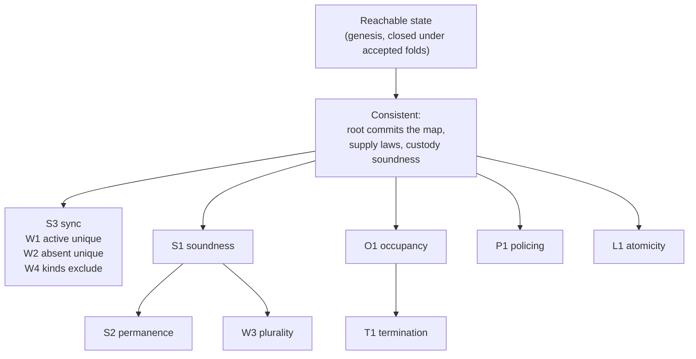

# Theorem manifest

As a proof reviewer, use this register to identify exactly which statements the
registry-mode model supplies, that each one is proved, and from which axioms.
Every declaration keeps its qualified name and a digest of its statement text, so
a changed or missing obligation is detectable rather than merely unlikely.

All 24 declarations of the registry's own statement module are **PROVED**
from the standard axioms — `propext`, `Classical.choice`, `Quot.sound` — and
nothing else. The naming instance adds 7, its lifecycle 6
and its wire encoding 5, for **42** in total, each with its own
manifest and its own compiled gate.

## What the eleven promises are

The interface states eleven guarantees the registry makes for *every*
application, and the model proves each one over states reachable from genesis by
folds. Reachability is a hypothesis, not a weakening: over an arbitrary `State`
value the supply laws are simply false.

Every promise is reached through one invariant — `Consistent` — that the model
proves survives each of the seven edges. That is why the statements read as
consequences rather than as separate arguments.

## Exact declaration inventory

| Qualified declaration | What it states | Statement SHA-256 | Status |
| --- | --- | --- | --- |
| `Singular.Statements.absent_witness_unique` | W2 — the absent witness is unique | `968c72784fe79c81a9296e74e23df3d4afa19f99a3ed616fc73d417f3e24053a` | PROVED |
| `Singular.Statements.active_witness_unique` | W1 — the active witness is unique | `76745382fd82c31a71125904f0c9e558e2ee4b770df5224ceaf41aac93ef3879` | PROVED |
| `Singular.Statements.biconditional_supply_sync` | S3 — sync: biconditional supply is 1 iff the key is in that token's state | `7f1089607f7d6578eac69fb4b68bb4147853f29c6b6ac4067eb0db9e667f3f68` | PROVED |
| `Singular.Statements.booked_at_most_once` | L1 — a key is booked at most once at a time; the batch is atomic; a request is spent once | `1c8b3268586a2ca2aaf930c3a45b0f8fde24c061f0ff63bf8962afbb42eb1ec2` | PROVED |
| `Singular.Statements.delete_absent_inversion` | — | `c9689a174e9c746e78fff3f5ee237875bce8f9f938333fefd3b3e18a73a1088b` | PROVED |
| `Singular.Statements.delete_active_inversion` | — | `9af5e32814773829e28a2db650f046f09059fe0b7f6ea0384ba2cceba2f2369b` | PROVED |
| `Singular.Statements.empty_fold_error` | — | `8bd6ec570fbda5220c7d841d4396605cf637e094bdeb275d7495f7169a4a1f06` | PROVED |
| `Singular.Statements.fold_batch_cons` | — | `48e4c5dc2c48053d54f7e534a11432df0809f53f3eb99a8bdc51d05d0da6f3cb` | PROVED |
| `Singular.Statements.insert_absent_inversion` | — | `d65e823c9af112589f84fc65ef080a18d166478eb1765144682a5d9022b3f711` | PROVED |
| `Singular.Statements.insert_active_inversion` | — | `1c492e72f96bd9676596c41015caffdf2bdbf4c6d79ae48c83204b81523cabf4` | PROVED |
| `Singular.Statements.no_tree_change_without_approval` | P1 — no tree change without an approval under the pinned policy; the pins never move | `a2fa6756fc4504f0ee55be8013dfb05cf94fde2ae06777cf62c25cfd5352ca1b` | PROVED |
| `Singular.Statements.occupancy` | O1 — a booking edge succeeds only on a key that is not taken | `f73130188c3bb9170d2a56dfaa4c965d1cd7ea93b31077d5b13f0c6b136aa876` | PROVED |
| `Singular.Statements.occupancy_free_key_succeeds` | O1, converse — a booking edge on an untaken key succeeds | `4ee0061a9b764b5548095be259818f55f9beb79907770d850ab4c082b2bbe350` | PROVED |
| `Singular.Statements.readAt_true_iff` | — | `69c6c811a286c3436e0b230319f762de5c3c89e977a8a1d075859159e87d5916` | PROVED |
| `Singular.Statements.read_changes_nothing` | — | `0a53256f91fbd4e8d4de2e8e2b9add39fc6a04ad10327d594d3f74acabdb6120` | PROVED |
| `Singular.Statements.terminal_attestation_permanent` | S2 — permanence: an attestation holds in every later state | `e133aaa076a248d60fc059e2698069b69485c9ba6f3c5a7aa4a209e224c888e2` | PROVED |
| `Singular.Statements.terminal_attestation_sound` | S1 — soundness: no attestation of an Active, Absent or Unknown key exists | `9cd4b73c811ee93427ae8eab5a96db956d0934eb20f3558117426f5b740b12ef` | PROVED |
| `Singular.Statements.terminal_mint_only_by_read` | S1 — provenance: a terminal token is minted only by a folded, verified read | `287bddd3ed1888a07b163f247fb4bdda6a4de049f26d815c5d52be9c82617639` | PROVED |
| `Singular.Statements.terminal_witness_plural` | W3 — the terminal witness is plural | `68beea77527a148a61f7f055d065aec3d1d2c3acdb25231c5c8db851a747efff` | PROVED |
| `Singular.Statements.termination` | T1 — a Terminal leaf is never moved, so the key is never re-booked | `daae0dd7f3dbce91850f546e619f4247a3a7688fbdaf6018f96e7213b5f91027` | PROVED |
| `Singular.Statements.update_active_inversion` | — | `4afa82ea2e3ed82bd530a2413a484a4fd32291f9e946bfe621e2309dadffa630` | PROVED |
| `Singular.Statements.update_terminal_inversion` | — | `4f7b5257414f293df032720fb952c04486160b6ad94a373782b54c62131d4683` | PROVED |
| `Singular.Statements.witness_kinds_exclude` | W4 — the three kinds exclude each other | `7013211d47dd903d511e417866114e9beac7d125ce81f40d3a08efbe996bfd1a` | PROVED |
| `Singular.Statements.witness_terminal_inversion` | — | `3e0bf453fa69525e78120fcc02b8130a613ae65eaa09b0020644c19362069176` | PROVED |

The naming, lifecycle and wire declarations are listed in their own manifests:
[naming-theorem-debt.json](../lean/naming-theorem-debt.json),
[lifecycle-theorem-debt.json](../lean/lifecycle-theorem-debt.json) and
[wire-theorem-debt.json](../lean/wire-theorem-debt.json).

## How this register is kept honest

A compiled gate in [Audit.lean](../lean/Singular/Audit.lean) runs while the
library elaborates: it collects the axioms of every theorem in the frozen module
and fails the build if any lies outside the three standard ones. Re-admitting a
single theorem turns the build red, so a `sorry` cannot reach this page.

`tools/check_model.py` then cross-checks three things that are easy to let drift
apart: the source declarations against the manifests, the compiled axiom report
against both, and — added by this ticket — **this page against the manifest**.
The last one exists because it was missing: before it, the page claimed 41
declarations while the manifest held 44, and three proved statements appeared
nowhere. The check is set equality, and the total above is derived from the
manifest rather than typed by hand.

## What this establishes, and what it does not

These proofs establish **properties of the model**. They do not establish that
the model is the right model, and no build ever will: that is what the operator's
rulings, the interface and the simulation are for. A theorem can also be true and
narrower than its name, so the column above says what each one states rather than
leaving the name to imply it.

The model is abstract where the chain is concrete. Commitments stand for
collision-free canonical commitments, the trie is a logical authenticated map,
and an approval's asset name is a commitment over the tuple it scopes rather than
a real BLAKE2b digest. The executable consumer supplies the real hashes; the
model fixes the complete preimages.
