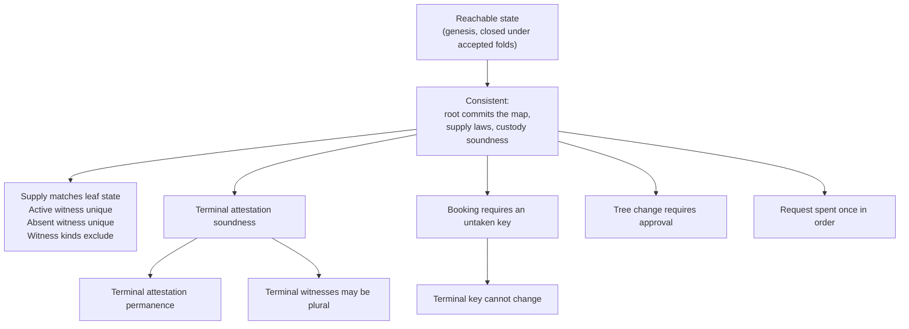

# Theorem manifest

As a proof reviewer, use this register to identify exactly which statements the
registry-mode model supplies, that each one is proved, and from which axioms.
Every declaration keeps its qualified name and a digest of its statement text, so
a changed or missing obligation is detectable rather than merely unlikely.

All 50 declarations of the registry's own statement module are **PROVED**
from the standard axioms — `propext`, `Classical.choice`, `Quot.sound` — and
nothing else. The naming instance adds 7, its lifecycle 9
and its wire encoding 5, for **71** in total, each with its own
manifest and its own compiled gate.

## What the eleven promises are

The interface states eleven guarantees the registry makes for *every*
application, and the model proves each one over states reachable from genesis by
folds. Reachability is a hypothesis, not a weakening: over an arbitrary `State`
value the supply laws are simply false.

```mermaid
flowchart TD
    G["Reachable state<br/>(genesis, closed under accepted folds)"] --> C["Consistent:<br/>root commits the map,<br/>supply laws, custody soundness"]
    C --> S3["Supply matches leaf state<br/>Active witness unique<br/>Absent witness unique<br/>Witness kinds exclude"]
    C --> S1["Terminal attestation soundness"]
    S1 --> S2["Terminal attestation permanence"]
    C --> O1["Booking requires an untaken key"]
    O1 --> T1["Terminal key cannot change"]
    C --> P1["Tree change requires approval"]
    C --> L1["Request spent once in order"]
    S1 --> W3["Terminal witnesses may be plural"]
```

Every promise is reached through one invariant — `Consistent` — that the model
proves survives each of the seven edges. That is why the statements read as
consequences rather than as separate arguments.

## Exact declaration inventory

| Qualified declaration | What it states | Statement SHA-256 | Status |
| --- | --- | --- | --- |
| `Singular.Statements.absent_witness_unique` | absent-witness-unique — the absent witness is unique | `968c72784fe79c81a9296e74e23df3d4afa19f99a3ed616fc73d417f3e24053a` | PROVED |
| `Singular.Statements.active_witness_unique` | active-witness-unique — the active witness is unique | `76745382fd82c31a71125904f0c9e558e2ee4b770df5224ceaf41aac93ef3879` | PROVED |
| `Singular.Statements.admission_refuses_first` | Retraction, before anything is paid — a retraction its admission refuses builds no transaction and is refused with admission's reason whatever it spends and pays: beside a state token, or paying its owner nothing, it still names the admission check it failed; any other exit, and an admitted retraction, is judged as before, by what it spends (`retract-state-spent`) and then what it pays | `c7ed5cabec1c955cf43772cdabcb547307d9c7023fc45dac90d347f45b61bcc7` | PROVED |
| `Singular.Statements.admitted_exit_is_the_exit` | Retraction, once admitted — an admitted retraction is the retract exit itself: its step and its transaction are exactly the exit's, so it pays what the exit owes, leaves the registry as it was and requires the owner's signature alone; a fold or a reject is unchanged whatever the retraction witness says | `3182f6fcacacf71f257ba4ddd17ec276302e04ba5342726b4833a8be51d68c38` | PROVED |
| `Singular.Statements.biconditional_supply_sync` | supply-matches-leaf-state — sync: biconditional supply is 1 iff the key is in that token's state | `7f1089607f7d6578eac69fb4b68bb4147853f29c6b6ac4067eb0db9e667f3f68` | PROVED |
| `Singular.Statements.booked_at_most_once` | request-spent-once-in-order — a key is booked at most once at a time; the batch is atomic; a request is spent once | `1c8b3268586a2ca2aaf930c3a45b0f8fde24c061f0ff63bf8962afbb42eb1ec2` | PROVED |
| `Singular.Statements.built_transaction_settles` | Every transaction an exit builds pays what the exit owes: for every state, exit, request and lovelace, a transaction the model builds settles the exit's obligations — the deposit at the cage, the named destination or the owner, and a retract's tip | `b5b45e560df2c4d3050466fd00b895dd61280d5b89c834bb2612c52c9b104796` | PROVED |
| `Singular.Statements.delete_absent_inversion` | — | `b040a97d18406c2a0be100516a5f9f5ea3f7c1bcc606a0c26eab4eb38828bce5` | PROVED |
| `Singular.Statements.delete_active_inversion` | — | `39b91a52340027b5062725a24c38ee9cb5e568518b6c44727946556be0a903f8` | PROVED |
| `Singular.Statements.delivered_datum_is_request_datum` | #419 — a delivered output carries exactly the datum its request carries, over all seven edges: inline with the request's datum when it carries one, no datum when it carries none | `76247fab5884aefffb7639b05675206c16b48c191fb0bd8c63ce87afba58c4a5` | PROVED |
| `Singular.Statements.destination_output_iff_delivers` | #304 — a fold describes a destination output exactly when it routes a token to the requester, over all seven edges: a fold that delivers nothing has no destination output, and the state, custody and owner outputs never take that role | `9fd337105c38a57f0413922e5eafc62bac2e388314b290e614d0ea805dd3a38b` | PROVED |
| `Singular.Statements.empty_fold_error` | — | `8bd6ec570fbda5220c7d841d4396605cf637e094bdeb275d7495f7169a4a1f06` | PROVED |
| `Singular.Statements.exit_settles_on_lovelace_received` | Value an exit does not owe is unconstrained, for every exit alike: when each recipient the exit owes that some output of a first list reaches is reached by some output of a second, and receives at least as much from the second as from the first — the summed lovelace of the outputs paying it by role, address and, for a destination, datum, or for a retraction's return bound to its request the largest such output — the second settles whenever the first does: adding outputs or lovelace never unsettles a transaction, and fees and the folder's tip play no part | `efdbcb44050b3bebb5c73d95e04fe8653ebe92e0c8c4a81b7b87347872427a12` | PROVED |
| `Singular.Statements.fold_admission_boundary` | The boundary of a fold's window — one request folded under a validity upper bound equal to its deadline is admitted and is exactly its step; one millisecond past it is refused `not-phase1`, as the chain's `interval.is_entirely_before` reads an excluded upper bound | `df18f10616d3a3adc8c356bd89d81076b1e256c13bde0dfaa539871d96833f1a` | PROVED |
| `Singular.Statements.fold_admitted_in_window_is_fold_batch` | Inside the window a fold is the law — a fold whose validity upper bound is at or before the deadline of every request it folds is exactly `foldBatch` | `bdb88cbaa8898e97fc22a0435a90e53388ad0c98395d550e9b620d837fb401b1` | PROVED |
| `Singular.Statements.fold_batch_claimed_mint_by_kind_key` | the fold's mint guard is per `(TokenKind, Key)`, strictly finer than a per-kind one, witnessed by a reachable state whose equal-per-kind batch is observed to be refused | `9c01e278443498d3488e6671cc1799393f565a2a1c0055c1926a8d3e559da988` | PROVED |
| `Singular.Statements.fold_batch_cons` | A fold succeeds exactly when every request applies in order, the claimed mint matches the edges', and no request consumes a holding or custody entry an earlier request of the batch creates | `a0992d97ae5b6f86503bdc5247b4b2602ec74a5516713e274c4919aa53d5d26f` | PROVED |
| `Singular.Statements.fold_batch_of_one_is_step` | A batch of one folds as its step — for one request whose claimed mint is its own edge's delta, `foldBatch` over that request alone is exactly `step`: refused for the same reason, or accepted with the same state, mint and payments | `09dc61dcbe8e7a4a68b170944bb42cdcf6ece9af9fc006af96135cfab1185f87` | PROVED |
| `Singular.Statements.fold_batch_refuses_consuming_created` | A batch cannot consume what it creates — a request consuming an active holding or a custody entry an earlier request of the same batch creates is refused, `token-missing` for a holding and `not-booked` for a custody entry, and the batch is never accepted | `0707908378fa9d1e58191e8758dbe198f7cd9dfe56974b240aedac2ece0d9b10` | PROVED |
| `Singular.Statements.fold_batch_refuses_past_deadline` | A fold past a request's deadline is refused — a fold whose validity upper bound passes the deadline of any request it folds, `submittedAt + processTime`, is refused `not-phase1`, as the chain refuses it, whatever its requests' steps | `2195f8d24a7aad10b51f42f1e5c6c578b236eb9ad736a07b6507c8ea9479b0ec` | PROVED |
| `Singular.Statements.fold_inputs_public` | #419 — fold inputs are public: the transaction a fold builds is the one any party builds from the public view, the registry state with its holdings and their datums and the request pending at the cage, found by its own output reference | `ece9dd0fd104368b34cf5bf210ed46ffca39a13ba70f05ead901d381a6cb0d1f` | PROVED |
| `Singular.Statements.fold_refuses_foreign_datum` | #419 — a foreign datum is refused: an observed fold delivering a token, whatever the request's deposit, whose every destination output carries a datum other than the request's — another value, a datum where none is carried, none where one is, a datum presented by hash — or that has no destination output at all, is refused `destination`, as the cage refuses a carrier that does not match | `959f43d652876b9ea5eff3f9772344ffbc09fa3162f669e03fe1946a3e100600` | PROVED |
| `Singular.Statements.fold_requires_no_signer` | no fold requires a signer: at every one of the seven edges the transaction the model builds has an empty signer list, and neither the step nor the transaction changes when the approval carries a different signature set | `7c24885ca77300bda88d97830ff54d237ddca2de3e3fdbd93cb1239a51a3eece` | PROVED |
| `Singular.Statements.insert_absent_inversion` | — | `b2ca14e3aa29caef0841c246964e5e64b600eef9ff64c0865677a1219d31525d` | PROVED |
| `Singular.Statements.insert_absent_transaction_row` | Complete absent-insertion transaction: refund-only custody, sole-asset key, the deposit locked at the cage and listed as its one payment, root and custody effects, keyed mint, no required signers, and no destination output | `a7e93824be2944e55b6482d0836111450522a7ed04eb57c262656f8903adaec6` | PROVED |
| `Singular.Statements.insert_active_inversion` | — | `df737501c3c51c4968eb5adcc658f74473984613c591b4886fa092c15e35dc9d` | PROVED |
| `Singular.Statements.insert_active_transaction_row` | the transaction an admitted `insertActive` builds: the whole constructed value — two inputs, two outputs, their datums, addresses and assets, the destination output holding the deposit with the token and carrying exactly the datum the request carries, inline, or none when it carries none, the deposit to the destination as its one payment, the keyed mint, no required signer — plus universal open admission and the duplicate-key refusal | `3c8d7b9bd9092b29d2bbb58ebbca15b008dc9b9396899d9d67d55ea66e1f6070` | PROVED |
| `Singular.Statements.no_exit_strands_the_deposit` | No exit strands a deposit: for every exit and every request, some payment the exit owes is at least the request's deposit | `d8e6d7f1148b6f328d7dcb5cbf9f32d760b0dcd4809257f2947946031353eaa5` | PROVED |
| `Singular.Statements.no_tree_change_without_approval` | tree-change-requires-approval — no tree change without an approval under the pinned policy; the pins never move | `a2fa6756fc4504f0ee55be8013dfb05cf94fde2ae06777cf62c25cfd5352ca1b` | PROVED |
| `Singular.Statements.obligations_read_only_the_request` | What an exit owes is read off the request alone: for every exit, two requests with the same owner, deposit, tip, destination — its address and the datum it carries — and output reference are owed the same payments; the obligations take no registry state as input | `7bafe21aa0e17e85bc8221746fe6f484e6f046fe42d237e55a3cdebe93a4017a` | PROVED |
| `Singular.Statements.occupancy` | booking-requires-untaken-key — a booking edge succeeds only on a key that is not taken | `f73130188c3bb9170d2a56dfaa4c965d1cd7ea93b31077d5b13f0c6b136aa876` | PROVED |
| `Singular.Statements.occupancy_free_key_succeeds` | booking-requires-untaken-key, converse — a booking edge on an untaken key succeeds | `4ee0061a9b764b5548095be259818f55f9beb79907770d850ab4c082b2bbe350` | PROVED |
| `Singular.Statements.only_retract_owes_the_tip` | Only a retract owes the tip: for every exit, what it owes is unchanged by the tip a request holds exactly when the exit is not a retract | `df27296176ea7a88ac2d8fcaf3047e5521838fe9dabe493183ef26ac21dd624f` | PROVED |
| `Singular.Statements.readAt_true_iff` | — | `69c6c811a286c3436e0b230319f762de5c3c89e977a8a1d075859159e87d5916` | PROVED |
| `Singular.Statements.read_changes_nothing` | — | `0a53256f91fbd4e8d4de2e8e2b9add39fc6a04ad10327d594d3f74acabdb6120` | PROVED |
| `Singular.Statements.reject_batch_of_one_is_reject` | A batch of one reject judges as the reject — the driver's judgement of a one-request batch of rejects, `settle` over its concatenated obligations, is exactly its judgement of the single reject's transaction over the same outputs, whatever inputs that transaction spends | `9f0e815f13a2ce1e41ecd3d19792aa741ade3187fb951fbce6b3fa4b87b1f42c` | PROVED |
| `Singular.Statements.retract_admitted_iff` | Retraction, when — a pending request's owner can retract it exactly when it inserts a key or reads a terminal one, the owner is among the transaction's signatories, and the validity interval lies inside phase 2: from submission plus the processing time, included, to that plus the retraction time, which the excluded upper bound may reach and not pass. The request script names this rule's refusal `not-phase2`: its exact-outcome tests admit the two endpoints themselves and refuse with that name one unit before the lower bound and one unit past the upper, and for an open interval alike | `6c9c65f00e1b9054319ae2151908af4336717df5642f31aace963aa80cb29f57` | PROVED |
| `Singular.Statements.retract_pays_exactly_its_obligations` | An executed retract pays exactly what it owes: for every registry state and request, the retract leaves the state as it was, mints nothing, and pays exactly its obligations, the deposit and the tip to the owner through an output bound to the request; nothing the state holds enters its payments | `a9ec205a3afaf4c62ff1e25f396d035fafbd25b34597e858c5468f6f77403390` | PROVED |
| `Singular.Statements.retract_refusal_first_failing` | Retraction, why not — a refused retraction names the first check it fails, in the request script's order: `withdraw-insert-only` for an update or delete request whoever signed and whenever, then `retract-owner` without the owner's signature inside phase 2 or not, then `not-phase2` | `506966483299dfa897bb988c179646373d3dfcf7a1a20728fdf0cae217197ffc` | PROVED |
| `Singular.Statements.terminal_attestation_permanent` | terminal-attestation-permanent — permanence: an attestation holds in every later state | `e133aaa076a248d60fc059e2698069b69485c9ba6f3c5a7aa4a209e224c888e2` | PROVED |
| `Singular.Statements.terminal_attestation_sound` | terminal-attestation-sound — soundness: no attestation of an Active, Absent or Unknown key exists | `9cd4b73c811ee93427ae8eab5a96db956d0934eb20f3558117426f5b740b12ef` | PROVED |
| `Singular.Statements.terminal_mint_only_by_read` | terminal-attestation-sound — provenance: a terminal token is minted only by a folded, verified read | `287bddd3ed1888a07b163f247fb4bdda6a4de049f26d815c5d52be9c82617639` | PROVED |
| `Singular.Statements.terminal_witness_plural` | terminal-witnesses-plural — the terminal witness is plural | `68beea77527a148a61f7f055d065aec3d1d2c3acdb25231c5c8db851a747efff` | PROVED |
| `Singular.Statements.termination` | terminal-key-cannot-change — a Terminal leaf is never moved, so the key is never re-booked | `daae0dd7f3dbce91850f546e619f4247a3a7688fbdaf6018f96e7213b5f91027` | PROVED |
| `Singular.Statements.update_active_inversion` | — | `038b9a1c9fb903c12d79f42f263709291ecd1573919f33b85906ae5a2ed78bae` | PROVED |
| `Singular.Statements.update_terminal_inversion` | — | `55610f5a33da76d49c9f8e5eee2170af33700b0222530d6548629960133bc470` | PROVED |
| `Singular.Statements.update_terminal_transaction_row` | the transaction an admitted `updateTerminal` builds: three inputs, the third spending the key's one active witness so the burn has a source, presenting the datum its holding carries, in form and value, two outputs — the state and an owner output with no datum returning the deposit and naming the approval it returns — the keyed mint of `-1`, the deposit to the owner as its one payment, no required signer — plus the `terminal-immutable`, `key-unknown`, `not-booked` and `token-missing` refusals, each exhibited | `4806b33d0b74c975981c8905ceb8aab758efbe5d780eca50f59e68202ea2a4bf` | PROVED |
| `Singular.Statements.witness_input_datum_is_held` | #304 — a witness a fold spends presents the datum its holding carries, over all seven edges, in its form and its value: the datum the delivering fold wrote, the request's own, so a retirement or deletion spends a witness as the chain holds it | `3ddeb0314193a02c809c78b87719c203760548449f42c538a955617534d1f44c` | PROVED |
| `Singular.Statements.witness_kinds_exclude` | witness-kinds-exclude — the three kinds exclude each other | `7013211d47dd903d511e417866114e9beac7d125ce81f40d3a08efbe996bfd1a` | PROVED |
| `Singular.Statements.witness_terminal_inversion` | — | `744464d451c58730a0619747bab570700e5ad4bf29e005e36f8302b980d3cabf` | PROVED |

The naming, lifecycle and wire declarations are listed in their own manifests:
[naming-theorem-debt.json](../lean/naming-theorem-debt.json),
[lifecycle-theorem-debt.json](../lean/lifecycle-theorem-debt.json) and
[wire-theorem-debt.json](../lean/wire-theorem-debt.json).

## How this register is kept honest

A compiled gate in [Audit.lean](../lean/Singular/Audit.lean) runs while the
library elaborates: it collects the axioms of every theorem in the frozen module
and fails the build if any lies outside the three standard ones. Re-admitting a
single theorem turns the build red, so a `sorry` cannot reach this page.

`tools/check_model.py` then cross-checks three things that are easy to let drift
apart: the source declarations against the manifests, the compiled axiom report
against both, and — added after the drift below was found — **this page against the manifest**.
The last one exists because it was missing: before it, the page claimed 41
declarations while the manifest held 44, and three proved statements appeared
nowhere. The check is set equality, and the total above is derived from the
manifest rather than typed by hand.

## What this establishes, and what it does not

These proofs establish **properties of the model**. They do not establish that
the model is the right model, and no build ever will: that is what the operator's
rulings, the interface and the simulation are for. A theorem can also be true and
narrower than its name, so the column above says what each one states rather than
leaving the name to imply it.

The model is abstract where the chain is concrete. Commitments stand for
collision-free canonical commitments, the trie is a logical authenticated map,
and an approval's asset name is a commitment over the tuple it scopes rather than
a real BLAKE2b digest. The executable consumer supplies the real hashes; the
model fixes the complete preimages.

Retraction admission is stated over a finite validity interval. Its bounds are
read off the request script's `in_phase2` and the ledger's validity interval,
whose lower bound is included and upper bound excluded. The model's bounds are
finite, so an interval open at either end is not a case it can be asked: that
is a named non-goal, not a gap waiting on a ticket, and the chain side is
pinned by the request validator's Aiken exact-outcome tests — they admit an
owner-signed retraction at the window's included lower bound and where its
excluded upper bound reaches the retraction time's end, and refuse it with
the named `not-phase2` one unit before the lower bound and one unit past the
upper, and for an interval with no lower or no upper bound alike. The finite
cases are compared live: the
retraction-window row (retract-outside-window) submits an owner-signed retraction before phase 2
and one after it on a devnet, both refused by the request script and answered
`not-phase2` by the model, which agrees on every step. The deployed validators
are compiled without traces, so this run's live refusals expose no name: they
are attributed to the applied request script, and the name itself is never
described as a live observation
(#287).
