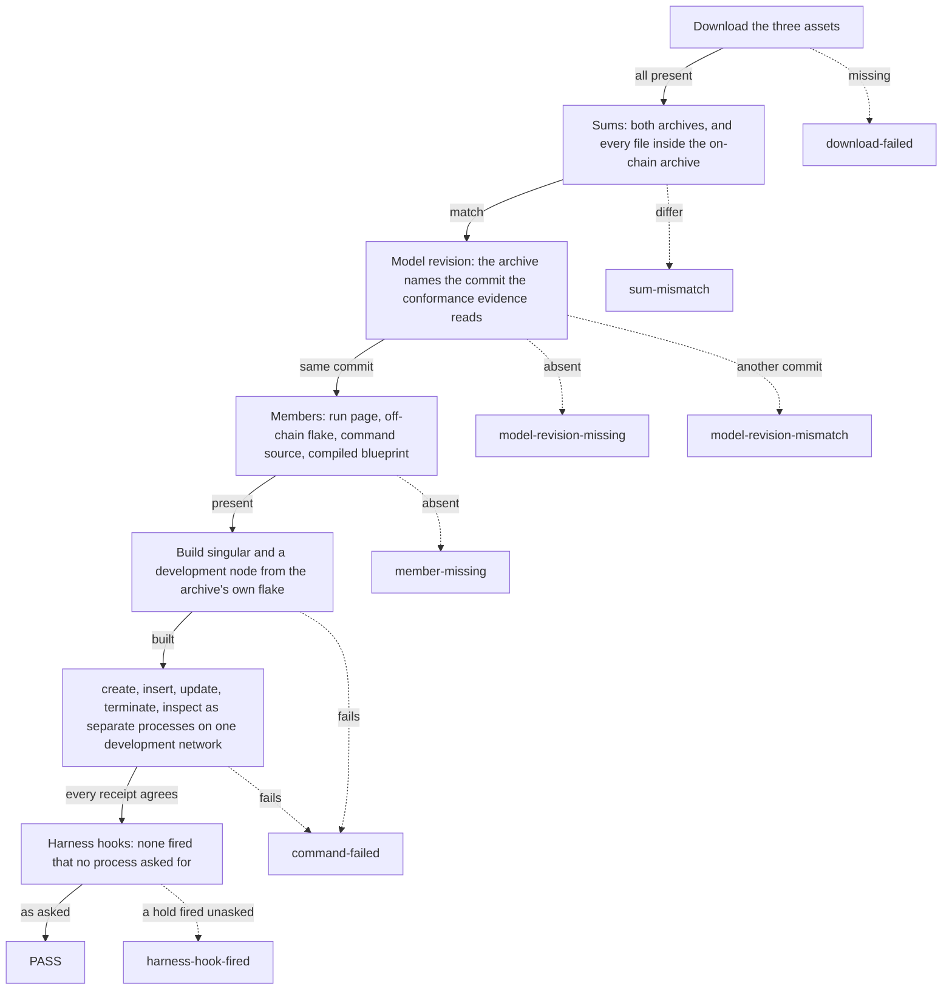

# Download and verify a release

You have cloned nothing. You want to know that a Singular release is what it
says it is before you run it: that the files you downloaded are the files
that were published, that the release names the formal model its evidence
was checked against, and that the `singular` command built from it actually
runs a registry from creation to termination. One command answers all
three, from the downloaded bytes alone, and either passes or refuses by name.

## What you run

You need [Nix](https://nixos.org/download) with flakes enabled. Nothing else:
no checkout, no credentials, no running node.

```sh
nix run github:lambdasistemi/singular/v0.8.0#verify-release -- v0.8.0
```

Name the release you are checking twice: once to choose the verifier that
release ships, once as the release to download. The verifier downloads the
release's three published assets from its GitHub release page without
logging in:

| Asset | What it is |
| --- | --- |
| `singular-onchain-X.Y.Z.tar.gz` | the compiled validators, the off-chain source with its own flake, and the run page of the `singular registry` commands |
| `singular-docs-X.Y.Z.tar.gz` | this documentation, as published |
| `SHA256SUMS` | the checksums of the two archives |

The archive is unpacked into a fresh temporary directory, never inside a
checkout. Pass `--work DIR` to choose that directory and keep what it
leaves behind: the downloaded assets, the extracted archive and the receipts
of every command the journey ran.

## What it checks, in order

Each check runs only when the ones before it passed, and the first one that
fails ends the run with one line naming why.



The model revision is the commit of the application model, the formal
specification the conformance evidence reads its statements at. The release
states it in the archive as `MODEL-REVISION`; the verifier compares it with
the revision the conformance evidence of the same release is compiled
against. The journey is the one on the archive's run page: a registry is
created, a key inserted, its payload updated and the key terminated, each a
separate `singular` process on one development network the verifier starts
and stops itself, with an `inspect` after every write.

The last check is computed from that same run. The released `singular` has
test-harness hooks, environment variables that stop a command at an exact
point for the project's own tests (see
[Connecting singular to a node](singular-node.md#test-harness-hooks)). The
verifier records which variables every process was started with, and checks
that each of the five commands ran with none set and that the hold points
that fired are exactly the ones a process asked for.

## What a refusal means

A refusal is one line, `verify-release: REFUSED <name>: <detail>`, and the
exit status is 1.

| Refusal | What it means | What to do |
| --- | --- | --- |
| `download-failed` | one of the three assets could not be downloaded | check the tag exists on the releases page and that you can reach github.com |
| `sum-mismatch` | an archive differs from `SHA256SUMS`, `SHA256SUMS` lists other files, or a file inside the on-chain archive differs from the archive's own checksum list | do not use these files; download again, and report it if the mismatch persists |
| `model-revision-missing` | the archive does not state a model revision | the release predates stated model revisions (every release before v0.8.0) or was not assembled by the release pipeline |
| `model-revision-mismatch` | the archive states a different model commit from the one the conformance evidence names | the release's evidence does not describe the model it claims; do not rely on it |
| `member-missing` | a file the verification needs is absent from the archive | the archive is incomplete; do not use it |
| `command-failed` | building `singular` from the archive, or one of the commands of the journey, failed | the detail names the step; with `--work DIR` the receipts of every command are kept there |
| `harness-hook-fired` | a test-harness hold point fired where no process asked for it, or a command ran with no process free of harness variables | the released command would stop or misbehave on its own; do not use it |

A release that passes prints its tag, both archive checksums, the model
revision and the directory it was verified in.

## Checking files you already have

If you downloaded the three assets yourself, point the verifier at their
directory; every check after the download is the same:

```sh
nix run github:lambdasistemi/singular/v0.8.0#verify-release -- --assets ./downloads v0.8.0
```

From v0.8.0 on, every release is verified this way by the release workflow
itself, right after it is published.
