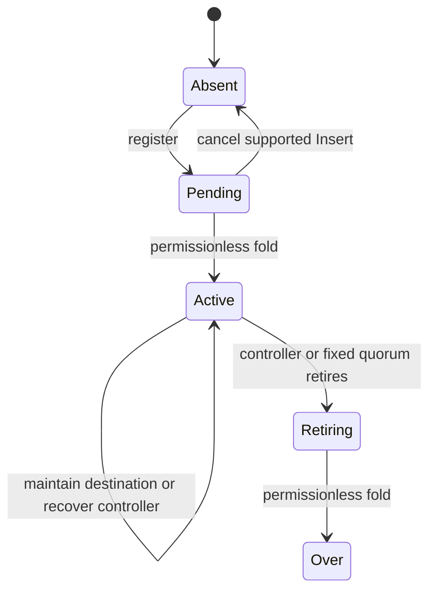

# Manage a naming registry

As a registry user, I want to install one executable, select my deployment,
and run one naming action with my own addresses and keys.

This is the implementation contract for
[issue 114](https://github.com/lambdasistemi/singular/issues/114).
The management executable is not implemented in this initial draft.

## Command contract

The target entry point is:

```text
singular-naming --deployment FILE --node-socket SOCKET --network-magic N ACTION ...
```

Actions are attach, inspect, register, maintain (alias update), cancel a
supported pending Insert, recover, retire, fold and follow. Every write names
its fee-paying wallet key; lifecycle authorization keys are supplied separately.
Help works without a node, manifest or signing key. No command implicitly
boots a registry or runs a row-test journey.



Registration reports claim and request references. Submission, pending state
and confirmed fold are distinct outcomes. Explicit claim/request references
or a mapping file provide pending Insert attachments; those inputs are not
part of the node-rebuilt registry mirror. The CLI refuses mismatched or
ambiguous pairs. Over remains permanent.

## Implementation boundary

New production modules take user parameters and reuse the generic request,
retraction and connected-fold builders. They preserve naming datums, actual
required signers, witnesses, refund destination and token custody. Existing
journey executables remain separate callers, owned by their current tickets.

Final attachment and identity adapters consume merged work from #106 and
#110. Adaptive batching is #104's responsibility; chain reconstruction is
#107's. Final acceptance consumes all four merged dependencies, without
copying a draft interface or implementing their algorithms again.

The separate deposit ticket later integrates its real deployment parameter
and committed refund address into this executable. The deposit amount is
fixed at deployment and refundable only at Over. No deposit code or inert
price option belongs in this wrapper's existing-lifecycle acceptance.

## Verification contract

The target `nix run ./offchain#naming-cli-e2e` invokes the same packaged
executable on a real isolated devnet. Separate calls register, inspect pending,
fold, inspect active, maintain, recover, retire, fold and inspect Over.
Additional calls exercise fixed-quorum retirement, cancellation and committed
refunds, follower reconstruction and adaptive batches.

A wrong controller's maintenance must be refused for the authorization reason
and preserve state; the valid controller then succeeds. Duplicate or retired
names cannot become Active, and retirement requests cannot be cancelled.
The test observes canonical identity, roots, datums, request consumption and
representative custody/burn. A temporary corrupted observation must make the
acceptance check fail. Help and source-text inspection prove none of these
ledger effects.

The exact model binding is the accepted integration revision of
`lean/Singular/Naming.lean` (`namingQueue`, `namingFoldRequest`, `namingResolve`)
and `lean/Singular/NamingLifecycle.lean` (`maintainDestination`,
`recoverController`, `beginRetirement`, `finishRetirement`, `cancelNamingClaim`).
Discovery used `fc2ad9e5987b171ca33a430f5bbe170ab6423fd5`; final evidence must bind
the actual candidate and updated dependency identities.
