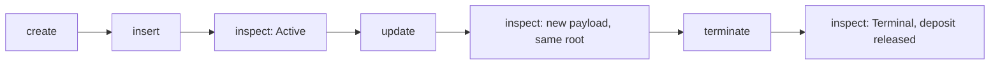

# `singular registry` — Alice's open-datum story, from this archive

You have the extracted archive and no checkout. This page is the
command's authority: what the ordinary `singular registry` commands do,
what to run, what you should see, and what they do not claim.

## The story

Alice boots a registry whose application is **open datum**: a key's live
value is an output at the application's script, holding the key's one
active token under an inline envelope. The envelope has a protected
control — this registry, its active policy, the key, the controller and a
protected deposit — and a free payload. Only the controller may replace
the payload; the deposit is released only when the registry terminates
the key.

Each step below is a separate process against one development node, and
each prints one JSON receipt. The saved registry directory carries the
identity from one process to the next.



## Build the commands

From the extracted archive:

```bash
cd offchain
singular="$(nix build --quiet --no-link --print-out-paths .#singular)/bin/singular"
devnet="$(nix build --quiet --no-link --print-out-paths .#devnet)/bin/devnet"
blueprint=../onchain/plutus.json
```

## Start one development node

The development node is private and generated: a fresh chain whose
genesis funds the wallets you name. Its keys are 32 random bytes in hex;
they fund nothing outside this node.

```bash
od -An -tx1 -N32 /dev/urandom | tr -d ' \n' > alice.skey
"$devnet" --fund-skey alice.skey --fund-outputs 4 --fund-lovelace 2000000000 > devnet.out &
sock="$(head -n1 devnet.out)"   # the node's socket, once it is printed
node=(--node-socket "$sock" --network-magic 42)
```

## Run the story

```bash
# 1. Preview the identity a seed gives, then create the registry on it.
"$singular" registry create --preview --registry reg --blueprint "$blueprint" "${node[@]}" --wallet-skey alice.skey
"$singular" registry create --seed TXID#IX --registry reg --blueprint "$blueprint" "${node[@]}" --wallet-skey alice.skey

# 2. Insert a key under an envelope naming this registry and Alice as controller.
"$singular" registry insert --registry reg --blueprint "$blueprint" --key 616c696365 \
  --envelope envelope.json "${node[@]}" --wallet-skey alice.skey

# 3. Read it back: no signing key, nothing submitted.
"$singular" registry inspect --registry reg --blueprint "$blueprint" --key 616c696365 "${node[@]}"

# 4. Replace the payload.
"$singular" registry update --registry reg --blueprint "$blueprint" --key 616c696365 \
  --payload payload.json "${node[@]}" --wallet-skey alice.skey

# 5. Read it back.
"$singular" registry inspect --registry reg --blueprint "$blueprint" --key 616c696365 "${node[@]}"

# 6. Terminate the key: the fold burns its token and releases the deposit.
"$singular" registry terminate --registry reg --blueprint "$blueprint" --key 616c696365 \
  "${node[@]}" --wallet-skey alice.skey

# 7. Read it back.
"$singular" registry inspect --registry reg --blueprint "$blueprint" --key 616c696365 "${node[@]}"
```

The envelope is Plutus data in the detailed JSON schema: constructor 0
over the control and the payload, the control being constructor 0 over
the version `1`, the registry's state asset (its state policy and token
name, as the create receipt prints them in `pins.pinState` and `token`),
the active policy (`pins.pinActive`), the key, the controller's payment
key hash (`walletKeyHash`) and the protected deposit in lovelace. The
payload, like the one `update` writes, is any Plutus data.

## What you should see

1. **`singular registry create`** prints the seed, the token, the pins — the applied
   open-datum script, the state script and the three witness policies —
   and the published reference outputs. Every later command derives the
   pins again from this archive's blueprint and the saved seed, and
   refuses a registry directory whose saved pins differ.
2. **`singular registry insert`** books the insertion through the application and folds it:
   the key's one active token lands in an output at the application,
   carrying your envelope inline.
3. **`singular registry inspect`** reads the key `active`, with the holding, its envelope and
   payload, the registry's root and the chain point it read at.
4. **`singular registry update`** replaces only the payload. The receipt's root equals the
   root before it.
5. **`singular registry inspect`** shows the new payload, the same control and deposit, and
   the same root.
6. **`singular registry terminate`** books the termination against the live holding and
   folds it: the token is burned and the protected deposit is paid back
   to the controller together with everything else the fold owes you.
7. **`singular registry inspect`** reads the key `terminal`, with no holding.

A command that stops prints why, in one outcome class with its own exit
status: `client-refusal` (nothing submitted), `ledger-refusal`,
`node-unavailable`, `timeout`, `stale-state`, `partial`,
`concurrent-writer`, `proof-missing` or `proof-inconsistent`.

## Partial outcomes and recovery

Every submission is journalled in the registry directory before it is
sent, and its confirmation after. A command never resubmits, reboots or
overwrites on its own:

- **partial** names what was left behind. An insertion of a key the
  registry already holds is booked by the application and then cannot be
  folded: the receipt names the pending request, and its deposit stays
  locked in it.
- **timeout** names the submitted transaction when its confirmation did
  not arrive within `--confirm-timeout` seconds (default 600). The entry
  stays unresolved, and every later write on that registry refuses until
  `inspect` resolves it from the chain.
- **inspect** is the recovery: it reads the journal, checks each
  unresolved submission against the chain, and advances the saved state
  only for what the chain shows.
- A second **create** on the same directory is refused, including one that
  was held while another create finished.

## What this does not claim

The open-datum application protects the payload and the deposit, nothing
more; it is a demonstration of the registry's mechanics. This page and
its receipts are evidence of behaviour on a private development node
only — not of any public network, indexing service, release or complete
conformance.
