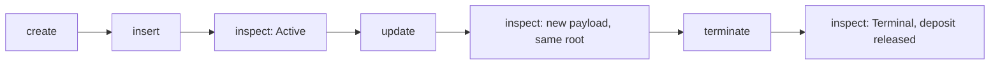

# `singular registry` — Alice's open-datum story, from this archive

You have the extracted archive and no checkout. This page is the
command's authority: what the ordinary `singular registry` commands do,
what to run, what you should see, and what they do not claim.

## The story

Alice boots a registry whose application is **open datum**: a key's live
value is an output at the application's script, holding the key's one
active token under an inline envelope. The envelope has a protected
control — this registry, its active policy, the key, the controller and a
protected deposit — and a free payload. Only the controller may replace
the payload; the deposit is released only when the registry terminates
the key.

Each step below is a separate process against one development node, and
each prints one JSON receipt. The saved registry directory carries the
identity from one process to the next.



## Build the commands

From the extracted archive:

```bash
cd offchain
singular="$(nix build --quiet --no-link --print-out-paths .#singular)/bin/singular"
devnet="$(nix build --quiet --no-link --print-out-paths .#devnet)/bin/devnet"
blueprint=../onchain/plutus.json
```

## Start one development node

The development node is private and generated: a fresh chain whose
genesis funds the wallets you name. Its keys are 32 random bytes in hex;
they fund nothing outside this node.

```bash
od -An -tx1 -N32 /dev/urandom | tr -d ' \n' > alice.skey
"$devnet" --fund-skey alice.skey --fund-outputs 4 --fund-lovelace 2000000000 > devnet.out &
sock="$(head -n1 devnet.out)"   # the node's socket, once it is printed
node=(--node-socket "$sock" --network-magic 42)
```

## Run the story

```bash
# 1. Preview the identity a seed gives, then create the registry on it.
"$singular" registry create --preview --registry reg --blueprint "$blueprint" "${node[@]}" --wallet-skey alice.skey
"$singular" registry create --seed TXID#IX --registry reg --blueprint "$blueprint" "${node[@]}" --wallet-skey alice.skey

# 2. Insert a key under an envelope naming this registry and Alice as controller.
"$singular" registry insert --registry reg --blueprint "$blueprint" --key 616c696365 \
  --envelope envelope.json "${node[@]}" --wallet-skey alice.skey

# 3. Read it back: no signing key, nothing submitted.
"$singular" registry inspect --registry reg --blueprint "$blueprint" --key 616c696365 "${node[@]}"

# 4. Replace the payload.
"$singular" registry update --registry reg --blueprint "$blueprint" --key 616c696365 \
  --payload payload.json "${node[@]}" --wallet-skey alice.skey

# 5. Read it back.
"$singular" registry inspect --registry reg --blueprint "$blueprint" --key 616c696365 "${node[@]}"

# 6. Terminate the key: the fold burns its token and releases the deposit.
"$singular" registry terminate --registry reg --blueprint "$blueprint" --key 616c696365 \
  "${node[@]}" --wallet-skey alice.skey

# 7. Read it back.
"$singular" registry inspect --registry reg --blueprint "$blueprint" --key 616c696365 "${node[@]}"
```

The envelope is Plutus data in the detailed JSON schema: constructor 0
over the control and the payload, the control being constructor 0 over
the version `1`, the registry's state asset (its state policy and token
name, as the create receipt prints them in `pins.pinState` and `token`),
the active policy (`pins.pinActive`), the key, the controller's payment
key hash (`walletKeyHash`) and the protected deposit in lovelace. The
payload, like the one `update` writes, is any Plutus data.

## What you should see

1. **`singular registry create`** prints the seed, the token, the pins — the applied
   open-datum script, the state script and the three witness policies —
   and the published reference outputs. Every later command derives the
   pins again from this archive's blueprint and the saved seed, and
   refuses a registry directory whose saved pins differ.
2. **`singular registry insert`** books the insertion through the application and folds it:
   the key's one active token lands in an output at the application,
   carrying your envelope inline.
3. **`singular registry inspect`** reads the key `active`, with the holding, its envelope and
   payload, the registry's root and the chain point it read at.
4. **`singular registry update`** replaces only the payload. The receipt's root equals the
   root before it.
5. **`singular registry inspect`** shows the new payload, the same control and deposit, and
   the same root.
6. **`singular registry terminate`** books the termination against the live holding and
   folds it: the token is burned and the protected deposit is paid back
   to the controller together with everything else the fold owes you.
7. **`singular registry inspect`** reads the key `terminal`, with no holding.

A command that stops prints why, in one outcome class with its own exit
status: `client-refusal` (nothing submitted), `ledger-refusal`,
`node-unavailable`, `timeout`, `stale-state`, `partial`,
`concurrent-writer`, `proof-missing` or `proof-inconsistent`.

## Partial outcomes and recovery

Every submission is journalled in the registry directory before it is
sent, and its confirmation after. A command never resubmits, reboots or
overwrites on its own:

- **partial** names what was left behind. An insertion of a key the
  registry already holds is booked by the application and then cannot be
  folded: the receipt names the pending request, and its deposit stays
  locked in it.
- **timeout** names the submitted transaction when its confirmation did
  not arrive within `--confirm-timeout` seconds (default 600). The entry
  stays unresolved, and every later write on that registry refuses until
  `inspect` resolves it from the chain.
- **inspect** is the recovery: it reads the journal, checks each
  unresolved submission against the chain, and advances the saved state
  only for what the chain shows.
- A second **create** on the same directory is refused, including one that
  was held while another create finished.

## On a public network

The same commands run against a public node. Nothing on this page has
been run there; receipts from such a run are published separately, and
this page only says how to make one and what stops it.

**Fund the wallet with two ada-only outputs.** The registry's first
publication is paid from an ada-only output other than the seed while the
seed stays unspent, so a wallet whose only output is the seed cannot
create: `create` and `create --preview` refuse it before anything is
submitted and name the missing output. A single funded output is first
split by an ordinary wallet transaction into a seed and a funding output.

**Preview with a public address, then write.** A preview names the caller
by an enterprise address instead of a signing key, reads through a
connection that cannot sign or send, and writes nothing: the registry
directory is byte for byte the same afterwards.

```bash
# The identity a seed gives, and what each write would cost, from public facts alone.
"$singular" registry create --preview --registry reg --blueprint "$blueprint" \
  --node-socket "$sock" --network-magic 1 --wallet-address "$address"
"$singular" registry insert --preview --registry reg --blueprint "$blueprint" --key "$key" \
  --envelope envelope.json --node-socket "$sock" --network-magic 1 --wallet-address "$address"
```

The preview receipt names the wallet outputs it selects, each body's fee,
the execution units the node's own evaluator measured for each script, the
total collateral each states and the collateral it returns, a digest of the
protocol parameters it was built under, and the outlay: the fee, the bond
the booking locks and a bound on the fold that follows. An insertion or a
termination is two transactions and the fold exists only once its booking
has confirmed, so the preview bounds the fold from the network's parameters;
the writing command measures it after the booking confirms and before it
submits it. A preview is not a confirmation: its bodies are built for one
moment.

`insert`, `update` and `terminate` take `--fund-input TXID#IX`, the wallet output
that funds and collateralises the write, and `--max-outlay LOVELACE`, past which
nothing is signed or sent. `create` and `inspect` enforce neither, so they
refuse both flags by name, before any key is read, rather than ignore them.
Every build, report and bound decision of one command rests on one snapshot of
the network's protocol parameters, read once: the preview's digest names it, and
a body is never built under another. A fee is never declared: the booking's units are measured on the
body that will be submitted, and its total collateral is stated and the
rest of its funding output returned. A funding output that cannot leave a return
of at least its minimum ada is refused before anything is submitted, never
collateralised whole.

**The four refusals on a registry that already exists.** `cli-controls`
takes an existing registry directory and a fresh key, through a node someone
else runs, and never creates a registry or starts, stops or resets a node:

```bash
cli-controls attach --singular "$singular" --blueprint "$blueprint" \
  --ledger applications/open-datum/ledgers.json \
  --node-socket "$sock" --network-magic 1 --wallet-skey wallet.skey --stranger-skey stranger.skey \
  --registry reg --key take-one --collateral-allowance 10000000 --max-outlay 40000000 \
  --readback tools/demo1_readback.sh --blockfrost-credential-file "$BLOCKFROST_KEY_FILE" --work take-one
```

It builds from this archive: make a scratch copy of the extracted tree,
`git init` and `git add` it there (Nix reads a flake from a Git tree), then
`nix build ./conformance#cli-controls`. The take inserts the key, refuses an
update another wallet's signature stands for beside the controller's own
update, refuses a release outside any fold beside the terminate that
releases the same holding inside one, and refuses a second insertion of the
Active key and an insertion of the Terminal key, each booked and then refused
at its fold. Every insertion refusal leaves its request pending, and a
registry's fold takes every pending request, so the take retracts each one as
its owner inside the request's retract window (a processing window of 120
seconds, then a retract window of 30). The retraction returns the bond and
costs its fee; the verdict requires the wallet to hold exactly that. A
refusal's submission is refused by the node and its receipt says so; whether a
node could ever collect collateral for one is not claimed, so every
node-judged transaction of the take states its total collateral within
`--collateral-allowance` and returns the rest of its funding output — read
from the body the receipt retained. The allowance is required: a take without
one is refused before it writes anything, and a transaction that states no
total, a total over it or no return is not signed.

The take reads its key from two public indexers while the key is Active: after
the controller's own update and the fresh inspect that follows it, before any
refusal of a release or the termination, it runs `tools/demo1_readback.sh`
for Koios and for Blockfrost from the policy id and asset name that inspect
names, and compares the output reference, the inline datum's bytes and hash
and the chain position with that inspect. The take keeps the script's record,
digested, and judges it from the facts it keeps, never from the summary it
states: the provider's own answers counted into the outputs holding the token,
the reported output, datum bytes and tip, each checked against those answers,
the datum's hash computed again from its bytes, and the lag measured from the
inspect's chain point against the maximum lag the take was run with. A record
whose stated verdict its facts contradict does not hold. An indexer that is
missing, unreachable, behind the node or in disagreement is never a
confirmation, and the take stops before its next write. The record's digest
proves that the bytes judged are the bytes kept; it does not prove that the
provider answered honestly, which no check here can. `--readback` and
`--blockfrost-credential-file` are required before anything is written, and
`--koios-base-url`, `--blockfrost-base-url` and `--max-lag` override the
public services and the lag allowed; the credential file is a reference the
script reads, never the take. On a development node there is no public
indexer, so `tools/demo1_cli_attach.sh` points the take at
`tools/demo1_mock_indexer.py`, a stand-in that answers in the services' shapes
from the inspect receipt the take has just written, and shows it disagree
and go unreachable.

**Fund the wallet for the whole take.** A write spends the wallet's largest
ada-only output, and an approval a booking mints returns to the wallet when
its request is folded or retracted and rides in the change output from then
on: the retraction of a refused insertion's request has the request's bond as
one output and the change, carrying the approval asset, as the other. That
output is no longer ada-only, and the next write needs another. A refusal
states its collateral from the largest ada-only output, and the balancer takes
a whole output as collateral, with no return, when what is left of it cannot
carry one. The take therefore refuses, before it writes anything, a wallet
that does not hold one ada-only output for every insert, terminate and
retraction of its story and one more, each at least the larger of the
collateral allowance and the outlay bound plus the ledger's minimum output.

The take goes on only from the outcome each step names. A booking's `partial`
stop, a refusal the node returns for the script that owns the rule, and the
ordinary commands' `success` advance the take, and only when the receipt
predicates of that step hold; a client error, an unknown or unconfirmed
submission, a timeout, a lost node, a concurrent writer or any requirement that
does not hold stops the take before its next action, with its receipts kept.
The retraction names the request the take's own insertion left pending, and
spends it only while the registry still reads as the readback that saw it
pending did: a missing, replaced or another owner's request is refused and no
other is substituted.

**Read the key back from two public indexers.** `tools/demo1_readback.sh`
starts from the policy id and asset name alone:

```bash
"$singular" registry inspect --registry reg --blueprint "$blueprint" --key "$key" \
  --node-socket "$sock" --network-magic 1 > inspect.json
tools/demo1_readback.sh --provider koios --policy "$policy" --name "$name" \
  --inspect inspect.json --out koios.json
tools/demo1_readback.sh --provider blockfrost --policy "$policy" --name "$name" \
  --inspect inspect.json --out blockfrost.json --credential-file "$BLOCKFROST_KEY_FILE"
```

It records each request and the complete response, the output the indexer
says holds the asset, its inline datum, that datum's hash recomputed here,
the indexer's own tip and the node's chain point, and the lag between them;
it succeeds only when the indexer finds exactly one output holding exactly
one of the asset and its output reference, datum bytes and datum hash are the
node's, within `--max-lag` slots. A provider that needs a key reads it from
the file named, hands it to curl on standard input, and never puts it in an
argument, the environment, a log, a receipt or a recording.

**Stopping.** Any outcome other than the one a step names, with its receipt
predicates holding, stops the take: the ordinary commands' `success`, the
booking's `partial` stop and the node's refusal at the script that owns the
rule are the only outcomes a step advances on. Inspect only, record the outcome as it is — a timeout is not a refusal
and a budget overrun is not a script's refusal — reconcile what is locked,
and continue only on a separately approved decision. Nothing resubmits,
reboots or retries by itself, and a reclaim retracts only a request the take
itself observed pending.

## What this does not claim

The open-datum application protects the payload and the deposit, nothing
more; it is a demonstration of the registry's mechanics. This page and
its receipts are evidence of behaviour on a private development node
only. Public-network receipts, when they exist, are published separately and are not
claimed here; nor is any release or complete
conformance.
