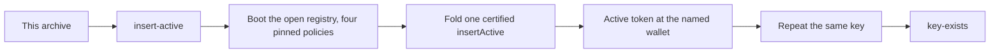

# `insert-active` — one booking on the open registry, from this archive

You have the extracted archive and no checkout. This page is the
command's authority: what it does, what to run, and what you should see.

## The story

The open registry is the application that **protects nobody by design**.
Anyone may mint an approval for any `(edge, key, owner, destination)` at
any time. Uniqueness of the active token, permanence of the terminal
token and the four witness laws hold anyway, because they are the
*registry's* laws, not the application's.

This command books one name on it:



## Run it

From the extracted archive, with a devnet-capable machine:

```bash
cd offchain
REGISTRY_BLUEPRINT=../onchain/plutus.json \
  nix run --quiet .#insert-active -- --observed /tmp/insert-active.json
```

No checkout, no `cabal`, no package index, no warm state: the binary is
Nix-built and brings its own pinned `cardano-node` on its PATH. It reads
exactly one input from you — `REGISTRY_BLUEPRINT`, the compiled
blueprint this archive carries at `onchain/plutus.json`.

**No naming blueprint is involved.** `NAMING_BLUEPRINT` need not be set,
and the command never consults it. All four registry pins come from the
one blueprint above: the parameterless `open.open` as the application
policy, and `witness.witness` applied at kinds 0, 1 and 2 for the
absent, active and terminal witnesses.

## What you should see

Four observations, in this order:

1. **Boot.** The registry boots under the open application. Its policy
   id is `open.open`'s own compiled hash — the validator takes no
   parameters, so there is no applied hash to derive and no registry
   identity baked into it.
2. **The fold.** One `insertActive` request folds, and **exactly one**
   `(activePolicy, key)` token lands in the output at the wallet the
   request named. Under each token policy the asset name IS the registry
   key.
3. **The accepting control.** A *fresh* key through the same builder
   also folds. This runs **before** the duplicate on purpose: a refused
   request is never consumed, so it would sit at the request address and
   make the next fold refuse for *its* sake rather than its own. Without
   this control, step 4 would be consistent with "this command cannot
   produce an acceptable booking at all".
4. **The refusal.** A second `insertActive` at the **same** key is
   refused. The key is taken, and the registry says so before any mint
   arithmetic runs.

`--observed PATH` writes all four as JSON. Every value in it is read
back from the chain or from the blueprint; nothing is a literal the
command writes to make an assertion pass. Where the registry's refusal
trace cannot be recovered from the ledger's error text, the field is
`null` rather than a guess.

## Two limits, stated plainly

**The refusal name covers more than occupancy.** The registry decides
"is this key free?" with the Merkle-Patricia-Forestry library's total
exclusion check, which answers *no* both for a key that is already bound
and for a malformed exclusion proof. The two are indistinguishable to
the validator, and both are refused as `key-exists`. Nothing the model
refuses is admitted — the guard errs toward refusing — but a
`key-exists` refusal on its own does not prove the key was occupied.

**This command ships on the pre-#183 request wire.** Issue #183 re-cuts
the request encoding for every edge: the edge tag replaces the operation
payload and the request's `tip` field goes away. Until it lands, this
command speaks the current bytes, and #183 re-baselines it. Nothing here
claims anything about the wire after that change.

## Cross-registry separation is a named non-goal

Two registries pinning this same open policy reach the same verdict on
the same approval. That is not an oversight to be fixed later: an
approval anyone can mint for free grants a second registry nothing it
did not already grant everyone. Separation is a property of an
application *with* authorization; this one has none, and promising it
here would be an invented requirement.
