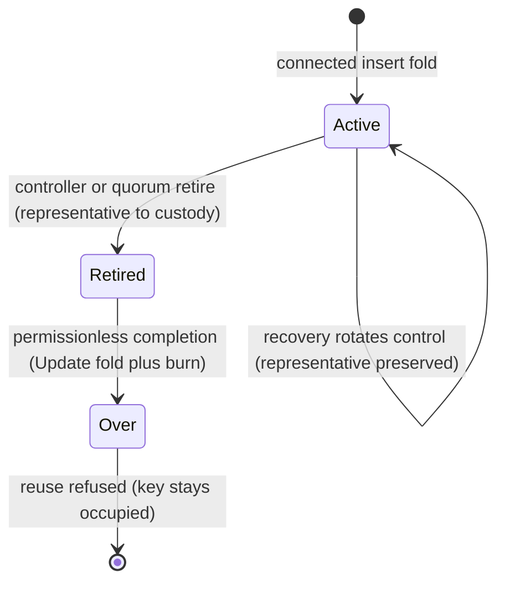

# Singular on-chain release — how to use this archive

You are an integrator who received a tagged release and wants to run
what this release verifiably carries: the bounded registry journey —
boot a registry, fold a request, apply it and read the state back —
plus the identity and contract-fixture checks, all re-derived from the
artifact itself. You need none of the repository to do it. Sections 1–4
run from this directory alone; section 5 documents retained commands
that are history, not runnable instructions. The only external
requirement is
[Nix](https://nixos.org) for the runnable parts (the identity
verification also runs without it, with just `jq`).

The archive also carries the naming-lifecycle row runners of earlier
releases (claim, recovery, retirement and their independent reader).
They are retained legacy commands: kept so the archive stays faithful
to its history, but not currently buildable and verified against this
release's source — see [the retained legacy commands](#5-the-retained-legacy-commands)
before relying on any name documented here. Release instructions are
corrected forward: a future correction changes the current source and
the archives built from it; already published archives are never rewritten, so an
older archive can still carry the previous instructions that presented
every row runner as runnable.

A zero exit is the verified journey's claim: it exits non-zero on any
mismatch, and the identity and fixture checks re-derive every binding
from retained bytes rather than trusting anyone's word.

## The naming lifecycle the retained rows exercise



Claiming writes the name, recovery rotates its control without
moving its representative, retirement moves the representative into
completion-only custody, and completion burns it while folding the
retirement's own pending registry update. The key stays occupied
forever afterwards: re-registering it is refused, which is what
"Over" means on chain. The row runners that exercised this lifecycle
end to end are the retained legacy commands of section 5; the verified
journey covers the registry protocol (boot, request, apply, read
back), not yet this naming lifecycle.

## What the archive carries

| path | contents |
|---|---|
| `onchain/` | the imported registry partition: Aiken validators, its own `flake.nix`/`flake.lock`, and `plutus.json` — the **compiled** blueprint |
| `naming-onchain/` | Singular's own naming partition: the same shape, with its compiled `plutus.json` |
| `onchain/script-identity.json`, `naming-onchain/script-identity.json` | the **pinned unapplied identities**: every validator's compiled hash and parameter count, plus the compiler string |
| `offchain/` | the verified bounded journey, the retained row runners (`offchain/journey/`), their library, and the vendored fixtures module (`offchain/naming/src/Naming/Wire/Vectors.hs`) |
| `fixtures/` | the contract fixtures — the vendored v0.2.0 wire vectors — with their provenance (`fixtures/README.md`) |
| `RELEASE.md` | an introduction to Singular and instructions for using the release archive |
| `RELEASE-COMMIT` | the commit this archive publishes; the row runners read it as their candidate revision when no git checkout is present |
| `verify-identities.sh` | the identity check of this archive, needing only `bash` and `jq` |
| `SHA256SUMS` | the checksum manifest of every file in this archive |

The pinned identities are the *unapplied* hashes — the stable,
reviewable identity of each validator. The identities a concrete
instance carries on chain are *applied* (parameterised) hashes,
derived from the pins at run time; the journey asserts that derivation
on every run.

## 1. Verify the archive

From the directory you extracted this archive into (the release's
`SHA256SUMS`, published next to the archive file, covers the archive
itself):

```sh
sha256sum --check SHA256SUMS
```

## 2. Verify the identities from this artifact

The hashes CI enforces, checked against the compiled blueprints this
archive carries — not against any repository:

```sh
bash verify-identities.sh
```

With Nix, you can instead run the exact checks CI runs:

```sh
nix build ./onchain#script-identity --no-link
nix flake check ./naming-onchain
```

## 3. The contract fixtures

The four vendored v0.2.0 wire vectors and their provenance are in
`fixtures/`. The codec suite that checks the naming datum encoding
against them runs with:

```sh
nix develop ./offchain --quiet --command bash offchain/naming/run-suite.sh
```

## 4. The runnable journey

The one lifecycle command this archive ships verified is the bounded
registry journey: the release pipeline runs it against a real devnet on
every candidate and asserts what it observes on chain — boot, request,
apply, read back, with the pinned and applied script identities. It
covers the registry protocol, not the naming lifecycle of the retained
rows below.

The journey boots a real devnet node (spawned locally,
node-to-client) and executes against it, unless you point it at a node
of your own: pass `--node-socket PATH --network-magic N --wallet-skey
FILE` (or the `SINGULAR_NODE_SOCKET`, `SINGULAR_NETWORK_MAGIC` and
`SINGULAR_WALLET_SKEY` environment variables) and the same runner
connects to your node and funds itself from your own signing key
instead. The devnet stays the default; all three settings are required
together. This two-way reachability is exercised by the release
pipeline, and the
[onboarding runbook](https://lambdasistemi.github.io/singular/docs/consumer-onboarding/)
is the end-to-end runbook for it: release download, node and wallet
setup, the funding diagnostic and the journey.

Build the two compiled blueprints from this archive's own flakes, then run
the journey from `offchain/` (it reads the pinned identity manifests from
`../onchain/` and `../naming-onchain/` by default). Use a shallow private
`TMPDIR` (the node socket path length is limited):

```sh
blueprint="$(nix build --no-link --print-out-paths ./onchain#plutus-blueprint)"
naming="$(nix build --no-link --print-out-paths ./naming-onchain#plutus-blueprint)"
export TMPDIR=/tmp/s77-exhibit REGISTRY_BLUEPRINT="$blueprint" NAMING_BLUEPRINT="$naming"
```

Then, from `offchain/`:

```sh
# the bounded registry journey (boot, request, apply, read back),
# printing the pinned and applied identities it verifies
nix run .#journey
```

The journey exits non-zero on any mismatch; a zero exit is the run's
claim. What each step does is documented in `offchain/journey/README.md`.
It retains every submitted transaction (`S77_EVIDENCE_DIR` overrides the
default evidence directory).

## 5. The retained legacy commands

The archive also carries the row runners and the independent reader of
the earlier naming design. They stay declared and shipped so the
archive remains faithful to its history. All nine are retained legacy
surfaces: not currently buildable or verified against this release's
source, and none is exercised by the release pipeline. The table below
binds each to its status and its owning issue. None of the nine has
passing build evidence at this source. Three carry direct build
failures on record from earlier revisions: `li01` at e69dce4 and
`recovery-rows` at f64ac08, both before the current integration, and
`connected-verifier` in a full-carrier build at c4a22d1 — the removed
identifiers it expects are still absent from the current library, a
source-level lead rather than a build result. The rest carry no passing
build evidence either — unverified rather than proven broken — and for
`retirement-verify` buildability is simply untested. Their re-cut
against the current registry mode is
owned by [#172](https://github.com/lambdasistemi/singular/issues/172)
— and by [#283](https://github.com/lambdasistemi/singular/issues/283)
for `register-rows`. Seven of these are the commands earlier release
instructions advertised; do not rely on any row below, and do not read
a documented name here as a working command:

| retained command | availability in this archive | repair |
| --- | --- | --- |
| `nix run .#li01` | unavailable: no passing build evidence at this source; direct build RED on record at e69dce4 (pre-rebase source) | [#172](https://github.com/lambdasistemi/singular/issues/172) |
| `nix run .#li-refusals` | unavailable: unverified, no passing build evidence | [#172](https://github.com/lambdasistemi/singular/issues/172) |
| `nix run .#naming-rows` | unavailable: unverified, no passing build evidence | [#172](https://github.com/lambdasistemi/singular/issues/172) |
| `nix run .#register-rows` | unavailable: unverified, source imports removed identifiers | [#283](https://github.com/lambdasistemi/singular/issues/283) |
| `nix run .#recovery-rows` | unavailable: no passing build evidence at this source; direct build RED on record at f64ac08 (pre-rebase source) | [#172](https://github.com/lambdasistemi/singular/issues/172) |
| `nix run .#retirement-rows` | unavailable: unverified, source imports removed identifiers | [#172](https://github.com/lambdasistemi/singular/issues/172) |
| `nix run .#retirement-verify` | unavailable: unverified, buildability untested | [#172](https://github.com/lambdasistemi/singular/issues/172) |
| `repair-rows` | unavailable: unverified, source imports removed identifiers | [#172](https://github.com/lambdasistemi/singular/issues/172) |
| `connected-verifier` | unavailable: no passing build evidence at this source; full-carrier build RED on record at c4a22d1 (pre-rebase source); the removed identifiers it expects are still absent from the library (source lead) | [#282](https://github.com/lambdasistemi/singular/issues/282) |

Two of the rows — `repair-rows` and `connected-verifier` — were never
advertised as commands in this archive or its predecessors; they are
declared executables of the shipped source, listed here so the
availability statement covers every retained declaration. What the
retained rows exercised, when they were current: the initialization,
refusal, maintenance, register, recovery and retirement rows, and the
permanent-retirement journey with controller and quorum retires,
recovery-then-retire on both routes, permissionless completion into
Over, and their attributed refusals:

```sh
# the retained legacy commands — see the availability table above
# LI01 — the canonical initialization row
nix run .#li01

# LI02–LI08 — the seven initialization refusals
nix run .#li-refusals

# LM01–LM04, WR01, LC01–LC06 — the maintenance and cancellation rows
nix run .#naming-rows

# connected inserts with real representatives (alice, bob, duplicate refused)
nix run .#register-rows

# recovery rows (rotation preserves the representative; refusals attributed)
nix run .#recovery-rows

# the permanent-retirement journey (see the retirement rows above)
nix run .#retirement-rows

# control modes (each exited non-zero by design after firing its probes):
RETIREMENT_CONTROL=valid nix run .#retirement-rows
RETIREMENT_CONTROL=wrong-reason nix run .#retirement-rows
```

The independent reader of that design, `retirement-verify`, was built
to replay a retirement exhibit from retained transaction bytes plus the
run log alone — re-deriving the creation control hash, the applied
representative policy, the registry-bound name, the custody triple, the
burn, the registry transition, the co-created request pairing and the
permissionless authorization, trusting no runner narration, no setup
constant and no key. As designed it printed one `VERIFIED` line per
retirement, one `VERIFIED-COMPLETE` per permissionless completion it
closed (or `COMPLETION-ABSENT` where custody correctly remained
intact), and failed loudly on the first mismatch. Its availability is
the row it holds in the table above.

```sh
nix run .#retirement-verify -- --evidence-dir <exhibit-dir> \
  --log-file <exhibit-log> \
  --naming-manifest ../naming-onchain/script-identity.json
```

## 6. Ordinary-user completion (what permissionless means)

In the retained design, completion needs no controller or quorum
approval: the spending transaction carries empty required signers. It
does carry exactly
one witness — the fresh fee-input owner's key, outside every route
— because ledger conservation needs the fee paid from somewhere and
a spent fee input needs its owner's witness. That witness is fee
mechanics, not approval: the custody script, the registry transition
and the burn check no signature. Calling this an empty witness set
or "no signature of any kind" would be inaccurate; calling it
operator-free is exact.

## 7. How refusals are attributed

In the retained rows, some refusals surface before submission, when
the builder locally
evaluates the transaction (the occupied-key fold, the mismatched
pair): the failure names the refusing script's hash in the
evaluation error at the exact spending purpose. Others surface on
submission as ledger phase-1 errors (a consumed output re-spent) or
phase-2 script failures naming the refusing script. The retained rows
pinned the actual shape — a budget exhaustion or a build failure is
never accepted as the claimed refusal — and the run log quotes the
full reason. The reader cross-checks the accepted transactions from
the same log against the retained bytes.

## Scope and limits

The verified part of this archive is the bounded registry journey with
the identity and fixture checks. The retained rows — claim, recovery,
retirement and permanent Over, plus all retained earlier rows — are
finite fixture executions on a devnet, not a statement about arbitrary
transactions, and none of that row evidence was re-established against
this release's source. Live-node assertions (spends accepted, refusals
with named reasons, chain reads) belong to the retained row runners;
the reader re-derives the same bindings from retained
accepted-transaction logs and bytes. Coverage debt stands
at 196 live obligations against the certified 196 baseline (192
preserved only as the historical predecessor; mapping 196,
implementation layer 196, findings 0, unclassified 83, stale 0);
the baseline ceremony belongs to the release owner. Conformance
beyond this artifact is a separate track.
