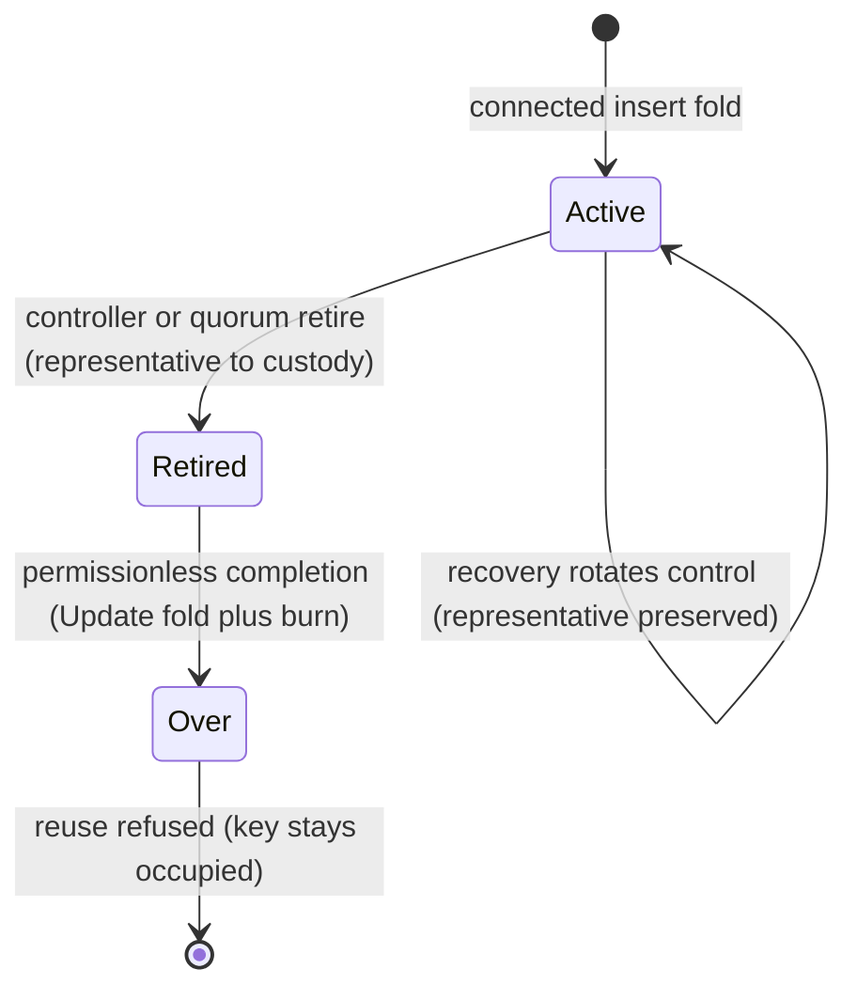

# Singular on-chain release — how to use this archive

You are an integrator who received a tagged release and wants to
replay the connected registry lifecycle from the released artifact:
claim a name, recover control, retire it through either route,
complete retirement permissionlessly, and observe the name Over —
then independently re-verify every step from retained evidence. You
need none of the repository to do it. Everything below runs from
this directory alone. The only external requirement is
[Nix](https://nixos.org) for the runnable parts (the identity
verification also runs without it, with just `jq`).

A zero exit is each run's claim: every runner exits non-zero on any
mismatch, and the independent reader re-derives every binding from
retained transaction bytes rather than trusting the runner's word.

## The lifecycle this release demonstrates



Claiming writes the name, recovery rotates its control without
moving its representative, retirement moves the representative into
completion-only custody, and completion burns it while folding the
retirement's own pending registry update. The key stays occupied
forever afterwards: re-registering it is refused, which is what
"Over" means on chain.

## What the archive carries

| path | contents |
|---|---|
| `onchain/` | the imported MPFS cage partition: Aiken validators, its own `flake.nix`/`flake.lock`, and `plutus.json` — the **compiled** blueprint |
| `naming-onchain/` | Singular's own naming partition: the same shape, with its compiled `plutus.json` |
| `onchain/script-identity.json`, `naming-onchain/script-identity.json` | the **pinned unapplied identities**: every validator's compiled hash and parameter count, plus the compiler string |
| `offchain/` | the runnable journey and the row runners (`offchain/journey/`), their library, and the vendored fixtures module (`offchain/naming/src/Naming/Wire/Vectors.hs`) |
| `fixtures/` | the contract fixtures — the vendored v0.2.0 wire vectors — with their provenance (`fixtures/README.md`) |
| `RELEASE.md` | what this release is and is not — read it before relying on any of this |
| `verify-identities.sh` | the identity check of this archive, needing only `bash` and `jq` |
| `SHA256SUMS` | the checksum manifest of every file in this archive |

The pinned identities are the *unapplied* hashes — the stable,
reviewable identity of each validator. The identities a concrete
instance carries on chain are *applied* (parameterised) hashes,
derived from the pins at run time; the journey asserts that derivation
on every run.

## 1. Verify the archive

From the directory you extracted this archive into (the release's
`SHA256SUMS`, published next to the archive file, covers the archive
itself):

```sh
sha256sum --check SHA256SUMS
```

## 2. Verify the identities from this artifact

The hashes CI enforces, checked against the compiled blueprints this
archive carries — not against any repository:

```sh
bash verify-identities.sh
```

With Nix, you can instead run the exact checks CI runs:

```sh
nix build ./onchain#script-identity --no-link
nix flake check ./naming-onchain
```

## 3. The contract fixtures

The four vendored v0.2.0 wire vectors and their provenance are in
`fixtures/`. The codec suite that checks the naming datum encoding
against them runs with:

```sh
nix develop ./offchain --quiet --command bash offchain/naming/run-suite.sh
```

## 4. The runnable journeys and row runners

Each runner boots a real devnet node (spawned locally, node-to-client)
and executes against it. Build the two compiled blueprints from this
archive's own flakes, then run the runners from `offchain/` (they read
the pinned identity manifests from `../onchain/` and
`../naming-onchain/` by default). Use a shallow private `TMPDIR` (the
node socket path length is limited):

```sh
mpfs="$(nix build --no-link --print-out-paths ./onchain#plutus-blueprint)"
naming="$(nix build --no-link --print-out-paths ./naming-onchain#plutus-blueprint)"
export TMPDIR=/tmp/s77-exhibit MPFS_BLUEPRINT="$mpfs" NAMING_BLUEPRINT="$naming"
```

Then, from `offchain/`:

```sh
# the bounded MPFS cage journey (boot, request, apply, read back),
# printing the pinned and applied identities it verifies
nix run .#journey

# LI01 — the canonical initialization row
nix run .#li01

# LI02–LI08 — the seven initialization refusals
nix run .#li-refusals

# LM01–LM04, WR01, LC01–LC06 — the maintenance and cancellation rows
nix run .#naming-rows

# connected inserts with real representatives (alice, bob, duplicate refused)
nix run .#register-rows

# recovery rows (rotation preserves the representative; refusals attributed)
nix run .#recovery-rows

# the permanent-retirement journey: controller and quorum retires,
# recovery-then-retire both routes, the over name recovered first then
# retired through its recovered controller, mismatched-pair and burn-only
# refusals, permissionless completion into Over, withdrawal/reuse/
# replay refusals, occupied-key fold refusal with fresh-key control
nix run .#retirement-rows

# control modes (each exits non-zero by design after firing its probes):
RETIREMENT_CONTROL=valid nix run .#retirement-rows
RETIREMENT_CONTROL=wrong-reason nix run .#retirement-rows
```

Every runner exits non-zero on any mismatch; a zero exit is the run's
claim. What each step does is documented in `offchain/journey/README.md`.
Runners retain every submitted transaction (`S77_EVIDENCE_DIR`
overrides the default evidence directory) so the independent reader
below can re-derive the run afterwards.

## 5. The independent reader (no node, no keys)

`retirement-verify` replays a retirement exhibit from retained
transaction bytes plus the run log alone: it re-derives the creation
control hash from claim bytes, the applied representative policy
from the creation mint, the registry-bound name, the custody triple,
the burn, the registry transition and its marker, the co-created
request pairing, and the permissionless authorization (empty required
signers, fee-owner-only witness outside every route). It trusts no
runner narration, no setup constant and no key:

```sh
nix run .#retirement-verify -- --evidence-dir <exhibit-dir> \
  --log-file <exhibit-log> \
  --naming-manifest ../naming-onchain/script-identity.json
```

It prints one `VERIFIED` line per retirement, one
`VERIFIED-COMPLETE` per permissionless completion it closes (or
`COMPLETION-ABSENT` where custody correctly remains intact), and
fails loudly on the first mismatch.

## 6. Ordinary-user completion (what permissionless means)

Completion needs no controller or quorum approval: the spending
transaction carries empty required signers. It does carry exactly
one witness — the fresh fee-input owner's key, outside every route
— because ledger conservation needs the fee paid from somewhere and
a spent fee input needs its owner's witness. That witness is fee
mechanics, not approval: the custody script, the registry transition
and the burn check no signature. Calling this an empty witness set
or "no signature of any kind" would be inaccurate; calling it
operator-free is exact.

## 7. How refusals are attributed

Some refusals surface before submission, when the builder locally
evaluates the transaction (the occupied-key fold, the mismatched
pair): the failure names the refusing script's hash in the
evaluation error at the exact spending purpose. Others surface on
submission as ledger phase-1 errors (a consumed output re-spent) or
phase-2 script failures naming the refusing script. Rows pin the
actual shape — a budget exhaustion or a build failure is never
accepted as the claimed refusal — and the run log quotes the full
reason. The reader cross-checks the accepted transactions from the
same log against the retained bytes.

## Scope and limits

Read `RELEASE.md`: this is the epic-17 delivery (connected claim,
recovery, retirement and permanent Over, plus all retained earlier
rows); the row evidence is finite fixture execution on a devnet —
not a statement about arbitrary transactions. Live-node assertions
(spends accepted, refusals with named reasons, chain reads) belong
to the row runners; the reader re-derives the same bindings from
retained accepted-transaction logs and bytes. Coverage debt stands
at 196 live obligations against the certified 196 baseline (192
preserved only as the historical predecessor; mapping 196,
implementation layer 196, findings 0, unclassified 83, stale 0);
the baseline ceremony belongs to the release owner. Conformance
beyond this artifact is a separate track.
