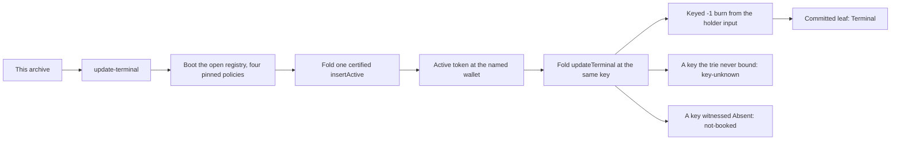

# `update-terminal` — one name ending, from this archive

You have the extracted archive and no checkout. This page is the
command's authority: what it does, what to run, and what you should see.

## The story

`insert-active` books a name. This command ends one.

Retirement is the only registry edge that destroys a token it did not
create. The active witness that `insertActive` handed to a wallet is
burned out of that wallet, the key's leaf is committed as `Terminal`,
and no output carries the witness afterwards. A name that has ended
stays ended: a second retirement at the same key builds no transaction.

The prerequisite is executed here, not assumed. The token this command
burns is the token it booked a moment earlier, in the same registry and
the same node session — a fixture dropped straight into the final state
would evidence nothing about the transition.



## Run it

From the extracted archive, with a devnet-capable machine:

```bash
cd offchain
REGISTRY_BLUEPRINT=../onchain/plutus.json \
  nix run --quiet .#update-terminal -- --observed /tmp/update-terminal.json
```

No checkout, no `cabal`, no package index, no warm state: the binary is
Nix-built and brings its own pinned `cardano-node` on its PATH. It reads
exactly one input from you — `REGISTRY_BLUEPRINT`, the compiled
blueprint this archive carries at `onchain/plutus.json`.

**No naming blueprint is involved.** `NAMING_BLUEPRINT` need not be set,
and the command never consults it. All four registry pins come from the
one blueprint above: the parameterless `open.open` as the application
policy, and `witness.witness` applied at kinds 0, 1 and 2 for the
absent, active and terminal witnesses.

## What you should see

On stdout, in order: the two policy ids the run derived, the booted
registry token, the wallet's active holding after the insert (`1`), the
same holding after the retirement (`0`), then the two refusals, then

```
update-terminal: OK — the witness was burned from its holder and the leaf is Terminal
```

The exit code repeats what the observation says, so a caller that never
opens the JSON still fails on a broken run.

## The observation

`--observed PATH` writes the run's evidence as JSON. Read that rather
than the exit code: it is the difference between "the command returned
zero" and "the name actually ended".

Under `retirement`:

| field | what it is |
|---|---|
| `activePolicy`, `key` | the policy the witness lives under, and the key that ended |
| `insertTxid`, `retireTxid` | the two transactions, distinct |
| `roots.beforeInsert`, `roots.active`, `roots.terminal` | the committed registry root at each step; all three differ |
| `quantities.before`, `quantities.after` | the wallet's holding of this witness: `1`, then `0` |
| `mint` | what the retirement moved under the active policy — exactly `[{policy, name, quantity: -1}]` |
| `source` | the input the burn consumed, by outref, read off the chain before it was spent |
| `leaf` | `"Terminal"`, read back from the committed trie |
| `unknown`, `absent` | the two refusals, each with its accepting control |

Every value is read back from the chain, the transaction, the committed
trie or the blueprint. None is a literal written by the command to make
an assertion pass.

## The two refusals, and why each carries a control

"Refused" on its own is consistent with "this command cannot fold at
all". So each refusal is paired with an ACCEPTING control taken in the
same run, through the same builder, differing in exactly one fact:

- **`unknown`** — a key that was never inserted. The control is a key
  that WAS inserted active and retires normally.
- **`absent`** — a key bound by a real `insertAbsent` fold and never
  booked. Same control; the only difference is the leaf.

The controls run before the refusals, because a refused request is never
consumed and would otherwise poison the fold that follows it.

### `trace` is usually `null`, and that is honest

The ledger's `EvalFailure` carries an empty Plutus log list, so the
cage's own trace is normally not recoverable from a submission failure.
The field records `null` rather than a guess. The reason NAMES —
`key-unknown`, `not-booked`, `terminal-immutable`, `token-missing` — are
asserted where the validator reads them, in the compiled Aiken suite
against `state.terminalRefusal` and `state.tokenMissingRefusal`. A name
printed here would be a literal this command wrote about itself.

## Limits

- One devnet, one session, one registry. The command boots its own; it
  does not attach to a running chain.
- The request wire is the pre-#183 `Operation` plus `tip`. Issue #183
  re-cuts it for every edge; nothing here claims anything about the wire
  after that.
- `token-missing` is a compiled guard against a state the model makes
  unreachable, not a story this command can tell. It has no leg in the
  observation, and its name is asserted in the Aiken suite.
