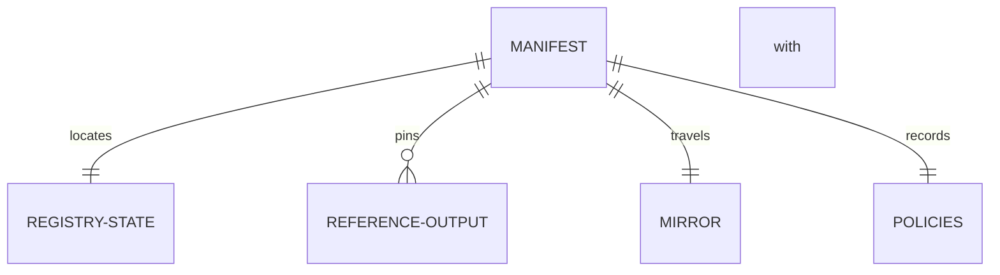

# Data

Retroactive record, written 2026-09-15 from PR #106 merged at
`f558d0e8fc916eef494fffcef09cfe2ac5582b8e`.

## Manifest

| Field | Type | Validation |
| --- | --- | --- |
| release tag | text | the release the deployment was built from |
| Lean revision | hash | the model revision the runners were built against |
| network magic | number | external-node identity |
| seed outRef | transaction reference | the bootstrap seed the registry token derives from |
| cage token | asset identity | carried by the quantity-one state output |
| applied script hashes | hashes | both blueprints, matching compilation |
| policy ids | policy ids | application and representative |
| reference-script outputs | outRefs with hashes | published once; verifier checks existence and pinned hashes |
| bootstrap transaction ids | transaction ids | the deployment's own history |

One JSON file. The verifier confirms a node agrees with it.

## Mirror

`<manifest>.mirror.json` carries the writer's current trie. Each
attached runner compares its root with the actual state output
before using it; a mismatch is an error. The mirror is a witness
source, not an authority to change the root.

## Run modes

| Mode | Registry | Reference scripts | Spellings |
| --- | --- | --- | --- |
| devnet, no flag | boots fresh | publishes | fixture spellings, full rows |
| attached | reuses recorded | reuses recorded | exact `--spelling`, duplicate rerun refuses |
| fresh negative row | boots fresh where the row says so | still uses recorded | as the row states |

## Counts

State outputs and reference-script outputs are counted before and
after every gate run. Attached journeys plus the duplicate leave
both unchanged; a fresh bootstrap increases both. The counter
observes every journey publisher address.
