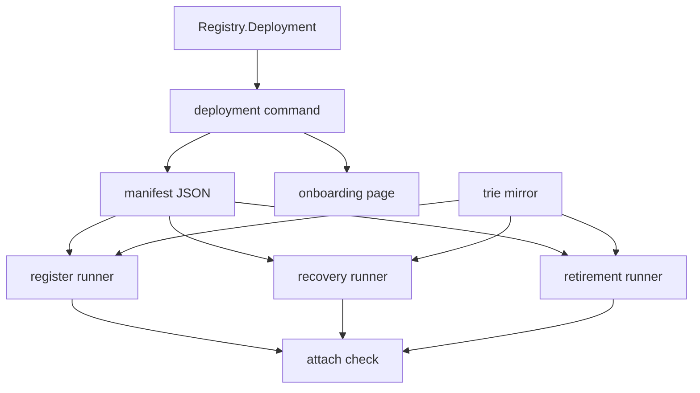

# Modules

Retroactive record, written 2026-09-15 from PR #106 merged at
`f558d0e8fc916eef494fffcef09cfe2ac5582b8e`.

## New and changed responsibilities

| Module | Responsibility | Depends on | Must not |
| --- | --- | --- | --- |
| `deployment/Main.hs` (new) | Publish once, boot once, write and verify the manifest | blueprints, joiner wallet | Run twice against one manifest |
| `Singular.Registry.Deployment` (new) | Token derivation, identity comparison, reference resolution, state location | seed, compiled scripts, chain | Treat the mirror as authority |
| journey runners | Attach to the manifest with mirror check, exact spellings, credential reuse and polled confirmations | manifest, mirror, live state | Boot or publish while attached |
| `deployment-attach-check.sh` | Shared-devnet gate with duplicate rerun and fresh-bootstrap control | the three runners | Skip the counter control |
| trie manager | Persisted mirror the writer carries | local trie | Reconstruct history from chain |
| retract builder | Tip-anchored validity against the deployed window | live tip | Widen the timing permission |
| `docs/consumer-onboarding.md` | Reader account of deployment and attach | shipped commands | Promise the canonical preprod record |

## Dependency direction

Identity flows from the deployment command into the manifest; the
manifest flows into every runner; runners keep their existing
connected transaction builders and authorization checks. Docs
describe the commands; they do not define deployment identity.

## Promotion

One new library module owned by deployment and the attached
runners. No shared extraction beyond it; no changes to Lean,
validators, workflow or CI gates.
