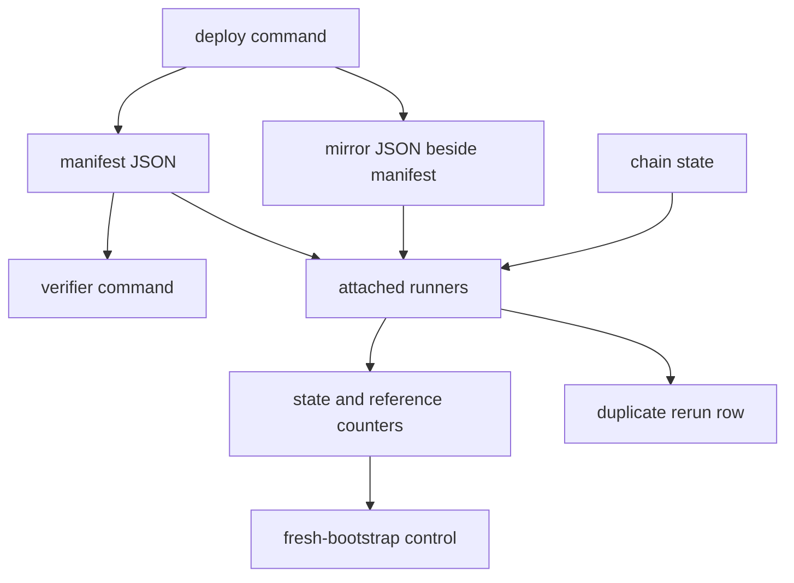

# Plan

Retroactive record, written 2026-09-15 from PR #106 merged at
`f558d0e8fc916eef494fffcef09cfe2ac5582b8e`.

## Strategy

Separate identity from execution: publish scripts and boot the
registry once into a manifest, then make every runner capable of
attaching to that manifest while devnet mode keeps booting and
publishing exactly as before. Carry the writer's trie beside the
manifest as a checked witness, never as an authority. Replace fixed
sleeps with polling and tip-anchored validity so deployed windows
hold on slow networks.

## What the diff actually built

A new `deployment/Main.hs` publishes the reference scripts and
boots the registry once from the joiner wallet, writes the
manifest, refuses a second run against it, and verifies a node
against a manifest. A new `Singular.Registry.Deployment` library
derives the registry token from the seed, compares compiled state
identity, resolves live reference outputs by recorded hash, and
locates the registry state by its quantity-one token. The three
journey runners take `--deployment`, load the mirror, compare its
root with the actual state output before using it, reuse registry
and reference outputs, keep exact spellings, handle the duplicate
rerun explicitly, reuse registered consumer and staking
credentials, pick a large funding UTxO, and poll for confirmations.
`deployment-attach-check.sh` deploys once on a shared devnet,
exercises all three attached journeys plus the duplicate, and ends
with a fresh-bootstrap counter control. Retract builds its lower
bound from a fresh chain tip and waits against the deployed window.
The onboarding doc gains the deployment account with its speech
restamped.

## Verification as shipped

`just ci` green; packaged builds pass; the full shared-devnet
attach gate exits 0 with 1 registry state and 5 reference outputs
stable across all journeys plus the duplicate, 2 states and 9
references after the fresh control, and both support retracts
accepted on live-tip bounds. The faulty counter is demonstrated
before its repair within the same PR history.

## File fence (what the merge touched)

Fifteen files, all in `offchain/` plus one docs page: the new
deployment command and registry library; the three journey
runners; the attach check; devnet, flake, lmlc, node, trie manager,
retract builder and cabal wiring; `docs/consumer-onboarding.md`
with its speech companion. No Lean, validator, workflow or
CI-required-check edits.

## Slice

One slice: persistent deployment with attached runners. Eleven
commits, oldest first — manifest and commands, runner attach,
devnet attach check, deployment docs, trie and chain for the
check, retract window and credentials, window-end wait, rename
carry-over, exact spellings, confirmation polling with credential
reuse, reference counting at every publisher.
