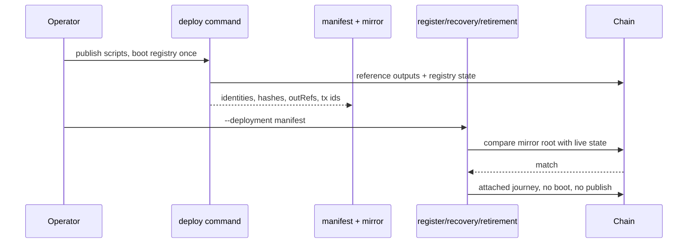

# Persistent deployment with attached runners

Retroactive record, written 2026-09-15 from PR #106 merged at
`f558d0e8fc916eef494fffcef09cfe2ac5582b8e`.

## Who this is for

A runner operator who wants every journey to use one persistent
deployment — reference scripts published once, one canonical
registry booted once — instead of each run paying to publish scripts
and creating a throwaway registry nothing else will ever see. A demo
that boots a throwaway registry is a demo of the code, not of a
deployment.

## What you can do

Deploy once from the joiner wallet, writing a JSON manifest, then
attach every runner to that manifest. Attached runs load the
accompanying trie mirror, check its root against the chain before
funding, and reuse the existing registry and reference outputs.

`register-rows --spelling NAME` uses the exact UTF-8 bytes supplied
(default `alice`); no runner adds a suffix. When the requested
spelling is already held, an attached register rerun submits the
duplicate, requires the state validator's phase-2 refusal, checks
root and live-record count stay unchanged, reports the occupied
spelling, and stops. Recovery and retirement keep their explicit
fixture spellings. A fresh register run on a node already hosting
another registry reuses the shared consumer and staking credentials
when they are already registered.

The deployment's writer carries its current trie as
`<manifest>.mirror.json` beside the manifest; a second writer
machine needs a copy, and a mismatch is an error.

## What you see when it is refused

| Attempt | Outcome |
| --- | --- |
| Run `deploy` twice against the same manifest | refused |
| Attached runner finds the mirror root differs from chain state | error before funding; reconstructing history stays later work |
| Attached register rerun on a held spelling | duplicate insert refused by the state validator, counts unchanged, run stops |
| Runner needing a fresh registry for a negative row | says so in the row and still uses the recorded reference scripts |

## Timely windows, not fixed sleeps

The support retract used to age across unrelated rows: ten waits
grew from 5 seconds to 30 seconds in external-node mode while the
30-second deployed window stayed fixed, and the observed attempt
arrived 307 seconds after its window closed. The request now lives
beside the support fold and retract rows, waits against the deployed
window, and builds its lower validity bound from a freshly queried
chain tip on each attempt. The three runners poll for the submitted
transaction's output instead of sleeping a fixed confirmation delay,
so a local devnet advances as soon as the output appears.

## Acceptance (from the shipped issue and PR body)

- `nix develop --quiet -c just ci` green on the docs record; it does
  not build the offchain runners, so the attach behaviour below is
  bound by the attach gate, not by `just ci`.
- `bash offchain/deployment-attach-check.sh`: deploys once on a
  shared devnet, counts state and reference-script outputs, runs all
  three attached journeys plus the explicit duplicate rerun, then a
  final fresh register run must increase both counters, proving the
  counters detect a new registry and publication.
- Observed at the shipped candidate: before and after all three
  journeys plus the duplicate rerun, 1 registry state and 5
  reference outputs; fresh control, 2 registry states and 9
  reference outputs. Both support retracts accepted using live-tip
  validity bounds. The counter was shown faulty by an earlier run
  (it missed one publisher address) and repaired to observe both
  publication addresses. GitHub CI: 25 successful checks, 2
  skipped, none pending or failed.
- `deploy` refuses to run twice against the same manifest; the
  verifier checks the node agrees with the manifest (reference
  outputs exist with pinned hashes; the state output carries the
  cage token).

## Deviations

The mandate is issue #102 (outcome, four-part diff, done-when,
order after #78 as the last code ticket before the preprod close).

- `docs/preprod.md` with the published manifest, the verifier
  output and the acceptance-run transaction ids is not in this
  merge; neither is the one canonical preprod deployment itself.
  The shipped PR body states this plainly: recording the canonical
  deployment, public-network attached acceptance, published
  documentation and release replay remain separate completion
  requirements, and #102 stays open. Deferred scope, not a
  behaviour disagreement. No question raised.
- The retract-window repair and the poll-instead-of-sleep
  observation go beyond the ticket's four diff items; the shipped
  PR body justifies them with the measured 457-second attempt
  against a closed 30-second window. Same lane, stated reason. No
  question raised.
- The ticket's manifest format is implemented with the mirror
  beside it per the operator's M1 ruling; devnet mode is unchanged
  throughout.

## Limits of this slice

Deposits and execution budgets for a public network are not
established here: the joiner holds 2,000 tADA while the register
fixture requests 26,000 tADA of pool outputs, and those harness
requirements must be resolved before a public run (the later
lifecycle-funding slice owns that repair). This merge does not
change the on-chain identity encoding; the spelling-derived
representative and per-registry policy integration arrive
separately. Lean is unchanged at `bbd81f2f`.
