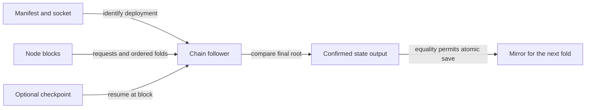

# Rebuild a registry mirror from the node

As a writer attaching on a second machine, I want the manifest and node socket to recover the trie, so I can submit a fold without copying another machine's mirror.

Accepted base and Lean binding: f558d0e8fc916eef494fffcef09cfe2ac5582b8e, lean/Singular/Model.lean foldOne, foldItems and step. The follower observes accepted transactions; it preserves their insert/update/delete order and rejected-request no-change effects through the existing request/action codec and MPF trie implementation. Ledger acceptance remains responsible for authorization, refunds and witness validation; replay does not replace those checks.

1. Add a compatible optional mirror checkpoint and bounded request/state replay data; legacy saveMirror invalidates it.
2. Implement Singular.Registry.Follower using the pinned chain-follower abstraction and node chain-sync adapter. Track bootstrap identity, request outputs, state spends, Modify actions and each resulting root. Refuse missing data or root mismatch. Resume from a valid point; fall back to replay when intersection has rolled back. Save atomically only after confirmed root equality.
3. Expose deployment follow without wallet requirements, and attach --rebuild through the existing runner/library seam.
4. Add offchain's `nix develop --quiet -c just follower-e2e`: real deploy and multiple folds, delete mirror, replay, assert equality, fold again, incremental resume, root-corruption refusal with unchanged persisted bytes. Wire it into registry.yml and update the onboarding second-machine instructions and speech.
5. Run root CI and applicable offchain checks, coordinate one preprod writer window through the desk, retain revision-bound logs, then request review. Merge only after desk sequence authorization through merge-guard; release only through the existing pipeline.

No behavior is implemented or verified at intake. Preprod completion depends on the desk's single-writer assignment. No semantic expansion, new security rule, auditor or child worker is commissioned.
