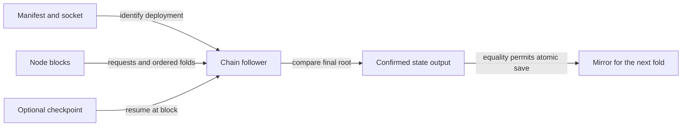

# Rebuild a registry mirror from the node

As a writer attaching on a second machine, I want the manifest and node socket to recover the trie, so I can submit a fold without copying another machine's mirror.

Accepted base and Lean binding: f558d0e8fc916eef494fffcef09cfe2ac5582b8e, lean/Singular/Model.lean foldOne, foldItems and step. The follower observes accepted transactions; it is written to preserve their insert/update/delete order and rejected-request no-change effects through the existing request/action codec and MPF trie implementation. Ledger acceptance remains responsible for authorization, refunds and witness validation; replay does not replace those checks. What that preservation claim is and is not currently backed by is stated under Verification state below.

1. Add a compatible optional mirror checkpoint and bounded request/state replay data; legacy saveMirror invalidates it.
2. Implement Singular.Registry.Follower using the pinned chain-follower abstraction and node chain-sync adapter. Track bootstrap identity, request outputs, state spends, Modify actions and each resulting root. Refuse missing data or root mismatch. Resume from a valid point; fall back to replay when intersection has rolled back. Save atomically only after confirmed root equality.
3. Expose deployment follow without wallet requirements, and attach --rebuild through the existing runner/library seam.
4. Add offchain's `nix develop --quiet -c just follower-e2e`: real deploy and multiple folds, delete mirror, replay, assert equality, fold again, incremental resume, root-corruption refusal with unchanged persisted bytes. Wire it into registry.yml and update the onboarding second-machine instructions and speech.
5. Run root CI and applicable offchain checks, coordinate one preprod writer window through the desk, retain revision-bound logs, then request review. Merge only after independent audit of the merge candidate and its gates, and desk sequence authorization, through merge-guard; release only through the existing pipeline.

## Slices

`S-follower` — OWNER. Implementation owner: separate accountable seat (Codex Astra high, worktree /code/singular-issue-107). Ticket owner authors this mandate and accepts; it does not write behaviour. Independent reviewer audits the candidate and the gates before trunk.

## Verification state

This section records what is actually demonstrated at candidate 112d20c52c276012541f71b2926018b6f64a9cbc, so no reader mistakes a written intention for an enforced one. It is maintained honestly and is not a completion claim.

| Requirement | State at 112d20c | Evidence or gap |
| --- | --- | --- |
| R-01 follow from bootstrap over chain-sync | IMPLEMENTED, DEVIATION OPEN | A cold rebuild issues FindIntersect at genesis, not at the bootstrap: the manifest records bootstrap transaction ids with no slot or block hash, so no intersection point exists to seek to. Cost is invisible on the ~455-block devnet and unmeasured at preprod scale. Desk A-001: this requirement is NOT waived and recording it here does not close it; the additive manifest chain point is a separate shared-contract dependency. |
| R-02 replay preserves insert/update/delete order and rejected no-change | IMPLEMENTED, COVERAGE OPEN | Only the insert arm is produced by any test; the follower gate queues exclusively through submitInsertRequest, so OpDelete, OpUpdate and Rejected never execute. |
| R-03 root equality gates the write, refusal by name | VERIFIED | Root-checked per fold and at the tip; the root-mismatch refusal has an executed failure control. |
| R-04 `attach --rebuild` | IMPLEMENTED, UNEXERCISED | No test or CI job passes `--rebuild`; the arms refuse under Devnet mode, the only mode any test uses. |
| R-05 checkpoint resume | VERIFIED for resume and invalidation | Earlier-rollback and intersect-not-found reset arms are executed by nothing. |
| R-06 backward-compatible mirror load | IMPLEMENTED, UNEXERCISED | Every mirror the test reads was written by this candidate and serialises an explicit null checkpoint; no fixture in the genuine pre-#107 format, with the key absent, is parsed. |
| R-07 atomic mirror write | VERIFIED | Temp-file plus rename under bracketOnError; the gate asserts byte-preservation of the previous mirror. Side effect: mirror mode moves from umask-derived to 0600. |
| R-08 devnet test in CI | PARTIAL | `just follower-e2e` runs in registry.yml. No CI job runs the offchain unit suite or fourmolu/hlint, so lint and unit regressions in this package cannot fail CI. |
| R-09 onboarding page | DONE, COMMAND UNEXERCISED | The page publishes `deployment follow`; nothing executes that entry point. |

Named refusals: eighteen ship; one (`root-mismatch`) has an executable control.

Preprod remains BLOCKED under A-002: it needs the complete verified M1 manifest, mirror, chainpoint and state handoff plus explicit writer release and desk sequencing. No preprod node, socket, credential or configuration has been touched, and the frozen "Done when" preprod observation therefore has no evidence. No registry creation, guessed manifest, migration or production secret is authorised.

No semantic expansion, new security rule or new epic is commissioned. Staffing follows the restored M4 team policy of 2026-09-15: separate ticket owner, implementation owner and independent reviewer, with independent audit of the candidate and its gates required before trunk.
