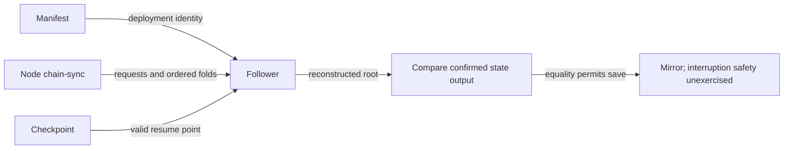

# Rebuild a registry mirror from the node

As a writer attaching on a second machine, I want the manifest and node socket
to recover the trie, so I can submit a fold without copying another machine's mirror.

## Implementation and boundaries

Accepted base and Lean binding: `f558d0e8fc916eef494fffcef09cfe2ac5582b8e`,
`lean/Singular/Model.lean`, `foldOne`, `foldItems` and `step`. The follower
observes accepted transactions and reconstructs their insert/update/delete
and rejected-no-change effects. Ledger acceptance owns authorization,
custody, refunds and witnesses; replay does not establish those properties.

The implementation adds a compatible optional checkpoint, the pinned chain
follower and node adapter, root checks, `deployment follow` and attachment
with `--rebuild`. Temp-file replacement is implemented; interruption safety
is unexercised. The repair leaves the shared manifest schema unchanged.

| Decision | Chosen over | Reason and limit |
| --- | --- | --- |
| Node chain-sync | External indexing service or copied mirror | Reconstruct accepted history directly; cold replay still begins at genesis. |
| Optional checkpoint | Mandatory new-format key | Preserve old-format loading and support resume. |
| Root equality before save | Publishing an unchecked trie | Refuse inconsistent replay; this does not prove all replay pairings correct. |
| Owner-only mode 0600 | Preserving umask-derived sharing | Deliberate local-writer ownership, asserted on create and replacement. |

## Current verification state

Product candidate: **`cc635ce75357632c5947a6b910658813992bda63`**.
`VERIFIED` means demonstrated within the named observation; `IMPLEMENTED`
means present in source; `UNEXERCISED` means no executable observation of
the claimed event; `OPEN` means an obligation remains unsatisfied.
The retained delta audit passed seven bounded rows and reported documentation
findings. This plan does not grant implementation acceptance.

| Requirement | Current label | Evidence and limit |
| --- | --- | --- |
| Follow starting at the recorded bootstrap | IMPLEMENTED; starting point OPEN | Cold replay sends FindIntersect at genesis. The manifest has transaction ids but no slot/block hash. An additive chain point is a separate shared-contract dependency. Recording the deviation does not close it; preprod-scale cost is unmeasured. |
| Replay insert/update/delete/rejected-no-change | VERIFIED for exercised constructors | Delta follower run confirms four folds; the rejected-arm mutant fails with root-mismatch. Positional pairing of mixed request/action lists remains an untested lead. |
| Root equality before publication | VERIFIED for tested paths | Checked per fold and against current state; root-mismatch preserves prior bytes. Not proof of every refusal variant. |
| Follow and attachment with rebuild | VERIFIED for invoked paths | CLI follows and rebuilds on a private magic-42 node. Rebuild reaches an existing-name duplicate refusal. A separate follower E2E proves a later successful fold; no single CLI rebuild-and-successful-fold journey is established. |
| Checkpoint resume and reset | VERIFIED for exercised callbacks | Resume, invalidation, immediate discard on earlier rollback/intersection failure, then real replay. The previously surviving reset mutant fails under the strengthened check. |
| Legacy mirror decoding | VERIFIED for old-format fixture | 108/0 unit receipt includes synthetic JSON with the checkpoint key absent; not a captured historical deployment. |
| Interrupted-write safety | IMPLEMENTED, UNEXERCISED; OPEN | Temp file plus rename under bracketOnError. No check interrupts, crashes or cancels during the write. Every byte-preservation assertion is across a named refusal, a different observable. |
| Devnet recovery and CI | VERIFIED within receipt scopes | Final focused follower 2/0; unit 108/0; CI runs units and changed-file fourmolu/HLint. Delta inspector re-executed unit/formatter controls and inspected HLint receipts. Full E2E 11/0 predates immediate-reset strengthening; it is not a full-suite run of the final test tree. |
| Onboarding follow command | IMPLEMENTED; CLI invocation VERIFIED | The CLI script executes the published command modulo its private manifest path. No permanent check binds the page text to that script. |

**Three acceptance obligations remain OPEN:** interrupted-write safety,
bootstrap-start (the blocking bootstrap finding and starting-point requirement),
and the frozen fresh-checkout preprod rebuild and successful fold.
Preprod is **unobserved** and blocked pending the complete verified milestone-one
manifest/mirror/chainpoint/state handoff, explicit writer release and desk
sequencing. No preprod node, socket, credential or configuration was touched
by the retained repair/delta checks. Recording these gaps closes none of them.

Refusal denominators: **eight logged preservation events**, **six unique names
across the checks** (including the separately asserted root-mismatch), and
**thirty source call sites**. The inventory separately records **22 uncontrolled
rows**. Those numbers count different things. Uncontrolled variants and
restoration exceptions remain a named limitation; the green controls do not
establish all refusal paths.

## Historical evidence

`112d20c52c276012541f71b2926018b6f64a9cbc` is the historical predecessor.
Its insert-only replay controls, unexercised CLI/legacy loading and old refusal
accounting are superseded by the bounded `cc635ce` observations above;
they must not be combined into a current denominator. Historical root CI and
full E2E receipts retain their actual source scopes in the command register.

The documentation-only predecessor `bf0995549ae5b83ec326227f0916e6e188d78512`
left product code unchanged but retained false narration and a wrong working
directory. This correction updates both reading modes. None of those historical
receipts establishes atomicity, bootstrap-start or preprod acceptance.

## Ownership and next decision

The documentation author owns this six-file correction and frozen runtime
handoff. The ticket owner coordinates; a fresh independent reviewer inspects
the correction. All other Git paths remain equal to `cc635ce`. No new
implementation work, manifest change, assurance campaign or sibling work is
commissioned. Review, implementation acceptance, preprod authorization,
merge and release remain separate decisions.
