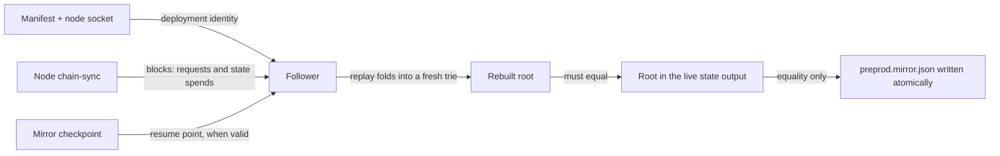

# Rebuild the registry mirror from the chain

## Who this is for

A writer who has a deployment manifest and a node socket, on a machine
that has never held the registry's mirror file, and who wants to submit
a fold without asking anyone to copy a file out of band.

## Why it is needed

Proving a key against the registry's current root needs the whole trie.
#106 carries that trie as `preprod.mirror.json` beside the manifest and
makes `attach` refuse when the mirror's root differs from the chain's.
That is correct and sufficient for one machine, and it is exactly what
strands the second one: without the file there is no fold. Readers are
unaffected — proving a key alive needs only the representative NFT.

The chain already holds everything the trie was built from. The registry
token's spending chain is the authoritative history of every fold, so a
second machine can rebuild the trie from the node instead of from a
colleague.

## What you can do

Point `deployment follow` at a manifest and a node socket. It walks the
registry token's spending chain through the node's chain-sync. Every
spend of the state output is a fold: the consumed request datums carry
key, value and operation, the fold's actions say what to do with them,
and replaying those into a fresh trie reconstructs the registry. At the
tip the rebuilt root is compared against the root in the live state
output, and `preprod.mirror.json` is written only if they are equal.

`attach --rebuild` does this for you when the mirror is missing or its
root does not match. A mirror records the last replayed point, so a
later `follow` resumes from there instead of replaying from the start.

## What you see when it is refused

Every refusal names its intended condition. A generic exception is a
defect. The follower refuses rather than publishing bytes it cannot
justify, and on refusal any existing mirror file is left untouched.

| Attempt | Intended condition |
| --- | --- |
| Rebuilt root differs from the root at the tip | `root-mismatch`, naming both roots |
| First state output is not the manifest's bootstrap | `bootstrap-identity-mismatch` |
| Node closes before the root can be verified | `node disconnected before root verification` |
| A stored checkpoint cannot be decoded | named checkpoint-decode refusal |
| A fold's action count does not match its request inputs | `request-action-count-mismatch` |
| The state output chain is broken | `registry-state-chain-broken` |
| A state spend is not a `Modify` | `unsupported-state-spend: expected Modify` |

## Requirements

| ID | Requirement |
| --- | --- |
| R-01 | `deployment follow` rebuilds the trie from the bootstrap transaction recorded in the manifest, over the node's chain-sync, with no external indexer or service. |
| R-02 | Each spend of the state output is replayed as a fold from its consumed request datums and the fold's actions, preserving insert, update and delete order and the no-change effect of a rejected request. |
| R-03 | The rebuilt root is verified equal to the root in the state output at the tip, and the mirror is written only on equality; otherwise the follower refuses by name. |
| R-04 | `attach` gains `--rebuild`, running `follow` first when no mirror exists or its root mismatches. |
| R-05 | The mirror records the last replayed point, and `follow` resumes from it rather than replaying from the start. |
| R-06 | The mirror format extension is backward compatible: a mirror written before this change still loads. |
| R-07 | Writing the mirror is atomic — an interrupted write leaves the previous mirror intact. |
| R-08 | A devnet test folds several requests, deletes the mirror, follows from the bootstrap, asserts the rebuilt root equals the chain root, and asserts a subsequent fold is accepted. It runs in CI. |
| R-09 | The onboarding page's "second machine" paragraph is replaced by the `follow` command. |

## Invariants

| ID | Invariant | Fails when |
| --- | --- | --- |
| I-ROOT | A mirror is published only when its root equals the confirmed chain root. | A rebuild publishes a trie the chain does not agree with. |
| I-REPLAY | Replay reproduces the accepted transaction's effect for every operation the module handles — insert, update, delete, and rejected-no-change. | An arm replays as the wrong operation or as a no-op. |
| I-REFUSE | Every named refusal detects its stated condition, and the existing mirror file survives any refusal. | A refusal is unreachable, or a failed run destroys a good mirror. |
| I-RESUME | Resuming from a valid checkpoint yields the same trie as a full replay; an invalid or rolled-back checkpoint falls back to full replay. | A resumed run silently skips folds. |
| I-COMPAT | A mirror written by the previous release loads without its checkpoint key present. | The new decoder requires a key old files do not have. |
| I-ATOMIC | A crash during the mirror write leaves the previous bytes intact. | A truncated mirror is left on disk. |

Replay does not re-derive custody, authorization, refunds or witness
validity. Ledger acceptance owns those, and the follower observes
transactions the ledger already accepted. Lean `foldOne`, `foldItems`
and `step` in `lean/Singular/Model.lean` govern the replay semantics.

## Observable success

`deployment follow`, given only a manifest and a node socket on a
machine with no mirror file, exits successfully and writes a
`preprod.mirror.json` whose root equals the root in the state output at
the chain tip; a fold submitted immediately afterwards is accepted.

## Out of scope

The adaptive multi-batch folder (#104), the naming executable (#114),
the deposit price rule, any external indexer or indexing service, and
any change to validator semantics.
