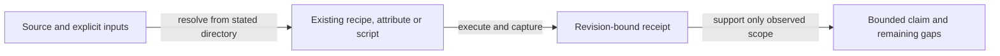

# Registry follower task record

As a writer recovering a mirror on another machine, I need to know which
claims have executable evidence and which acceptance obligations remain open.
This record describes product `cc635ce75357632c5947a6b910658813992bda63`.
Checked means the bounded observation stated beside it, not whole-ticket acceptance.

## Verified repair results

- [x] Replay all declared request/action constructors through confirmed folds; root comparison and retained mutants distinguish the exercised effects.
- [x] Refuse root mismatch and preserve the existing bytes in the tested refusal paths.
- [x] Resume and invalidate checkpoints; observe immediate reset on both callbacks before a later callback can mask a defect, then replay real blocks.
- [x] Load a synthetic genuine old-format mirror with the checkpoint key absent; the key-required mutant fails after compilation.
- [x] Execute the offchain unit binary and changed-file fourmolu/HLint through CI commands, with class controls. HLint evidence was inspected, not re-executed, by the delta inspector.
- [x] Invoke the published `deployment follow` command and journey `--rebuild` on a private node. Rebuild reaches an existing-name duplicate refusal; the separate follower E2E demonstrates a later successful fold.
- [x] Assert deliberate 0600 mirror mode, including replacement of an existing 0644 file.

The onboarding page publishes the follow command. Its text is not permanently
bound to the executing CLI script. The original seven-item repair batch is
retained in the runtime evidence; documenting the unchanged manifest and open
bootstrap deviation is an accounting task, not satisfaction of bootstrap-start.

## Open acceptance dependencies

Exactly **three acceptance obligations remain OPEN**. They are not waived:

- [ ] **Interrupted-write safety — IMPLEMENTED, UNEXERCISED.** Temp file plus rename under `bracketOnError` is the implementation shape. No check interrupts, crashes or cancels a process during that write. All byte-preservation assertions cross a named refusal, a different observable. A controlled-interruption check remains required.
- [ ] **Bootstrap-start — OPEN, blocking.** Cold rebuild seeks genesis, because the manifest lacks a slot/block hash for the recorded bootstrap. Genesis replay does not satisfy the required starting point. The additive chain point belongs to a separate shared-contract dependency. Recording the deviation does not close the requirement or finding.
- [ ] **Fresh-checkout preprod rebuild and successful fold — OPEN, unobserved.** The complete verified milestone-one manifest/mirror/chainpoint/state handoff, explicit writer release and desk sequencing are required before that observation. Private magic-42 evidence does not satisfy it.

## Refusal coverage and follow-ups

The retained run has **eight logged preservation events**. Across the checks,
including the separate root-mismatch assertion, there are **six unique names**.
The source inventory has **thirty refusal call sites**, of which **22 inventory
rows remain uncontrolled**. These denominators are distinct. The restore
wrapper's CBOR path is exercised while arbitrary restoration exceptions remain
uncontrolled; no all-refusals claim follows from the logged count.

The runtime follow-up register retains uncontrolled variants, baseline lint
debt, the separate CLI/E2E journeys, async rethrow in `namedBoundary`,
live-query disconnection detection, positional request/action pairing,
documentation drift, the default offchain lint/flake-check concern and the
pre-existing magic-42 branch. These residuals and source-derived leads are not
newly demonstrated defects. Automatic documentation drift checking remains an
open follow-up, separate from the three acceptance obligations above.

## Reproducible commands

Each working directory is relative to the repository root. The frozen base
input below is `f558d0e8fc916eef494fffcef09cfe2ac5582b8e`.
Receipts belong to their stated source vintage; this documentation correction
does not rerun every product gate. No `gate.sh` is supplied.

| Command | Working directory | Inputs and actual entry | Retained execution and limit |
| --- | --- | --- | --- |
| `nix develop --quiet -c just follower-e2e` | `offchain/` | Recipe builds `../onchain#plutus-blueprint` and runs `.#cage-tests-e2e` with the registry-follower match and pinned node. | Delta E01 at cc635ce, 2 examples/0 failures; focused recovery and constructor checks. |
| `nix develop --quiet -c just e2e` | `offchain/` | Recipe builds the registry blueprint, sets REGISTRY_BLUEPRINT and runs the wrapped full E2E binary. | Repair `e2e-full-green-01`, 11/0, before immediate-reset strengthening; historical scope. |
| `nix build -L --no-link --print-out-paths .#checks.x86_64-linux.cage-tests` | **`offchain/`** | Exported by offchain flake from `offchain/nix/checks.nix`; runCommand executes the unit binary and retains unit-tests.log. | Delta E04/E04b at cc635ce, 108/0; attribute also freshly built from this directory for this correction, receipt E01-unit-attribute. |
| `bash lint-changes.sh f558d0e8fc916eef494fffcef09cfe2ac5582b8e` | `offchain/` | Script computes merge-base selection, includes untracked Haskell sources and passes explicit files to the lint derivation. | Delta E06 at cc635ce, exit 0. Changed-file scope; not a repository-wide clean claim. |
| `bash test/lint-selection.sh` | `offchain/` | Existing selector controls create their own temporary Git fixtures. | Delta C01 exit 0; three selector mutations independently fail. |
| `bash follower-cli-check.sh` | `offchain/` | Builds registry/naming blueprints and deployment/devnet/register-rows; creates private magic-42 socket, manifest and key. | Delta E08 at cc635ce, exit 0. Follow succeeds; rebuild reaches duplicate refusal. |
| `nix develop --quiet -c just ci` | repository root | Root justfile runs model, simulator, browser, docs/site, presentation and rename checks. | Repair `root-ci-green-02`: historical pre-correction receipt, not a fresh run on these six files. |

## Handback

One local documentation commit and frozen claim-comparison and follow-up
artifacts go to the ticket owner for fresh independent review. Before commit,
read full unfiltered status and require an empty index; commit with the explicit
six-file pathspec. Prove every other Git path equals `cc635ce` and the
change from `bf09955` is confined to those six files. No push, merge,
release or preprod action is authorized.
