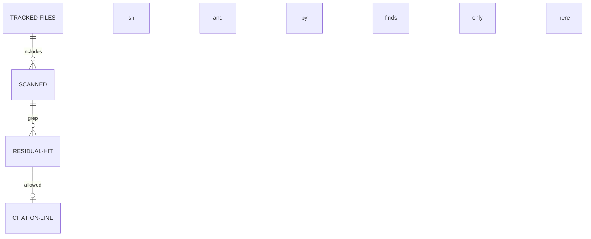

# Data

Retroactive record, written 2026-09-15 from PR #109 merged at
`fc2ad9e5987b171ca33a430f5bbe170ab6423fd5`.

## Scan universe

| Field | Type | Validation |
| --- | --- | --- |
| scanned kinds | tracked text files | the previous list plus `*.sh` and `*.py` |
| residual hit | grep match | any product mention outside the tool and its test |
| allowed hit | grep match | sits on a `cardano-mpfs-onchain#100` or `#101` citation line, either spacing form |
| gate verdict | pass or named files | pass only when every hit is allowed |

## Exemptions

The rename tool and its test are exempt from both scan and gate:
they must keep naming the product they rename.

## Test states

First run completes with the gate passing on a clean main;
second run leaves index state and every tracked file's bytes
unchanged with the gate passing again; a planted stray product
line in a tracked `.sh` makes `--gate-only` fail naming that
file.
