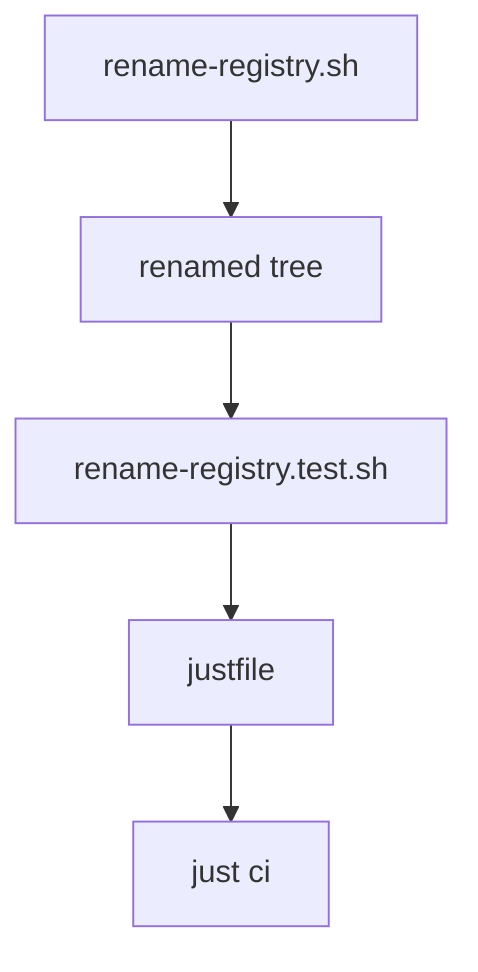

# Modules

Retroactive record, written 2026-09-15 from PR #109 merged at
`fc2ad9e5987b171ca33a430f5bbe170ab6423fd5`.

## New and changed responsibilities

| Module | Responsibility | Depends on | Must not |
| --- | --- | --- | --- |
| `tools/rename-registry.sh` | Rewrite product mentions across all text kinds and self-check with a derived allowlist | tracked tree, upstream citation lines | Keep a hand allowlist or skip shell and Python files |
| `tools/rename-registry.test.sh` (new) | Prove clean-tree pass, second-run no-op and planted-stray failure on a throwaway worktree | the script, main | Leave worktrees behind |
| `justfile` | Run the test as `rename-registry-test` inside `just ci` | the test script | Gate product behaviour on it |

## Dependency direction

The tool rewrites the tree; the test drives the tool; the recipe
wires the test into the docs gate. Nothing in this slice feeds
back into product code.

## Promotion

No new shared modules. The derived-allowlist rule lives in the
tool; the twice-run discipline lives in its test.
