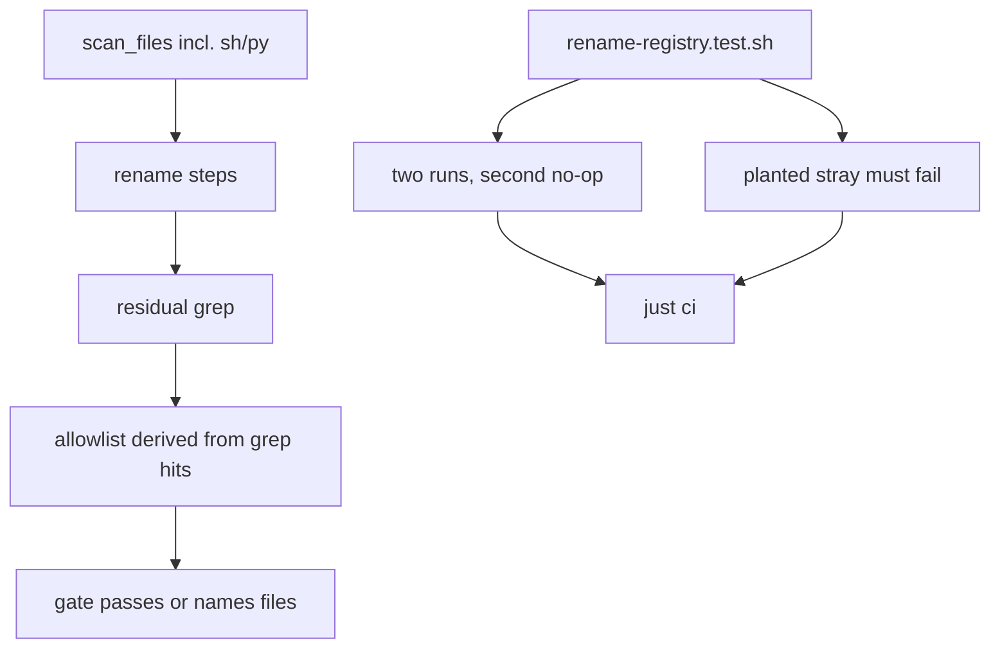

# Plan

Retroactive record, written 2026-09-15 from PR #109 merged at
`fc2ad9e5987b171ca33a430f5bbe170ab6423fd5`.

## Strategy

Fix the tool's two self-inflicted defects without touching what
the rename rewrites: widen the scan to the file kinds a branch can
carry, and replace the hand allowlist with a rule computed from
the same grep the gate runs, so the gate can neither miss a file
nor fail a clean tree.

## What the diff actually built

`tools/rename-registry.sh` scans `*.sh` and `*.py` alongside the
existing kinds; its final gate keeps a file only when every one
of its matches sits on a `cardano-mpfs-onchain#100/#101` citation
line, derived from the grep output rather than a hand list. The
new `tools/rename-registry.test.sh` drives the script twice on a
throwaway detached worktree cut from main — snapshotting index
state plus every tracked file's bytes to prove the no-op — then
plants a stray product line in a tracked `.sh` and requires
`--gate-only` to fail naming that file. The `justfile` wires the
test into `just ci` as `rename-registry-test`.

## Verification as shipped

`just ci` green including the new test; the test fails at run 1
against the pre-fix script and its weakened-derivation control
fires; the gate passes on a clean main.

## File fence (what the merge touched)

Three files: `tools/rename-registry.sh`,
`tools/rename-registry.test.sh` (new), `justfile`. No Lean,
validator, runner, docs, workflow or CI-required-check edits.

## Slice

One slice: the rename gate that scans shells and derives its
allowlist. One commit: `fix(tools): scan sh/py files and derive
the rename gate allowlist (#108)`.
