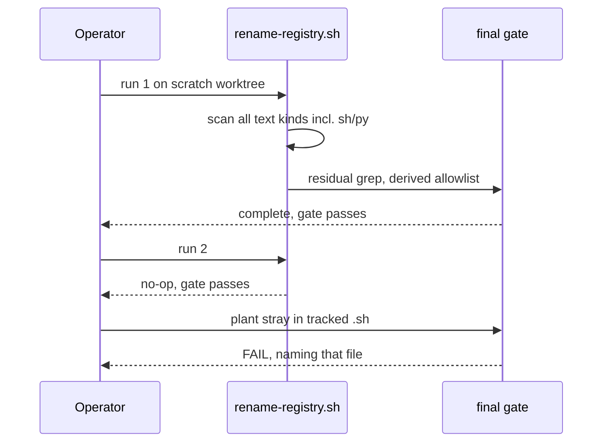

# Rename script scans shells and derives its gate

Retroactive record, written 2026-09-15 from PR #109 merged at
`fc2ad9e5987b171ca33a430f5bbe170ab6423fd5`.

## Who this is for

Anyone who runs `tools/rename-registry.sh` on a branch cut before
the registry rename and expects two things: it scans every tracked
text file kind, and its final gate passes on a tree with no product
mentions left.

## What was broken

The first re-run on a branch found two defects in the tool itself:

1. The final gate fails on main itself. The residual check reports
   product mentions remaining outside the citation files and lists
   the eight `cardano-mpfs-onchain#100/#101` citation lines from a
   file its hand-written allowlist does not name. Every rename
   step completes; only the self-check is wrong, and it is wrong
   for everyone who runs the script.
2. Shell scripts are never scanned. The scan list names Haskell,
   Cabal, Nix, Markdown, JSON, Aiken, YAML, TOML and the justfile;
   a tracked `*.sh` kept `export MPFS_BLUEPRINT` past the rename
   and had to be fixed by hand.

## What you can do

Run the script twice on a scratch worktree of main: the first run
completes with the gate passing, and the second run is a byte-for-
byte no-op with the gate passing again. The scan now covers `*.sh`
and `*.py` alongside the other text kinds, and the gate derives its
allowed residuals from the same grep it runs — a file survives only
if every one of its matches sits on an upstream citation line.

## Acceptance (from the shipped issue and PR body)

- `nix develop --quiet -c just ci`, which includes
  `just rename-registry-test`: green. Unlike the sibling slices,
  this change is bound by `just ci` itself because the new test
  runs inside it.
- `bash tools/rename-registry.test.sh`: cuts a scratch worktree
  from main, drives the rename twice (second run byte-for-byte
  no-op, gate passes), then plants
  `export MPFS_BLUEPRINT=/tmp/mpfs-blueprint.json` in a tracked
  `.sh` and asserts `rename-registry.sh --gate-only` fails naming
  that file.
- Falsified both ways: against the pre-fix script the test fails
  at run 1 (the reported gate failure), and with the derivation
  weakened to accept everything the control fires.
- Merged with a merge commit when CI is green.

## Deviations

The mandate is issue #108 (outcome, two defects, three diff
items, found-by line, refs #96). The diff implements every item:
`*.sh` and `*.py` in the scan, the derived allowlist, and the
twice-run test with the negative control. No departure found. No
question raised.

## Limits of this slice

The gate still cannot see tokens shaped with underscores: `_` is
a word character, so a word-match grep never matches them, and
scanning `.sh`/`.py` is what removes them — the negative control
plants a line carrying a bare word for exactly that reason. Both
citation forms on main (with and without a space before `#100`)
are matched. The rename tool and its test are exempt from the
scan and the gate because they must keep naming the product they
rename. Governance-only for the rename machinery: no runtime
product behaviour changes; Lean, proofs and simulator untouched.
