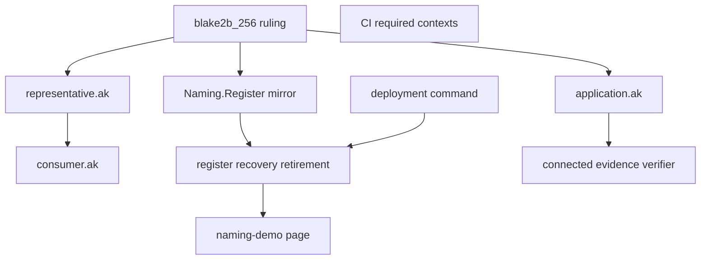

# Modules

Retroactive record, written 2026-09-15 from PR #112 merged at
`b4a36eaf72d8a355d9048a00081a8f999c195e27`.

## New and changed responsibilities

| Module | Responsibility | Depends on | Must not |
| --- | --- | --- | --- |
| `application.ak` | Name equation, fold binding, retire and burn binding, withdrawal-witness requirement | folded request key, referenced registry credential | Gate the name on controller, registry bytes, prefix or incarnation |
| `representative.ak` | Registry-scoped mint, burn and withdraw under application and registry parameters | exact registry credential and token | Mint for a foreign registry |
| `consumer.ak` | Request-name checks under the same equation | current blueprint and manifest | Keep a second name encoding |
| `Naming.Register` | Byte-for-byte Haskell mirror and parameter plumbing | validator equation | Drift from the on-chain hash |
| journey runners | Seed-before-policy bootstrap, attached derivation, connected folds with named refusals | deployment manifest, live state | Invent security beyond the ruled equation |
| evidence verifier | Actual name, applied policy and connected transition from accepted records | retained outputs | Count a retained refused probe as a spender |
| `docs/naming-demo.md` | Reader paragraph with the exact hash command and Over-versus-unclaimed | deployed policy | Controller-derived name text |
| CI workflows | Required contexts present on every pull request; artifacts-only build gate | workflow triggers | Change the name equation |

## Dependency direction

The ruling flows into validators and mirror together; journeys and
verifiers consume both; docs describe the deployed result. Lean
stays upstream and unchanged — nothing in this slice imports a new
model obligation.

## Promotion

No new shared library. The registry parameter is promoted into the
representative policy head because mint, burn and withdraw all
enforce it; the application validator stays unparameterized.
