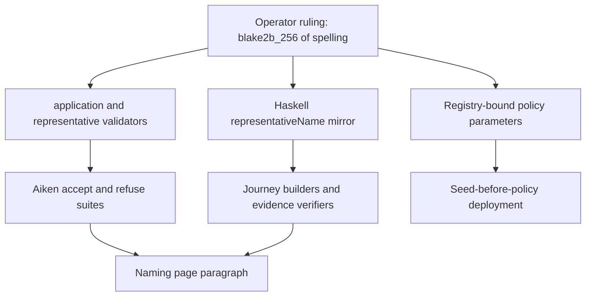

# Plan

Retroactive record, written 2026-09-15 from PR #112 merged at
`b4a36eaf72d8a355d9048a00081a8f999c195e27`.

## Strategy

Put the ruled equation in every place a representative name is
produced or checked — validators, Haskell mirror, journey builders,
evidence verifiers — while the model stays frozen. Move the registry
distinction into the representative policy parameters, regenerate
every pinned identity the hash change moves, and prove the equation
with a check that cannot pass by accident plus on-chain negative
controls.

## What the diff actually built

`application.ak` computes `representative_name` as
`blake2b_256(key)` over the folded request's key, with the control
hash and registry-id preimage removed; the fold arm binds the mint
to the key drawn from the processed Insert, and the retire and burn
arms bind the same way. `representative.ak` is parameterized by
application policy and registry asset identity, checks that exact
registry and its executing policy on mint and burn, and executes
through a withdrawal witness that the application requires at the
credential read from the referenced state.
`consumer.ak` carries the same name equation for its request-name
checks. `Naming/Register.hs` mirrors the equation byte for byte,
and every Haskell call site passes the new parameters. Deployment
selects the seed before applying the registry parameter, records the
policy, registers the stake credential, and attached runners derive
that policy from the manifest seed with verification against the
compiled policy, the manifest and live state. The naming page shows
the exact hash command and tells permanent Over apart from
unclaimed. CI keeps all required check contexts present on every
pull request and builds package artifacts only in the build gate.

## Verification as shipped

`just ci` green; Aiken naming 135/135 and on-chain 145/145;
consumer 145/145; Haskell 104/104; script-identity builds;
devnet alice and bob folds with the `e11d8149…` mint; planted
newline preimage fails and is removed; wrong-name and
cross-registry folds refused; retirement journey exit 0 with the
witnessed and witnessless controls behaving as ruled.

## File fence (what the merge touched)

Thirty-six files, all outside `lean/`: naming validators, tests and
fixtures; the representative and custody validators and their tests;
the consumer validator and its tests; script identities and release
wiring; the attach check, deployment command, journey runners,
registry library, naming correspondence note and Haskell mirror;
register and retire-verify specs; the naming docs page and its
speech companion; CI workflows.

## Slice

One slice: the computable representative name with registry-bound
policy and witnessed retirement. Nine commits, oldest first —
policy binding, spelling derivation with retirement witness,
registry-refusal evidence, Over-versus-unclaimed docs, deployment
integration, attached-identity verification, two CI scoping fixes,
and reference-publication preservation.
