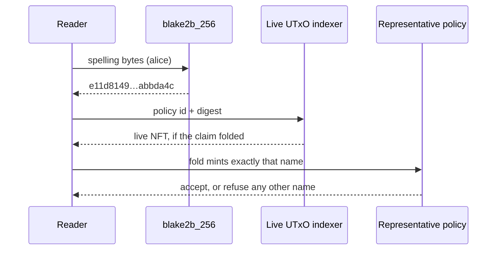

# Representative names derived from spelling

Retroactive record, written 2026-09-15 from PR #112 merged at
`b4a36eaf72d8a355d9048a00081a8f999c195e27`.

## Who this is for

A reader who knows the published representative policy id and wants
to locate the live NFT for a spelling — with the policy id and a
hash, no history, no trie.

## What you can do

Hash the exact spelling bytes and look the result up under the
policy id:

```sh
printf %s alice | b2sum -l 256
```

That digest is the asset name, nothing else in it: no registry
identity, no prefix, no incarnation byte. The policy id already
scopes the registry, because the representative policy is applied
per application and each application is bound to one canonical
registry.



The application reads the key from the consumed native Insert
selected by its Modify action. The mint arm binds the minted name to
that key; the retire and burn arms bind the burned name the same
way. Retirement carries the unchanged spelling, and custody
completion checks the Update key against the burned name. Recovery
preserves each record's distinct spelling-derived NFT. The
representative policy takes the application hash and the registry
asset identity; both mint and burn check that exact registry and its
configured executing policy. Runners select their bootstrap seed
before applying the policy, and attached runners derive that same
policy from the manifest seed.

## What you see when it is refused

| Attempt | Outcome |
| --- | --- |
| Fold whose mint carries any other name | refused by the policy, named application-script phase-2 failure |
| Same claim's fold in registry B under A's applied policy | refused, with A's representative policy named as the failed witness; both roots preserved |
| Retirement referencing a foreign registry | the foreign-registry test refuses after executing both validators |
| Retirement without the withdrawal witness | refused by the node with the application's own error |
| Correctly named but rejected Insert | refused |
| Different spelling at completion | refused |

## Finding alice

`printf %s alice | b2sum -l 256` prints
`e11d814979372c883b50bdb0ffadb1eaf0898bf54fd4fbf298af126fbabbda4c`
— the same command `register-rows` prints. A trailing newline hashes
differently (`79cf3829…`), which is how the deliberately planted
wrong preimage was told apart from the true name. The demo registry
A applies policy `f3077a426a…`; registry B derives `6a54e09563…`.
The naming page now distinguishes permanent Over (minted, then
burned) from unclaimed (never minted) through asset history for the
same policy and name.

## Acceptance (from the shipped issue and PR body)

- `nix develop --quiet -c just ci` green on the docs record; it does
  not execute validators or runners, so it does not bind the name
  equation — the equation is bound by the checks below.
- `register-rows` on the devnet prints `representative` equal to
  `blake2b_256("alice")` and exits 0; alice and bob connected folds
  succeed.
- The planted wrong-preimage run fails: compiled with a newline in
  the preimage while construction is unchanged, the accepted alice
  fold mints nothing under the planted expectation `79cf3829…` and
  the run exits 1. The plant is removed afterwards.
- The on-chain negative control refuses: a wrong-name fold fails
  phase-2 validation, and the cross-registry probe is refused with
  the foreign policy named.
- Aiken naming suite 135/135 and on-chain suite 145/145, including
  the canonical witness, the foreign-registry reference refusal and
  the missing-witness control; consumer tests 145/145; Haskell units
  104/104; both compiled-identity checks pass; the six changed
  executables compile.
- The full retirement journey exits 0: controller and quorum
  retirements, recovery-then-retirement and permissionless Over
  completion succeed, and the evidence verifier validates five
  retirement units plus the completed Over transition.
- Merged with a merge commit when CI is green. This lands before the
  preprod deploy that closes #102, which uses the new hashes.

## Deviations

The mandate is issue #110 with the NOTE-001/A-001 binding ruling
(Lean and theorems unchanged; concrete name exactly
`blake2b_256(spelling bytes)`; permanent Over; incarnation zero;
registry distinction in the representative policy parameters; demo
and `register-rows` print the identical command) plus the A-003
acceptance addition (foreign-registry retirement test refuses;
witnessless devnet retire refused by the node). The diff carries no
`lean/` files, matching the ruling; the ticket's own step 3 allowed
a model change, which the ruling closed off. No question raised.

- Base: the ticket text predates the persistent-deployment PR, but
  the shipped PR integrates on top of it (main containing #106) and
  documents that integration. #106 does not close #102, so the
  ticket's before-the-preprod-deploy order still holds in substance.
- Scope: two workflow commits keep every required check context
  present on all pull requests and move model and release self-tests
  out of the build gate. They are outside the naming mandate and are
  recorded here, not hidden by it.
- Coverage: the devnet observations above (alice and bob folds, the
  planted-newline failure, cross-registry refusal, retirement
  journey) are reported in the shipped PR body and were not
  re-executed by the later commit audit; the check suites that bind
  the equation (Aiken, consumer, Haskell, script-identity) were
  re-run there with a killing mutant on the name equation.

## Limits of this slice

Lean is unchanged (last `lean/` change `bbd81f2f`); the model's
`representative` stays the abstract registry, key, policy and scope
tuple with naming scope zero, and the concrete name encodes the key
while the applied policy identity scopes the registry. Historical
conformance receipts retain the identities they recorded. The
cancellation arm is untouched: no change to `application.cancel`,
its dispatch, approval roundtrip, burn-rides-claim or payment
credential — Insert-claim cancellation belongs to the separate
connected-cancellation lane. No preprod deployment or release is
claimed.
