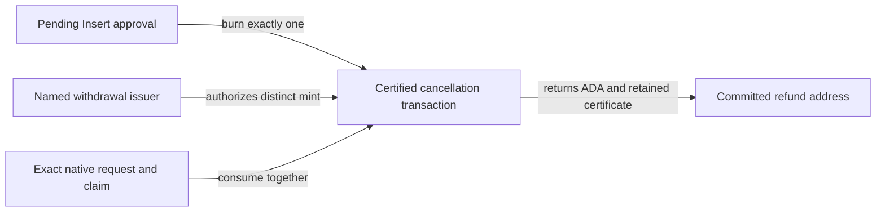

# Connected cancellation rulings and implementation mapping

## Model correspondence

As a naming user, I create a pending registration and later cancel it, with an
explicit withdrawal approval, to the refund destination fixed at registration.
The registration and native request disappear together and no Active name is
created by cancellation.

Authority is the milestone-4 desk's A-003 (2026-09-14 refinement disposition),
A-004 (distinct withdrawal attestation) and A-005 (draft interface disposition),
answering this lane's Q-001/Q-002. Model definitions are
`NamingLifecycle.cancelNamingClaim`, `cancellationAsset`,
`withCancellationApproval`, and `Model.step` at accepted
f558d0e8fc916eef494fffcef09cfe2ac5582b8e; accepted #110 merge
b4a36eaf72d8a355d9048a00081a8f999c195e27 supplies spelling-based representative
identity and registry-bound representative policy/witness behavior.

The original `insert_attestation_alone_cannot_cancel` theorem is unchanged.
`claimedOnce` alone refuses `withdraw-binding`. `cancellationPending` first calls
`step .mintWithdraw` and records the distinct accepted withdrawal approval;
`cancelledClaim` then calls the existing cancellation transition. The added
`connected_withdrawal_composition_example` checks those concrete states,
request/refund identity, retained approvals, unchanged records/entries, consumed
request/claim and replay refusal. It is an executable model example, not a proof
of the ledger codec or Haskell builder.

The desk authorized the following representation refinement, preserving these
observable model effects:

- Co-create the native Insert request and naming claim atomically. The unchanged
  four-field naming datum stays at the claim. A versioned Insert commitment binds
  a consumed seed outref, registry policy/token, native request output index,
  full address and existing six-field datum, immutable full refund address and
  naming datum. The receipt is public. It creates no new request-owner signature
  obligation: registration requires the explicitly named controller signature
  under the existing application mint authorization plus normal funding witnesses.
- Instantiate `connected.connected` with the exact applied native request script
  hash from the pinned native blueprint, state policy and cage token. The
  representative policy uses the resulting application hash and registry asset
  identity under accepted #110. Register/fold store `blake2b_256(spelling)`.
- Pending claims cannot relocate via Maintain/Recover/Retire. These actions
  require actual representative custody before reusing the accepted Active
  transition rules. Thus the claim creation txid and committed request index
  identify the exact original request throughout its pending life.
- Cancellation requires native Retract of that request with the existing
  request-owner signer and phase-2 window, and a separate `CancelApproval` mint
  branch requiring its explicitly named withdrawal issuer in required signers.
  Request-owner Retract, the Insert controller signature, knowledge of the
  receipt, or Insert burn alone cannot substitute for withdrawal issuance.
- The ledger transaction composes `mintWithdraw` followed by `withdraw`: burn
  exactly one original Insert approval and mint one DISTINCT request/refund-bound
  withdrawal certificate. The certificate remains in the committed refund
  output and represents the approval retained by the model. It is not minted
  and burned net-zero. No representative is minted; the registry state is only
  referenced, never spent. Both pending inputs are consumed, no claim continues,
  and the registry root is unchanged. The production builder returns all claim
  and request ADA to the refund, paying fees from its selected funding input.
  The validator preserves the accepted refund floor (combined input ADA less
  transaction fee). The certificate cannot cancel a different request or replay
  consumed inputs; a folded/unavailable request remains unavailable.

Old zero-parameter application scripts and old pending claims keep their previous
behavior. This code cannot retrofit them. No migration, redeployment or preprod
write is authorized. #114 existing-deployment cancellation acceptance remains
open; the new exports are a draft dependency until #117 lands. Economic deposit
rules and CLI code remain outside #117.

## Exact public witness and transaction encodings

`R = Constr 0 [seedOutRef, B registryPolicy, B cageToken, I requestIndex,
B fullRequestAddress, nativeRequestDatum, B fullRefundAddress, namingDatum]`.
The native request datum is the existing `RequestDatum` constructor, unchanged.
`seedOutRef = Constr 0 [B txid, I index]` uses the existing native encoding.

| Value | Canonical Plutus Data preimage / redeemer |
| --- | --- |
| Insert name | Blake2b-256 of `serialiseData(Constr 0 [B "singular/naming/connected-insert/v1", R])` |
| Portable receipt | The exact canonical CBOR bytes hashed for the Insert name above |
| Withdrawal name | Blake2b-256 of `serialiseData(Constr 0 [B "singular/naming/connected-withdraw/v1", B registryPolicy, B cageToken, exactRequestOutRef, B fullRefundAddress])` |
| Register mint | `Constr 0 [R, B controllerKeyHash]` |
| Fold approval burn | `Constr 1 [R]` |
| Cancel approval issuance + Insert burn | `Constr 2 [R, B withdrawalIssuerKeyHash]` |
| Claim Cancel spend | Existing `Constr 1 [B fullRefundAddress]` |
| Native Retract spend | Existing `Constr 3 [stateOutRef]` |

`Naming.Connected.serialiseRegistration` and `deserialiseRegistration` persist
and restore the public witness. The decoder requires the supported version,
valid structural fields and addresses, complete input consumption and canonical
re-encoding. The claim's on-chain token hash authenticates that decoded witness.
The devnet route serializes each register-produced receipt, decodes it, compares
the exact commitment, rejects trailing bytes, and uses the recovered receipt for
cancellation; its CBOR bytes are retained with the registration transaction ID.

## Verification scope

The isolated app is `nix run ./offchain#connected-cancellation`; CI invokes the
same app. It builds both blueprints from its own source snapshot, starts its own
node, and rejects external-node arguments. It also runs the existing naming
maintenance/WithdrawApproval rows on a second fresh ledger. No external wallet
or deployment is used. CC01..CC08 and observed input/root/refund/mint evidence are
required; successful builds and component tests alone do not establish them.

Baseline evidence establishes expected Insert-only refusal, not a contradiction
of the negative theorem. Candidate/command/results and remaining delivery checks are recorded in PR118.
The mapping and owner tests do not replace the required review and sequencing.
