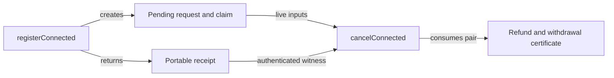

# Production functions

## Builder sequence

`Naming.Connected.connectedApplication` applies the genuine native request script
hash to the connected application template. `registerConnected` constructs the
atomic claim/request transaction and returns its receipt. `cancelConnected`
authenticates live inputs, preserves native Retract signer/window, requires
separate withdrawal issuance, burns Insert and refunds both inputs. It evaluates
the final balanced body before returning it to the caller for signing/submission.

`serialiseRegistration` / `deserialiseRegistration` persist the exact versioned
canonical CBOR witness. The devnet runner consumes these same production exports.
Exact signatures and model/ledger effects are in [decisions.md](decisions.md).

