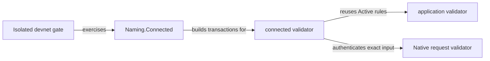

# Scoped modules

## Responsibilities

`validators/connected.ak` owns the parameterized application and certificate
branches; `application.ak` retains its accepted entry and shares its Active
transition implementation behind the connected entry's custody guard.
`Naming.Connected` owns the production builders and portable receipt.
The existing register runner owns the connected real-node sequence and refusals;
`offchain#connected-cancellation` packages that gate plus legacy WithdrawApproval
checks and CI executes it. No CLI or deployment module is changed by #117.

Accepted #110 is integrated; its spelling-derived representative identity and
registry-bound mint/retirement witness are preserved. See decisions.md.

