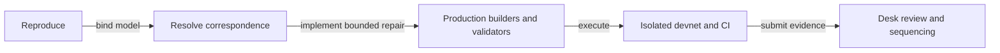

# Restore cancellation of a pending registration

## Delivery sequence

A user who cancels before fold receives the refund bound to the queued Insert,
without creating an Active name. The acceptance and refusal obligations are
CC01–CC06 in spec.md, bound to Lean revision
f558d0e8fc916eef494fffcef09cfe2ac5582b8e.

First reproduce the reported component failure and the actual devnet failure.
Resolve the missing claim/request refund association with the model authority
before changing representation or authorization. Then implement the production
builder and minimal corresponding validator changes, preserve generic request
semantics, and ship the connected command in CI. Integrate accepted #110 before
final verification. Expose the builder for #114 through the coordinated naming
library; keep wrapper implementation in #114.

The independent Aiken probe cannot stand in for node/ledger evidence. Keep exact
candidate, commands, exits and observations for both layers. No deposit, preprod
write or deployment is part of this plan. One owner implements this bounded repair.

