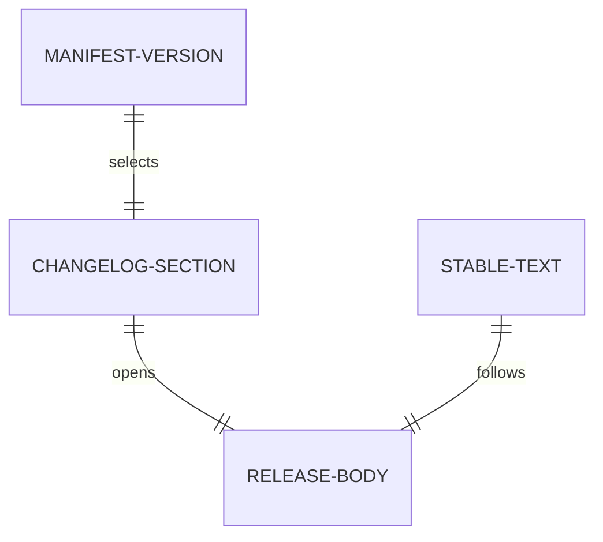

# Data

Retroactive record, written 2026-09-15 from PR #121 merged at
`454aec3858f0aa029d93928f09b5c4447bf49894`.

## Release body

| Field | Type | Validation |
| --- | --- | --- |
| version | release-please manifest | selects the `## [X.Y.Z]` changelog section |
| changes section | markdown | non-empty; missing or empty stops publication before upload |
| stable text | markdown | introduction plus use-it instructions; none of `epic`, `E18`, `obligation`, `milestone artifact` |
| composed body | markdown | section followed by stable text; optional packaged notes override replaces the stable part |

## Archive contents

Both archives with checksums; validator identities verified from
the assembled artifact; shipped `RELEASE.md` byte-equal to the
source; archive README row describes the introduction-plus-
instructions purpose.

## Check cases

Wrong tag, wrong commit, wrong release PR, corrupt upload (all
refuse without creating or uploading); missing section, empty
section, missing changelog (refuse with the loud message);
section at end of file, notes override, new release (pass with
the exact composed body); already-published (pass without
recreating).
