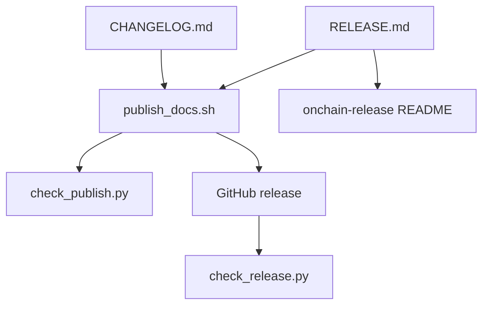

# Modules

Retroactive record, written 2026-09-15 from PR #121 merged at
`454aec3858f0aa029d93928f09b5c4447bf49894`.

## New and changed responsibilities

| Module | Responsibility | Depends on | Must not |
| --- | --- | --- | --- |
| `tools/publish_docs.sh` | Extract the version section, refuse loudly when absent, compose the notes file, create and fill the release | changelog, stable text, manifest version | Hand-write per-version bodies |
| `onchain-release/RELEASE.md` | Stable introduction plus use-it instructions | archive layout | Carry internal ceremony or epic language |
| `tools/check_publish.py` | Section and wording assertions plus double-backed publisher cases | real publisher script | Create a real release |
| `tools/check_release.py` | Shipped-equals-source and wording assertions on the assembled artifact | built archives | Require internal boilerplate |
| `onchain-release/README.md` | Archive table describing the new purpose | stable text | Describe the old status text |

## Dependency direction

The changelog and stable text flow into the publisher; the
publisher flows into the release; both checkers observe the real
scripts without replacing them. Docs describe the archive; they
do not define release identity.

## Promotion

No new modules. The existing shell stays the extractor; checks
replace hand assertions with the composed-body identity.
