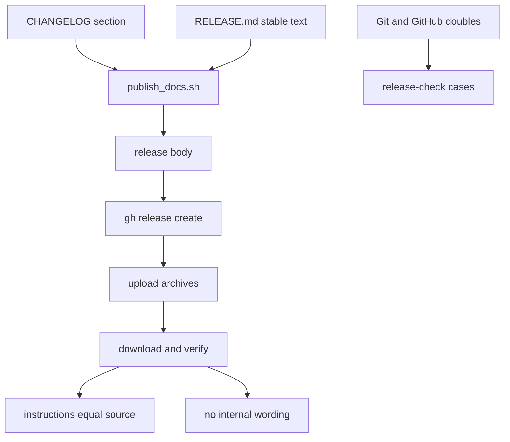

# Plan

Retroactive record, written 2026-09-15 from PR #121 merged at
`454aec3858f0aa029d93928f09b5c4447bf49894`.

## Strategy

Compose, don't hand-write: the version's changelog section plus a
rewritten stable text become every release body from 0.6.1 on.
Enforce the composition with executable checks on both sides —
the publisher refuses a missing or empty section before upload,
and the archive checker requires shipped instructions to equal the
source and carry no internal wording.

## What the diff actually built

`onchain-release/RELEASE.md` rewritten as the stable part: one
paragraph introducing Singular and what the archive lets you do,
then use-it instructions (download, `sha256sum --check`,
`verify-identities.sh`, devnet README, onboarding runbook,
conditional deployed-registry guide). `tools/publish_docs.sh`
extracts the manifest version's changelog section with the
existing shell, fails loudly when it is missing or empty, and
passes the composed file as `--notes-file`. `tools/check_publish.py`
asserts the manifest version's section is non-empty and the stable
text carries none of the four forbidden wordings, and drives the
real publisher through eleven double-backed cases. `tools/check_release.py`
drops the old internal-ceremony phrase requirements for the exact
equality plus forbidden-wording checks. The archive README row
describes the new purpose.

## Verification as shipped

`just ci` green; release-check cases green (manifest section,
adjacent versions, end-of-file section, missing, empty, missing
changelog, notes override, new release, already-published, and the
three wrong-input refusals); release-artifacts green on both
archives with checksums and identities; packaged publisher shell
checks green; negative controls refuse and the restored candidate
passes.

## File fence (what the merge touched)

Five files: `onchain-release/RELEASE.md` and `onchain-release/README.md`,
`tools/publish_docs.sh`, `tools/check_publish.py`,
`tools/check_release.py`. No Lean, validator, runner, workflow or
CI-required-check edits.

## Slice

One slice: versioned release bodies with usable archive
instructions. One commit: `fix(release): publish version changes
and usable archive instructions`.
