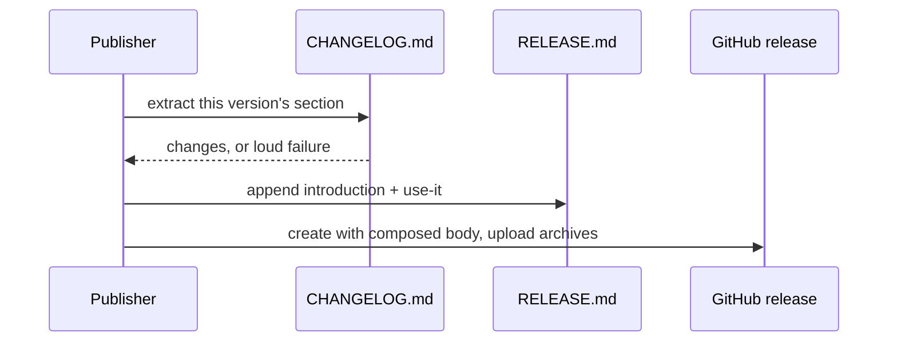

# Release pages with version changes and archive instructions

Retroactive record, written 2026-09-15 from PR #121 merged at
`454aec3858f0aa029d93928f09b5c4447bf49894`.

## Who this is for

A Singular user choosing a version and running it — who wants the
release page to say what changed and how to use the archive,
without interpreting internal project terminology.

## What you can do

Open any release from 0.6.1 on and read, first, that version's own
changelog section, then a short introduction to Singular and
archive usage: download, checksum verification, identity
verification, the devnet README, the onboarding runbook for your
own node, and the deployed-registry guide once it exists.

The publisher composes the body from the version's own
`## [X.Y.Z]` section followed by the stable text, using the
existing shell, and fails loudly when the section is missing or
empty — before any upload. The archive checker verifies the
shipped instructions equal the source instead of requiring
internal boilerplate.

## What stops publication

| Attempt | Outcome |
| --- | --- |
| Changelog section for the manifest version missing | `FAIL: missing or empty CHANGELOG.md section`, exit before upload |
| Changelog section present but empty | same loud failure |
| Stable text carries internal wording (`epic`, `E18`, `obligation`, `milestone artifact`) | check refuses |
| Shipped archive instructions differ from the source | archive check refuses |
| Forbidden phrasing, the original publisher, or a stable-only body in a negative control | refused |

## Acceptance (from the shipped issue and PR body)

- `nix develop --quiet -c just ci` green on the docs record; it
  does not run the publisher, so the release behaviour below is
  bound by the release checks, not by `just ci`.
- `nix run --quiet .#release-check`: the real publisher Bash runs
  against isolated Git and GitHub doubles — the actual manifest
  version's section, adjacent versions, a section at end of file,
  missing and empty sections, and the packaged notes override.
- `nix run --quiet .#release-artifacts -- /tmp/singular-release`:
  both archives, checksums and validator identities verified from
  the assembled artifact.
- `nix build --quiet .#checks.x86_64-linux.release --no-link`:
  includes the packaged publisher's shell checks.
- Negative controls reject each forbidden phrase, the original
  publisher, and a publisher changed back to a stable-only release
  body; the restored candidate passes.

## Deviations

The mandate is issue #120 (four frozen acceptance items, one
`fix(release):` PR, merge through merge-guard, authority
NOTE-003, no Lean or contract behaviour change). The diff
implements all four items. Two notes, neither a user-visible
disagreement. No question raised.

- The ticket names `tools/check_publish.py` for the extended
  assertions; the merge also rewrites the sibling
  `tools/check_release.py`, replacing the old internal-ceremony
  phrase requirements with the same forbidden-wording list plus an
  exact-equality check between shipped and source instructions.
  Same acceptance, both files. Recorded, not hidden.
- The stable text refers to the deployed-registry guide
  conditionally: `docs/preprod.md` is not present at this base, so
  the reference waits until that guide is published.

## Limits of this slice

The publisher tests use isolated doubles; they do not create a
GitHub release. Existing published bodies remain as the operator
edited them. No Lean definitions, validators, transaction
builders, authorization, state transitions or token behaviour
change — the changed mapping is release manifest version to
changelog section to release body.
