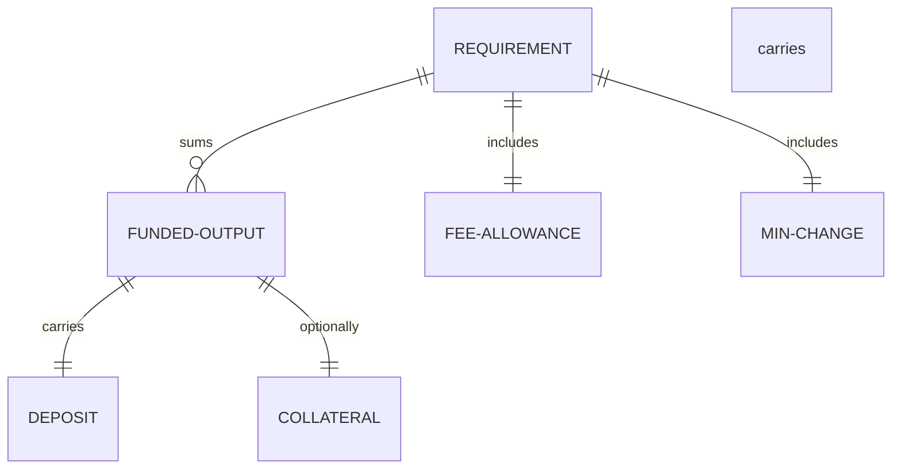

# Data

Retroactive record, written 2026-09-15 from PR #122 merged at
`6ab1093367e00290a4b74638f03f5ef44b3137e6`.

## Funding requirement

| Field | Type | Validation |
| --- | --- | --- |
| actor outputs | list of transaction outputs | exactly the requested positive actors: claim/request deposits, change, collateral |
| fee allowance | lovelace | one maximum-size transaction at the live fee rate plus the measured maximum over the actual reference scripts — an allowance, not the fee charged |
| minimum change | lovelace | ten percent above the live minimum for the final coin width, recomputed |
| collateral | lovelace | live collateral percentage of the fee allowance, at least the live minimum |
| spendable | lovelace | wallet UTxOs excluding reference scripts and multi-asset outputs; funding refuses when below the requirement |

All amounts derive from the live protocol parameters read from the
node. Reserved outputs are funds, not claimed fees.

## Provider selection

A selectable UTxO is ada-only, carries no reference script, and is
not in the reserved set passed by the caller (inputs a later
lifecycle step needs). Reference publications are never funding.

## Execution budget

| Field | Type | Validation |
| --- | --- | --- |
| per-purpose cost | memory and steps | measured by node evaluation per redeemer |
| aggregate | memory and steps | exact sum across purposes |
| live limit | memory and steps | `ppMaxTxExUnitsL` from the live parameters |

The aggregate must fit the live limit exactly or below; two
individually legal purposes whose sum exceeds memory refuse, as does
any step excess. The refusal reports the measured requirement beside
the live limit.

## Path selection

Public external nodes use the lifecycle automatically; any other
network selects it with `--lifecycle`. Devnet magic 42 without the
flag keeps every existing fixture and row.
