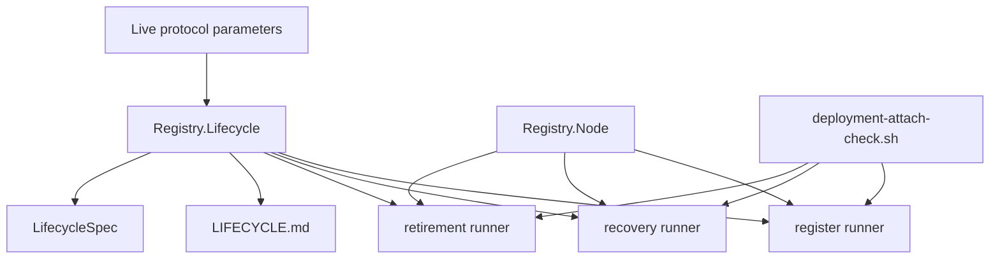

# Modules

Retroactive record, written 2026-09-15 from PR #122 merged at
`6ab1093367e00290a4b74638f03f5ef44b3137e6`.

## New and changed responsibilities

| Module | Responsibility | Depends on | Must not |
| --- | --- | --- | --- |
| `Singular.Registry.Lifecycle` (new) | Live-parameter funding, filtered provider, aggregate limit, evaluate-and-rebalance | `Node`, `Provider`, `Deployment`, ledger and transaction-builder internals | Submit refusal probes; change devnet fixtures or semantic refund outputs |
| `Singular.Registry.Node` | Node sessions with or without a fixed funding floor | existing node setup | Decide lifecycle funding itself |
| `journey/register` | Exact-spelling claim with preflight refusal before funding on the public path | `Lifecycle`, connected fold builders | Change the successful-claim transaction shape |
| `journey/recovery` | `rc-main` claim, rotation and maintenance with reserved-input funding | `Lifecycle`, connected fold builders | Spend later-step inputs during request funding |
| `journey/retirement` | `rt-over` claim through permissionless Over completion with reserved-input funding | `Lifecycle`, connected fold builders | Spend later-step inputs during request funding |
| `deployment-attach-check.sh` | `--lifecycle` public-path gate plus the retained full suite | the three runners | Replace the fresh-bootstrap counter control |
| `offchain/LIFECYCLE.md` | Joiner-facing lifecycle funding guide | the shipped layer | Promise submitted fees or preprod acceptance |
| `LifecycleSpec` | Aggregate-limit and reserved-input regression | `Lifecycle` | Call the full request builder |

## Dependency direction

Live parameters flow into the funding layer; the funding layer
flows into the three runners; the runners keep their existing
connected transaction builders. Docs and tests describe the layer;
they do not define funding policy.

## Promotion

One new library module owned by the lifecycle runners. No shared
extraction, no changes to Lean, validators, workflow or CI gates.
