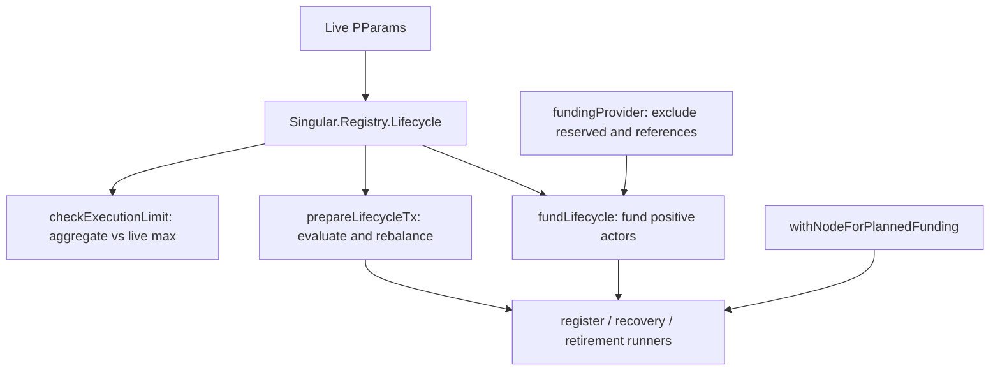

# Plan

Retroactive record, written 2026-09-15 from PR #122 merged at
`6ab1093367e00290a4b74638f03f5ef44b3137e6`.

## Strategy

Keep every existing transaction constructor and chain assertion, and
add a funding and evaluation layer beside them that only the public
lifecycle path uses. Compute deposits, minimum-UTxO change,
collateral and fee allowance from the live protocol parameters;
evaluate each transaction with the node and rebalance exactly before
signing; check the aggregate execution cost against the live
per-transaction limit. Devnet fixtures, refusal rows and existing
splits stay untouched.

## What the diff actually built

A new library module `offchain/lib/Singular/Registry/Lifecycle.hs`
owns the whole layer: path selection, fee reserve, minimum-coin
change, request deposits, budget verification, funding requirement,
funding with a filtered provider, the aggregate execution check, and
evaluate-and-rebalance before signing. `Node.hs` gains
`withNodeForPlannedFunding`, which runs the existing node-mode setup
with no fixed funding floor so wallets that can afford the computed
plan are not rejected by the old 100-ADA gate and read-only
estimates are not blocked. The three journey runners call this layer
only on the public path; devnet mode keeps `lifecycleRequested =
False` and every existing row.

Request creation in recovery and retirement wraps its provider with
the reserved-input filter, so funding never spends an input a later
lifecycle step needs. Public duplicate handling refuses before
spending; the devnet submitted-refusal row is retained.

## Verification as shipped

`just ci` green; `cabal build` of the three runners plus
`cage-tests` 109/0; `deployment-attach-check.sh --lifecycle` for the
public path with duplicate preflight and unchanged deployment
counts, full suite without the flag; read-only preprod allowance
plans; no public transaction submitted. The retroactive audit
killed a mutant on the reserved-input row and confirmed the
aggregate-limit spec discriminates.

## File fence (files the merge touched)

`offchain/lib/Singular/Registry/Lifecycle.hs` (new),
`offchain/LIFECYCLE.md` (new),
`offchain/test/Singular/Registry/LifecycleSpec.hs` (new),
`offchain/lib/Singular/Registry/Node.hs`,
`offchain/journey/register/Main.hs`,
`offchain/journey/recovery/Main.hs`,
`offchain/journey/retirement/Main.hs`,
`offchain/deployment-attach-check.sh`,
`offchain/singular-registry.cabal`, `offchain/test/Main.hs`.
No Lean, validator, workflow or CI-required-check edits.

## Slice

One slice: public lifecycle funding and evaluation. Final subjects:
`fix: fund public naming lifecycles from live protocol parameters`
(`345658df4231bc2623e77c11ba50d86add03359c`) and
`fix: preserve reserved lifecycle inputs during request funding`
(`e4ae94111e02e87f766b75a220c1bad97a76c2ba`).
