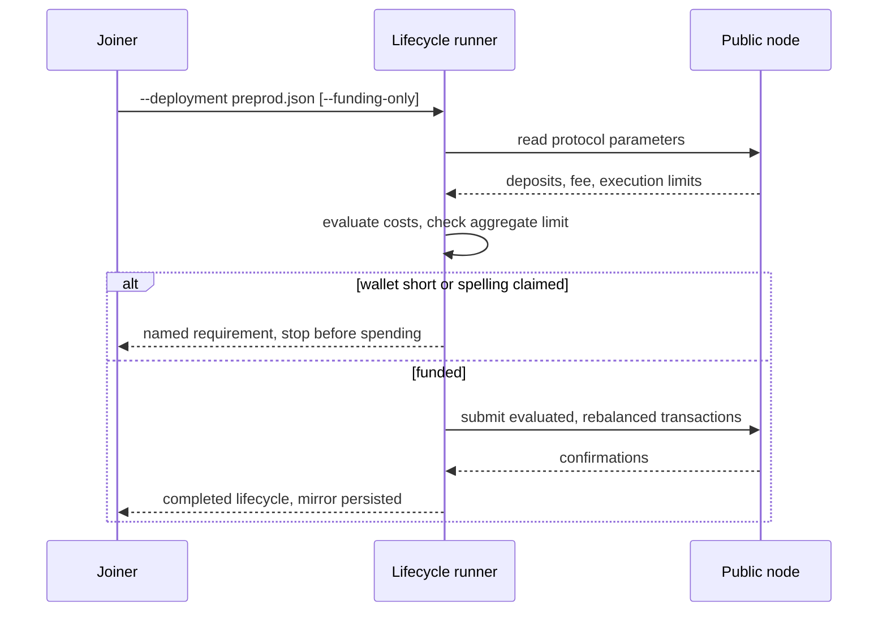
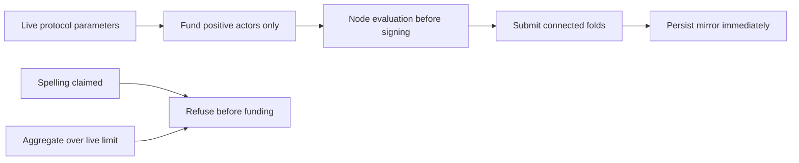

# Public lifecycle funding from live protocol parameters

Retroactive record, written 2026-09-15 from PR #122 merged at
`6ab1093367e00290a4b74638f03f5ef44b3137e6`.

## Who this is for

A joiner with a wallet on a public node who wants to run the three
positive naming lifecycles — claim a spelling, recover a controller,
retire a name into Over — against one persistent deployment, without
reserving the devnet fixture pools.

## What you can do

Point the register, recovery and retirement runners at a deployment
manifest on a public network. Each runner funds only its own positive
actors and actual deposits, computed from the live protocol
parameters, evaluates every transaction with the node before signing,
and stops with a named requirement before spending when the wallet
cannot cover it or when the spelling is already claimed.

## What you see when it is refused

| Attempt | Outcome |
| --- | --- |
| Wallet balance below the computed requirement | `lifecycle funding: requires … lovelace, available …` before any submit |
| Register a spelling the deployment already holds | `requested spelling is already claimed`, stop before funding |
| Aggregate execution cost above the live per-transaction limit | `lifecycle execution limit: requires memory=…, steps=…; live transaction limit …`, stop |
| Evaluated fee does not fit the change output minimum | `lifecycle change cannot cover the evaluated fee and minimum UTxO`, stop |
| Node evaluation does not cover every redeemer | `lifecycle evaluation did not cover every redeemer`, stop |

No refusal probe is submitted on the public path. Devnet and CI keep
their full submitted-refusal row suites.

## The three lifecycles

Register claims one exact spelling (default `alice`). Recovery claims
`rc-main`, rotates it, then maintains the recovered controller.
Retirement claims `rt-over`, recovers, retires and completes it
permissionlessly into Over. Public runs require the deployment
manifest.

## Funding rule

Deposits, minimum-UTxO change, collateral and one maximum-size
transaction fee allowance are computed from the live parameters and
the actual reference scripts. Request funding never selects
reference-script outputs, multi-asset outputs, or inputs reserved for
later lifecycle steps. Reference publications cannot fund the split.
The old 100-ADA connection floor is bypassed only by these runners,
which complete their funding preflight before spending.

## Acceptance (from the shipped PR body)

- `nix develop --quiet -c just ci` green; the final delta is isolated
  to request funding selection and its regression.
- `cabal build -O0 register-rows recovery-rows retirement-rows` and
  `cabal test -O0 cage-tests`: 109 examples, 0 failures, including the
  exact aggregate boundary accept and the excess memory and steps
  refusals, plus the reserved-input selection regression.
- `bash offchain/deployment-attach-check.sh --lifecycle` exercises
  the public path locally with duplicate preflight and unchanged
  counts; without the flag the full suite and fresh-bootstrap counter
  control are retained.
- Read-only preprod plans report 25,235,942 + 43,729,096 +
  59,501,649 = 128,466,687 lovelace total allowance against
  11,880,741,235 spendable. These are reserves, collateral and
  deposits, not claimed actual fees. No public journey transaction
  was submitted by this change.

## Deviations

There is no dedicated issue for this repair. The mandate is the PR
body plus the operator's A-004 ruling (fund only positive lifecycle
actors and actual deposits from live parameters, evaluate execution
costs before signing, stop any aggregate per-transaction overflow).
Tickets #102 and #18 are referenced and are not closed by this PR.
The retroactive audit
(`/tmp/projects/singular/milestone-1/t-audit/handoffs/audit-122.md`,
verdict PASS) found the diff matches the PR body claims; its one
residual — a wallet can pass the lovelace preflight yet fail later on
a UTxO-shape problem such as a missing ada-only collateral fragment —
is a documented limit, not a user-visible disagreement. No question
raised.

## Limits of this slice

Public journey acceptance stays pending until all three lifecycles
run against preprod. Release 0.6.0 predates this runner repair; its
downloaded deployment verifier passes on preprod, while public
lifecycle compatibility requires this repaired source. No validator,
Lean, workflow, build-gate or required-check setting changes are
included. Lean is unchanged at
`bbd81f2f86c07a9963e9a6aa35c1a8457d7ba38e`.
