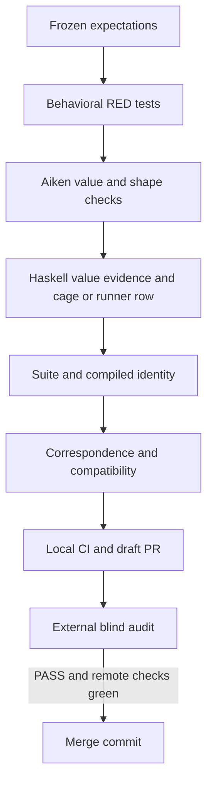

# Implementation plan

## Outcome and authority

The controller keeps a clean record's recovery and retirement paths available.
Implement the frozen [specification](spec.md) under constitution 1.0.0, with
Lean at `41861a66b72a840042f2e633ce33a607e817d6c6` unchanged. This is one repair
slice with named invariant checks and a second implementation boundary.

## Implementation

Add permanent tests before production edits in
`naming-onchain/validators/application.tests.ak`. Use ordinary Boolean negation
for polluted recovery and retirement so premature exit is a failure. Preserve
the polluted-maintenance accepted reproduction and clean controls.

In `naming-onchain/validators/application.ak`, compare flattened non-ADA values
exactly and check ADA separately. Return a named Boolean refusal for malformed
record asset cardinality before extracting a representative. Apply the shared
preservation rule to maintenance and recovery. Require the genuine insert-fold
continuation to contain only its already authenticated representative; the
legacy empty-representatives cancellation fixture path retains its meaning.

## Decisions

| Choice | Reason |
| --- | --- |
| Exact non-ADA equality with separate ADA floor | Reject additions and quantity changes while allowing deposit top-up |
| Named false for polluted recovery and retirement | Distinguish the expected refusal from a destructuring crash |
| Check genuine insert-fold output shape | Establish the invariant before maintenance preserves it |
| Keep existing polluted maintenance accepted | Preserve the issue's frozen third reproduction verdict |

## Verification and delivery

Capture executed RED and GREEN results in the runtime evidence directory.
Run the Aiken suite, the appropriate Haskell cage or devnet check, compiled
script-identity verification, root `nix develop --quiet -c just ci`, and the
presentation gate on new specs and docs. Regenerate manifests using
`naming-onchain/justfile` and document exactly which hashes move.

Create one draft PR with `fix`, assignee `paolino`, `Closes #146`, the repository
template's model mapping and verification limits. Journal `READY-FOR-AUDIT`
and stop until a matching external PASS handoff exists. Merge with a merge
commit only after all PR checks have passed. No additional workers, GitHub
comments, preprod deployment or Lean edits.
