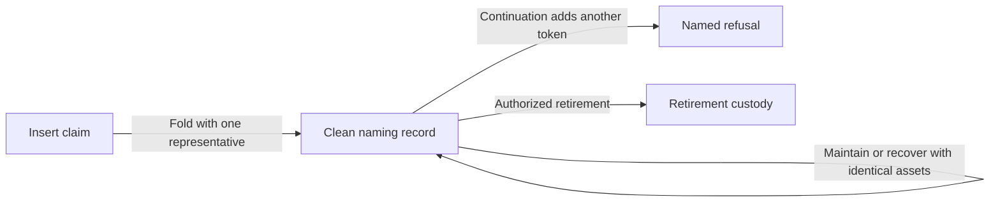

# Keep naming records recoverable and retirable

## Who this is for

As a name's controller, I want wallet change selection to leave recovery and
retirement available, so an unrelated token cannot permanently disable either
operation. This specification implements [issue #146](https://github.com/lambdasistemi/singular/issues/146)
and the operator's frozen acceptance of 2026-09-15.

## Required behavior

A maintenance continuation must carry exactly the spent record's non-ADA assets,
including policies, names and quantities. ADA may increase but must not decrease.
Adding an unrelated token must refuse with `record-value-preservation` before
the continuation becomes a record. Recovery preserves the same value shape.
An insert fold must create a record containing exactly ADA and its representative.

## Existing polluted records

The three issue reproductions become permanent tests. Recovery and retirement
from a record containing a second non-ADA asset return false with
`record-single-asset`, instead of failing a list destructuring assertion.
Maintenance of an already polluted value remains accepted when the entire
non-ADA value is unchanged. This preserves the issue's third reproduction verdict;
it does not repair such a record or promise a migration of old script outputs.

## Acceptance and controls

- The polluted recovery and retirement tests assert a Boolean refusal, so a
  crash cannot satisfy them. Their clean controls continue to accept.
- Maintenance refuses asset addition, removal, replacement and quantity changes;
  ADA top-up and an unchanged value accept, and ADA reduction refuses.
- Recovery cannot introduce another token, and insert fold cannot create a
  polluted record. Both have clean positive controls.
- One devnet runner row or cage-test exercises the extra-token maintenance
  continuation and checks its named refusal.
- The naming Aiken suite and root `just ci` pass. Script identity is regenerated
  from the compiled blueprint, and the changed application hash is documented.
- Haskell mirrors and evidence verifiers that encode value shape agree with the
  exact non-ADA preservation rule.

## Model binding and limits

Lean is unchanged, bound to repository revision
`41861a66b72a840042f2e633ce33a607e817d6c6`:
`Singular.Output` in `lean/Singular/Model.lean` has one representative,
a quantity and scalar value. `Singular.NamingLifecycle.maintainDestination`,
`recoverController`, `beginRetirement` and `validateLifecycleOutput` in
`lean/Singular/NamingLifecycle.lean` govern the lifecycle. Multi-asset encoding
is the implementation refinement explicitly assigned by the operator.
The correspondence table must identify the checks that establish and preserve
the clean-record invariant. Fixtures establish component behavior; they do not
establish a public-network lifecycle. No preprod deployment is included.
