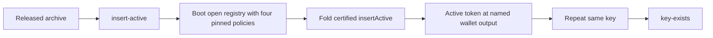

# #173 — `insertActive` on the open registry, from the released archive

Authority: the registry interface §§0, 2, 3, 5 and 8; issue #173; rulings
A-001 through A-006; and accepted Lean revision
`854f56fd3e2765ef19270b3a40398d53092748f2`. Where prose or existing code
disagrees with that Lean revision, Lean wins and the affected line stops for a
ruling. Constitution: `.specify/memory/constitution.md` v1.0.0.

Day-0 release is 0.7.0. This ticket adds the first edge-scoped pre-release
artifact; the epic owner owns its tag after merge.

## The runnable story

As a reviewer with the released archive and no checkout, I follow its page and
run its packaged `insert-active` command against a devnet. The command boots a
registry whose parameterless open application and three witness policies come
from the archive's `onchain/script-identity.json`, folds one certified
`insertActive`, and shows the active token at the requested wallet output. A
repeat for the same key is refused `key-exists`.

The separate mint-guard story uses two distinct keys: the folded edges require
one active token per key, while the transaction claims the same total under the
wrong key distribution. It is refused `net-mint-mismatch` even though its
per-kind total agrees.

## Accepted behavioral authority

| id | accepted meaning |
|---|---|
| L1 | `Singular.Statements.insert_active_transaction_row` constructs the whole transaction from the executed step: two inputs, two outputs, datums, addresses/assets, keyed mint, refunds and signers. |
| L2 | `Singular.Statements.fold_batch_claimed_mint_by_kind_key` binds one reachable/applicable two-key witness to equal per-kind totals, unequal `(kind,key)` totals and the observed `net-mint-mismatch` refusal. |
| L3 | `openPolicyParameters = []`; the open policy is parameterless and universally admits the approval tuple. Cross-registry separation is a named non-goal. |
| L4 | A second `insertActive` on the same known key is refused `key-exists` before mint arithmetic. It is not the L2 wrong-key batch. |
| L5 | Existing `insert_active_inversion`, `occupancy_free_key_succeeds`, `no_tree_change_without_approval` and `active_witness_unique` remain true and consumer-visible. |

## Implementation contract

| id | requirement |
|---|---|
| I1 | Add parameterless `onchain/validators/open.ak`. `Approve { edge, key, owner, destination }` mints exactly one `+1` asset named `approvalName(edge,key,owner,destination)` for edges 0–5; a wrong name refuses `approval-binding`, edges 6–7 refuse, a two-asset mint refuses `approval-quantity`, and a pure burn accepts. |
| I2 | Move `witness.ak` from `naming-onchain/validators/` to `onchain/validators/`, preserving the three applied kinds. Boot pins open, active, absent and terminal policy IDs from `onchain/script-identity.json`; no naming blueprint participates. Only the active witness is exercised by this edge. |
| I3 | The request wire shape carries the edge tag in place of `Operation` and drops its `tip`; the fold checks request lovelace is at least `state.tip`. Retire G1, G3 and `tip-mismatch` only with an explicit old-to-new row mapping. |
| I4 | The cage's `insertActive` arm admits the bound approval, applies the unknown-to-active transition, compares mint per `(kind,key)`, and routes exactly one active token to the request's named address and inline datum. Same-key duplication refuses `key-exists`; the distinct-key wrong-mint fixture refuses `net-mint-mismatch`. |
| I5 | `TxBuilder.Boot`, `TxBuilder.Request` and `TxBuilder.ConnectedFold` construct this exact boot/request/fold. The packaged `insert-active` command uses those builders against a devnet and reports the resulting token and both named refusals. |
| I6 | The archive contains the command, its run page and every runtime input. Extraction plus the documented invocation requires no checkout and no naming blueprint. |

## Acceptance lines

These are the implementation owner's decision-review checkpoints.

| line | invariant and observable result |
|---|---|
| A173-BOOT | One boot derives and pins the parameterless open policy plus active/absent/terminal witnesses from the on-chain identity manifest; the resulting eight-field datum decodes with no naming input. |
| A173-APPROVAL | All six open approval mints and pure burns accept; wrong binding, edge 6/7 and quantity widening refuse by name. |
| A173-EDGE | One `insertActive` request folds, produces the modeled transaction shape and places exactly one `(activePolicy,key)` token at the named wallet output. |
| A173-REFUSALS | Repeating the same key refuses `key-exists`; the two-distinct-key equal-per-kind/wrong-key fixture refuses `net-mint-mismatch`; accepting controls for both remain. |
| A173-COMMAND | The released archive's documented `insert-active` invocation boots and runs the story on a devnet without a checkout. |
| A173-COPIES | Conformance rows, E2E example, journey, identities, workflow assertions, coverage records, consumer-conformance page, run page and archive manifest all name the same policies, fields, edge and verdicts. |

## Copies and published contracts

The implementation and PR body enumerate every encoding of this decision:

- Lean row identities and generated corpora; `simulator/formal` mirrors and
  derived simulator output; coverage `record.json` and `base-record.json`;
- Aiken validators/tests, both script-identity manifests and compiled
  blueprints;
- off-chain boot/request/fold builders, devnet E2E, journey and packaged verb;
- `conformance/rows.json`, CS01/CS02/CS04/CS07/CS08 and the edge fold/refusal
  rows, plus `.github/workflows/{registry,conformance}.yml` assertions;
- `docs/consumer-conformance.md`, the command page, archive manifest and their
  speech companions.

Published contracts are the parameterless `open.ak` policy ID,
`approvalName(edge,key,owner,destination)`, the three witnesses' new `onchain/`
home and applied hashes, and the edge-tagged request/eight-field datum encodings.

## Non-goals and stop conditions

No other edge arm or row is changed: #177 `updateTerminal`, #158
`witnessTerminal`, #178 `insertAbsent`, #179 `updateActive`, both delete edges,
custody, NYA/application record preimages, escrow, or a release tag. Cross-registry
separation is not promised by the parameterless open policy.

If an implementation choice contradicts the accepted Lean rows, invents a
naming dependency, or needs a CI command that does not exist, stop that line and
raise a question. At the four-hour owner wall, keep the boot + `insertActive` +
archive command vertical slice and return any independent remainder explicitly.
