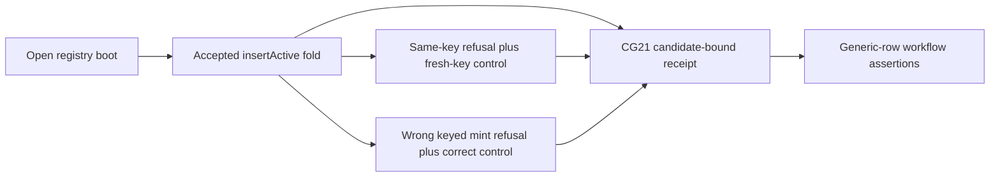

# #184 — the `insertActive` conformance row and receipt

Authority: issue #184; parent #154; accepted Lean revision
`854f56fd3e2765ef19270b3a40398d53092748f2`; repository base
`698c4036c14f18ab971dad727e48e7c92fec67c9`; and
`.specify/memory/constitution.md` v1.0.0. Lean is unchanged. If an executing
consumer contradicts these statements, the affected line stops for a user
ruling rather than changing the model.

## Runnable story

As cardano-keri, I run the conformance workflow's generic-row step on a
registry booted with the parameterless open application. CG21 folds one
`insertActive` to a named wallet and emits one candidate-bound receipt that
reports the fold, delivered asset, same-key refusal and keyed-mint refusal,
including an accepting control for each refusal.

## Accepted behavioral authority

| id | Lean identity | accepted meaning |
|---|---|---|
| L184-1 | `Singular.Statements.insert_active_transaction_row` | The accepted fold has the modeled inputs and outputs, exactly one `(activePolicy,key)` mint at the requested address and inline datum, no refunds or signers, a covered tip, non-root configuration preservation, and a root committed to the resulting trie. |
| L184-2 | `Singular.Statements.fold_batch_claimed_mint_by_kind_key` | A reachable two-distinct-key batch whose claimed mint agrees per kind but disagrees per `(kind,key)` is refused `net-mint-mismatch`. |
| L184-3 | `Singular.Statements.occupancy_free_key_succeeds` | A fresh admissible key accepts; this is the control distinguishing same-key occupancy from a generally unusable request path. |
| L184-4 | `Singular.Statements.active_witness_unique` | The accepted result carries exactly one active witness for the inserted key. |

## Acceptance lines

| line | severity | observable result |
|---|---|---|
| A184-FOLD | BLOCKING | CG21 accepts one fold under the open policy and the receipt names the open policy and parameter count, fold transaction, active policy/key, minted assets, requested and observed destination, and exactly one delivered active asset. |
| A184-CONJUNCTS | BLOCKING | The receipt asserts separately that refunds and signers are empty, destination datum bytes bind to the request, the request covers the tip, only the registry root changes, and that root commits the landed trie. |
| A184-DUPLICATE | BLOCKING | A second insert at the same committed key is refused on chain with state-script attribution and a fresh-key transaction through the same builder accepts in the same run. The compiled validator suite owns the `key-exists` name because ledger logs may be empty. |
| A184-KEYED-MINT | BLOCKING | Two distinct keys with claimed `2/0` and actual `1/1` distribution are refused on chain with state-script attribution, while the same keys with correct `1/1` distribution accept in the same run. The compiled validator suite owns the `net-mint-mismatch` name. |
| A184-SEQUENCE | BLOCKING | Every accepted fold is committed into the manager trie before the next proof is built; no control or refusal is proved against the boot root after an earlier fold landed. |
| A184-WIRING | BLOCKING | CG21 is in the generic-row invocation, expected receipt set, accounting and verdict assertions; the old #184 mapping comment is removed; the workflow step and root `just ci` both exit 0. |
| A184-COPIES | ADVISORY, required | `rows.json`, workflow assertions, receipt schema and tests, consumer page and speech all describe the same executed row and honest trace limit. No residual is authorized for this acceptance line. |

## Receipt truth contract

The optional edge field remains backward-compatible for other receipts, but
it is mandatory and complete for CG21. The loader must reject a CG21 receipt
that omits the field, either refusal control, any identity/delivery field, or
any fine-conjunct observation. A receipt reports observed transaction ids and
chain values; it never invents a validator trace that the ledger did not
surface.

## Copies and non-goals

Required copies are `conformance/rows.json` CG21 fields, the conformance
runner and receipt surface, the generic-row workflow invocation/accounting and
verdict table, receipt-schema tests, and `docs/consumer-conformance.md` with its
speech companion. `offchain/lib/Singular/Registry/Receipt.hs` changes only if
the existing conformance receipt type cannot carry the required evidence.

Forbidden: `lean/**`, `onchain/**`, `simulator/**`, request wire #183, NYA,
and every other edge row. The existing limitation remains explicit:
`key-exists` also covers malformed exclusion proofs, so that refusal alone does
not prove occupancy.

## Stop conditions

Stop the affected line if Lean is ambiguous or contradicted, a required row
has no existing CI job command, the runner needs a forbidden surface, or the
four-hour owner wall arrives before every acceptance line is green. Nothing is
stubbed and the ticket owner does not merge.
