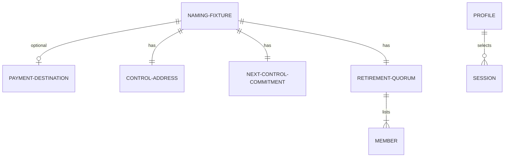

# Data

## Naming fixture

| Field | Type | Validation |
| --- | --- | --- |
| payment destination | optional natural number | absent, or present and not equal to the control address |
| control address | natural number | required |
| next-control commitment | natural number | required; opaque commitment, not a revealed next key |
| retirement quorum members | list of natural numbers | required as structure |
| retirement quorum threshold | natural number | required as structure |

Values are fixtures. No price, bond, expiry, refund amount, or other
economic policy is stored.

## Profile registry

`simulator/identity.json` gains a `profiles` array. The discovered
extent must be non-empty and must include:

| id | label requirement | engine |
| --- | --- | --- |
| `generic` | contains "generic" | existing generic engine |
| `m1-naming` | contains "naming" and states the candidate is unaccepted | `simulator/naming.mjs` |

Identity status remains `SIMULATOR-CANDIDATE`. Existing generic `files`
hashes stay byte-identical.

## Claim and observation

A pending naming claim is a certified Insert request for a fixture
spelling. Two pending claims may share a spelling. An active naming
record is a registry Active entry plus the application output whose
representative matches and whose fixture fields equal the certified
initial record.

Observation results: `unauthenticated`, `absent`, `active` with fixture
fields, or `pending`. This slice does not produce a completed Over
through the naming profile.

## Demo spelling

`alice` maps to one frozen natural-number key. That mapping is a demo
fixture, not a canonical encoding of names.

## Generic preservation

The generic theorem debt file remains exactly the frozen forty-one
records. The generic Lean corpus file remains byte-identical.
`lean/Singular/Statements.lean` and `lean/Singular/Model.lean` remain
byte-identical.
