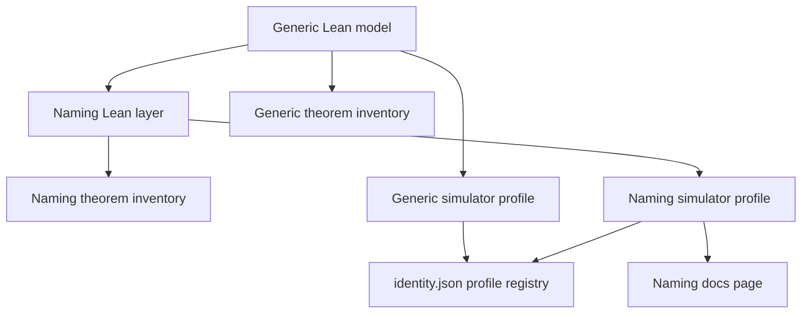

# Modules

## New and changed responsibilities

| Module | Responsibility | Depends on | Must not |
| --- | --- | --- | --- |
| `lean/Singular/Naming.lean` | Naming fixtures, well-formed initial Insert, naming `step`/`resolve`, Delete/release/reuse refusal | Generic model types and Insert/fold | Change generic statements or invent maintenance, recovery, retirement, fees |
| `lean/Singular/NamingStatements.lean` | Naming theorem surface only | Naming layer | Share a file or inventory with the forty-one generic statements |
| `lean/naming-theorem-debt.json` | Exact naming declaration identities and proof status | Naming statements | Replace `lean/theorem-debt.json` |
| `simulator/naming.mjs` | Executable transcription of the naming layer | Frozen naming Lean and corpus | Drive Lean from the browser |
| Generic `simulator/core.mjs` | Generic profile, including Delete | Generic model | Become the naming profile without explicit selection |
| `simulator/identity.json` | Profile registry plus existing generic file hashes | Both engines | Drop generic hashes or omit profile labels |
| `docs/naming-demo.md` | Playable first-release naming entry, implemented versus pending, diagrams, finite-model limits, unaccepted candidate | Naming profile URL | Edit reserved simulation guide or README |

## Dependency direction

Generic foundation stays upstream. Naming imports it. The simulator
naming engine imports the naming transcription, not the reverse. Docs
describe the playable profile; they do not define transition rules.

## Promotion

No new shared library. No extraction of generic code. New files for
naming; generic modules keep their current owners.
