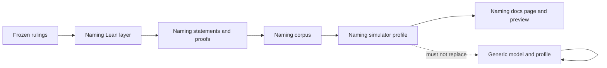

# Plan

## Strategy

Add a naming layer on top of the generic registry model. Do not rewrite
the generic machine, and do not edit the forty-one generic theorem
statements. Freeze naming registration and initial-state rules, prove
them, export a naming corpus, then transcribe that layer into a labelled
docs profile.

## Model then simulator

The Lean naming layer is the authority. Simulator behavior is derived
from it. The browser must not lead the model.

New Lean modules own naming fixtures, well-formed initial construction,
permissionless fold of certified absent-name Insert, authenticated
observation, and transition-layer refusal of Delete, name-release and
reuse. Generic `Output.datum` as a single natural number stays the
generic profile's application payload. Naming fixtures are first-class
fields, not a packed encoding of that natural number.

## Topology and budget

One OWNER slice. Commit owner family `glm` (harness Pi, provider Z.AI,
model `glm-5.3-flash`, effort max). Auditor family `codex` model
`gpt-5.6-sol` effort high, one fresh seat per candidate, fresh audit
worktree. `draft=NONE`.

At most two submitted candidates and two auditor launch attempts. Ten
executions for the campaign: one invocation of a frozen repository
recipe counts as one, including internal stages. Setup and transport
failures are logged, not charged, and escalate.

## File fence

Writable by the commit owner: new naming Lean modules and their
inventory and corpus; simulator naming engine, stories, identity
extensions, page and gate wiring; `docs/naming-demo.md` and its speech
companion; tools and Nix wiring needed to run the new inventories
without changing generic results; `mkdocs.yml` only if a new unreserved
page must appear in navigation.

Forbidden: generic theorem statements and their debt file's existing
forty-one records; `README.md`; `README.speech.json`;
`docs/simulation.md`; `docs/simulation.speech.json`; `version.txt`;
`.release-please-manifest.json`; `CHANGELOG.md`; `/code/singular`;
release tags; pull request 2.

If the naming page must be linked from the reserved simulation guide,
stop and ask the epic owner. Do not edit the reserved files.

## Live preview

The existing preview job binds `candidate.txt` to the pull-request head
and runs `.#preview-check` on live bytes. A localhost URL is not the
preview. The served page must say the candidate is unaccepted.
